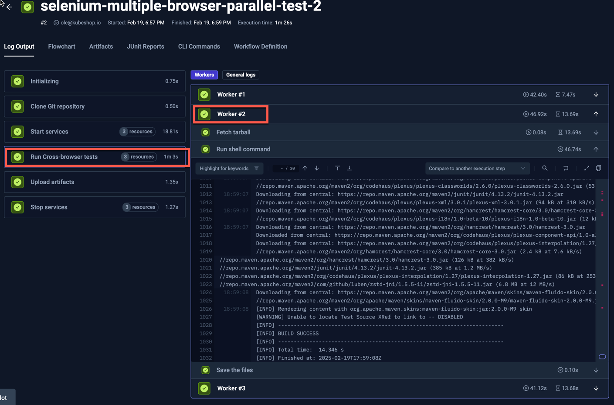
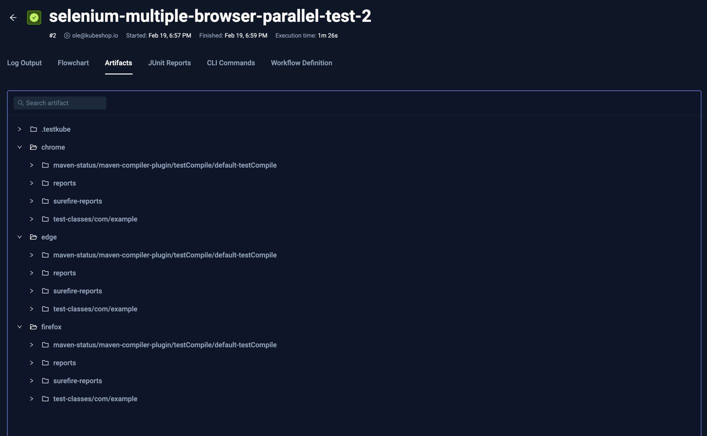
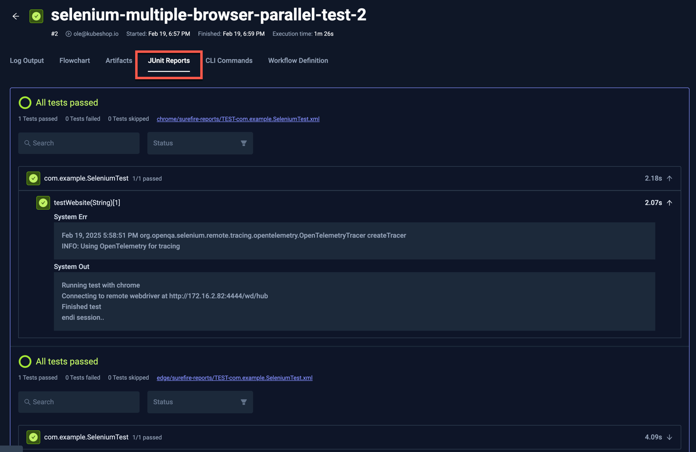

import Tabs from "@theme/Tabs";
import TabItem from "@theme/TabItem";
import AdvancedSelenium from "../../workflows/advanced-selenium-workflow.md"

# Advanced Selenium Example

import RequiresCommercialWorkflows from "../_commercial-workflows-note.mdx"

<RequiresCommercialWorkflows/>

Below is an advanced workflow for executing a Selenium test with maven and 3 browser engines; chrome, edge and firefox.
The test itself is written in Java and available on GitHub. You can paste this directly into the YAML of an existing or new test,
just make sure to update the `name` and `namespace` for your environment if needed.

- The `spec.content` property defines the location of the GitHub project.
- The `spec.services` property starts three services, one for each browser engine, which are then used to by Selenium when running the test (read more about [Services](../test-workflows-services)).
- The `spec.steps` property defines a single step that uses `parallel` to run the test for each browser engine and upload the created reports (read more about [Parallel Execution](/articles/test-workflows-parallel)).
- The `spec.steps[0].parallel.matrix` property defines a matrix of ip-addresses gathered from the corresponding browser engine services (read more about [Matrix Parameters](/articles/test-workflows-matrix-and-sharding)).
- The `spec.steps[0].parallel.steps` property defines the actual steps to run on each parallel node, using the properties defined in the matrix for the browser name and ip address.

<AdvancedSelenium/>

After execution, you can see the output from the test executions under the executions panel tabs:

<Tabs>
<TabItem value="logs" label="Log Output" default>

The log output from the Selenium execution with the second worker highlighted:

</TabItem>
<TabItem value="artifacts" label="Artifacts" default>

The uploaded report is available in the Artifacts tab:

</TabItem>

<TabItem value="junit-report" label="JUnit Report" default>

  Clicking the JUnit Reports tab shows parsed JUnit results:

  

</TabItem>

</Tabs>

