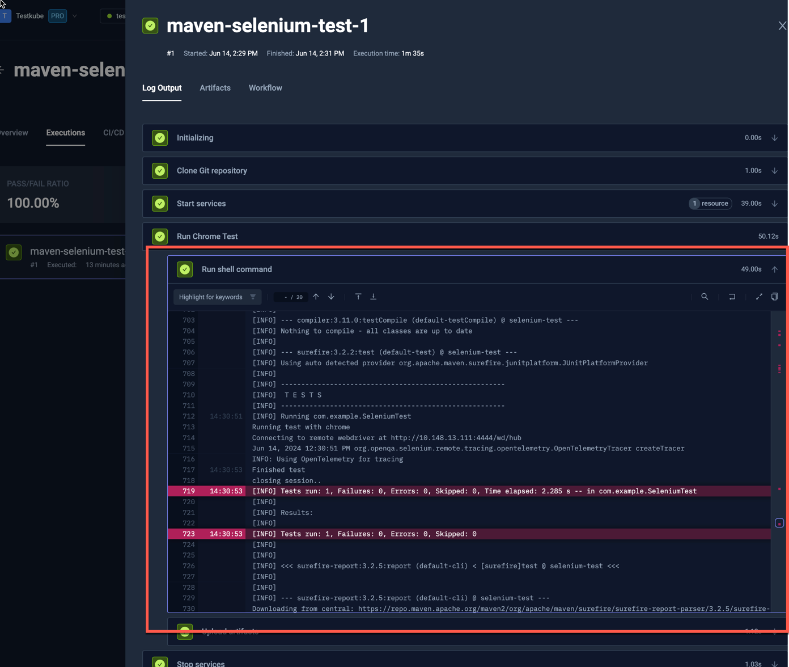
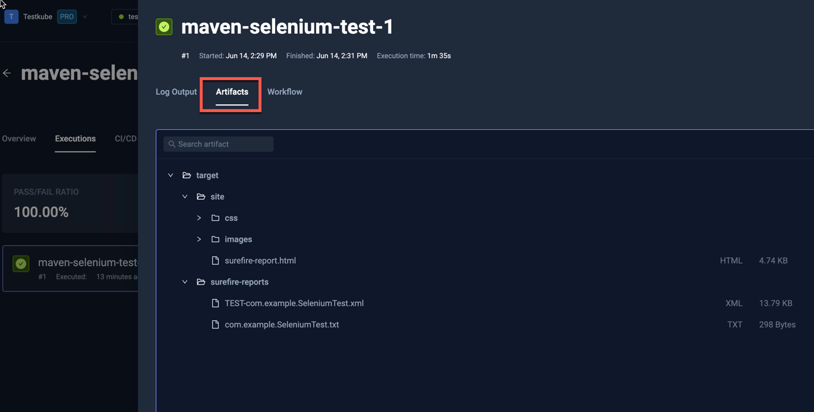
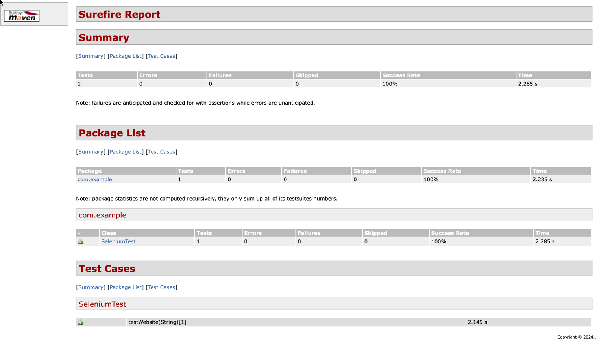

import Tabs from "@theme/Tabs";
import TabItem from "@theme/TabItem";
import SimpleSelenium from "../../workflows/simple-selenium-workflow.md"

# Basic Selenium Example

Below is a basic workflow for executing a Selenium test with maven - the test itself is written in Java and available
on GitHub. You can paste this directly into the YAML of an existing or new test, just make
sure to update the `name` and `namespace` for your environment if needed.

- The `spec.content` property defines the location of the GitHub project
- The `spec.services.chrome` property starts the Chrome engine as a Service which Selenium then uses for running the test (read more about [Services](../test-workflows-services))
- the `spec.steps` property defines a single step that runs the test using the started Chrome engine and uploads the created reports.

<SimpleSelenium/>

After execution, you can see the output from the test executions under the executions panel tabs:

<Tabs>
<TabItem value="logs" label="Log Output" default>

The log output from the Selenium execution:

</TabItem>
<TabItem value="artifacts" label="Artifacts" default>

The uploaded report is available in the Artifacts tab:

</TabItem>

<TabItem value="htlm-report" label="HTLM Report" default>

Clicking the HTLM report opens it in your browser:

</TabItem>
</Tabs>

