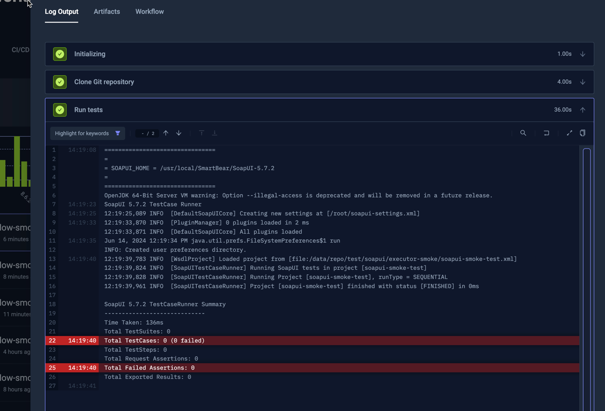

import Tabs from "@theme/Tabs";
import TabItem from "@theme/TabItem";
import SimpleSoapUI from "../../workflows/simple-soapui-workflow.md"

# Basic SoapUI Example

Below is a simple workflow for executing all tests in a SoapUI project stored on GitHub. 
You can paste this directly into the YAML of an existing or new test, just make
sure to update the `name` and `namespace` for your environment if needed.

- The `spec.content` property defines the location of the SoapUI project on GitHub
- The `spec.container` property defines default resources for any container created in this workflow
- the `spec.steps` property defines a single step that runs the test.

<SimpleSoapUI/>

After execution, you can see the log output from the SoapUI runner under the executions panel Log Output tab:

