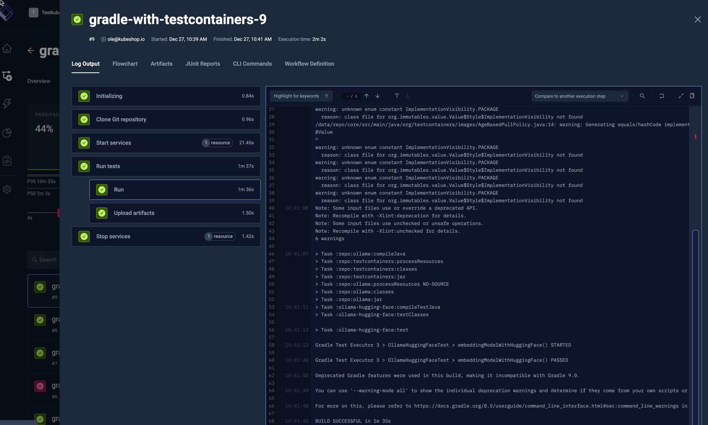
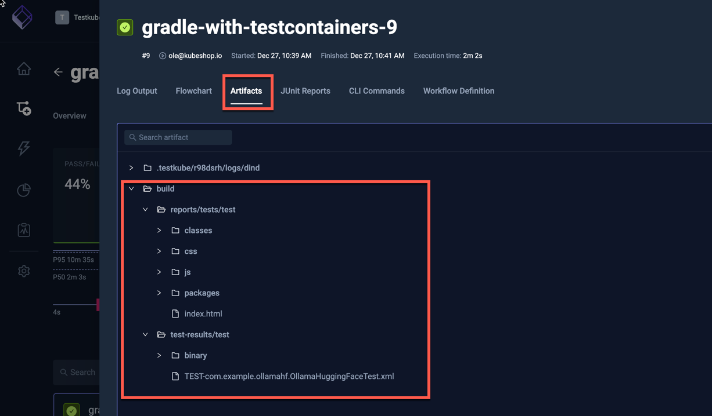
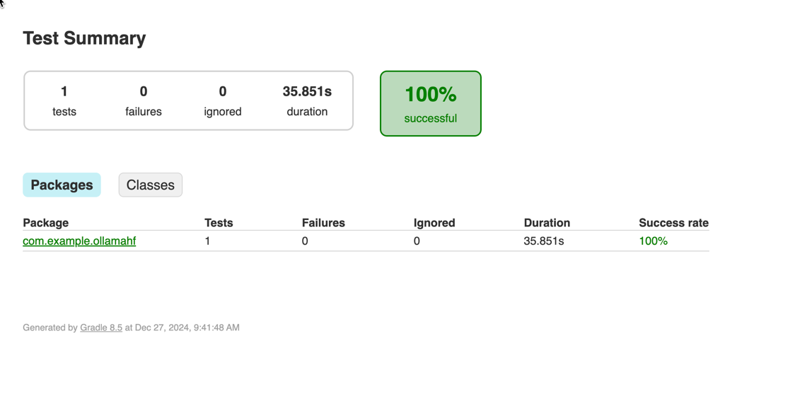
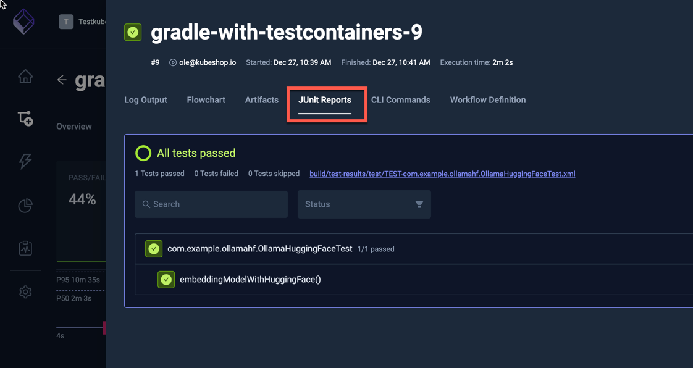

import Tabs from "@theme/Tabs";
import TabItem from "@theme/TabItem";
import OllamaHuggingFaceTestContainers from "../../workflows/ollamahuggingface-testcontainers-workflow.md"

# Using TestContainers with Testkube

import RequiresCommercialWorkflows from "../_commercial-workflows-note.mdx"

<RequiresCommercialWorkflows/>

[TestContainers](https://github.com/testcontainers/) is a popular framework for managing test dependencies on specific Docker containers.

To make sure TestContainers can successfully launch defined Docker images, it is recommended to define a separate `service` in your Workflow
that runs a [docker-in-docker (dind) image](https://hub.docker.com/_/docker), which can then be used by TestContainers by overriding the `DOCKER_HOST` environment variable in
your test executions.

The below example runs an Ollama Hugging Face example test from the [testcontainers-java repository](https://github.com/testcontainers/testcontainers-java)
that uses TestContainers to spawn corresponding Ollama dependencies
- The `spec.content` property defines the location of the GitHub project
- The `spec.services.dind` property starts the Docker-in-Docker container (read more about [Services](../test-workflows-services))
- the `spec.steps` property defines a single step that runs the Ollama test with gradle, overriding the `DOCKER_HOST` environment
  variable with the internal service ip of the dind service.

<OllamaHuggingFaceTestContainers/>

After execution, you can see the output from the test executions under the executions panel tabs:

<Tabs>
<TabItem value="logs" label="Log Output" default>

The log output from the test execution:

</TabItem>
<TabItem value="artifacts" label="Artifacts" default>

The uploaded reports are available in the Artifacts tab:

</TabItem>

<TabItem value="html-report" label="HTML Report" default>

Clicking the HTML report opens it in your browser:

  

</TabItem>

<TabItem value="junit-report" label="JUnit Report" default>

  Clicking the JUnit Tab shows the JUnit test results from the execution:

  

</TabItem>

</Tabs>

