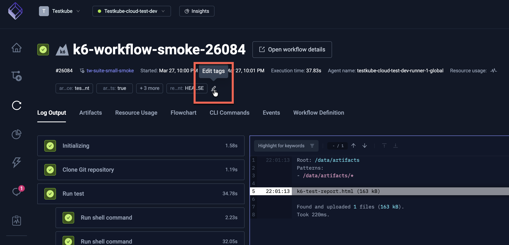
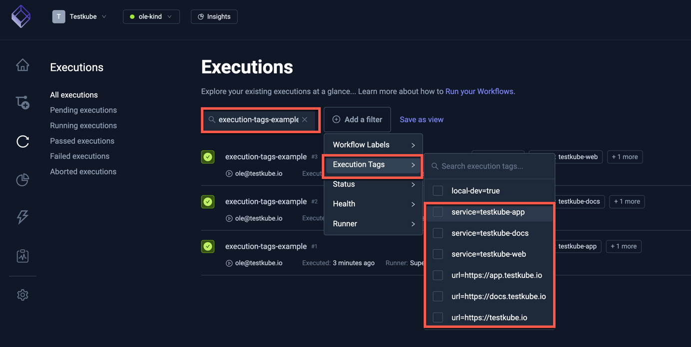

# Execution Tags

Execution tags let you label, filter, and organize your test executions. Tags are key-value pairs 
that can be set when an execution is triggered, or added and modified after an execution has completed,
making them useful both for upfront categorization and for post-hoc analysis.

## Adding Tags When Triggering an Execution

There are multiple ways to add tags when triggering a workflow execution.

### In the Workflow Definition

You can add tags to a workflow execution by setting the `execution.tags` field in the workflow definition.

```yaml
kind: TestWorkflow
apiVersion: testworkflows.testkube.io/v1
metadata:
   name: execution-tags-sample
   labels:
      docs: example
spec:
   execution:
      tags:
         service: '{{config.serviceUnderTest}}'
         url: '{{config.targetUrl}}'
```

### From the CLI

The Testkube CLI allows you to specify tags when triggering a workflow execution using the `--tag` flag:

```sh
testkube run testworkflow execution-tags-example --tag service=testkube-app
```

### In a TestTrigger

Testkube TestTriggers allow you to specify tags when triggering a TestWorkflow execution using the `tags` field -
see more at [Action Parameters](/articles/test-triggers#action-parameters).

### Via the REST API

When triggering a TestWorkflow execution via the REST API using the `executeTestWorkflow` operation, it is possible to specify 
tags using the `tags` property - [Read More](https://docs.testkube.io/openapi/cloud/Agent-Operations----test-workflows#operation/executeTestWorkflow).

## Editing Tags After Execution

Tags can also be added or modified after an execution has completed. This is useful for
post-hoc categorization — for example, marking executions as part of a release, flagging
regressions, or annotating results during triage.

### From the Dashboard

Open a completed execution in the Testkube Dashboard and edit its tags directly from the
execution details panel.



### From the CLI

Use the `testkube update testworkflowexecution` command to set or replace tags on a
finished execution:

```sh
testkube update testworkflowexecution <executionID> --tag release=v1.42.0 --tag status=reviewed
```

### Via the REST API

The `updateTestWorkflowExecution` operation accepts a `tags` property to update tags on an
existing execution — [Read More](https://docs.testkube.io/openapi/cloud/Agent-Operations----test-workflows#operation/updateTestWorkflowExecution).

### Via the MCP Server

When using Testkube's [MCP Server](/articles/mcp-overview), you can update execution tags
through the `update_execution_tags` tool, making it possible to tag executions from AI
assistants and automation pipelines.

## Example Use Cases

### Tagging Service and Target URL

This example shows how to tag executions with the service under test and target URL.

```yaml
kind: TestWorkflow
apiVersion: testworkflows.testkube.io/v1
metadata:
  name: execution-tags-sample
  labels:
    docs: example
spec:
  config:
    serviceUnderTest:
      type: string
      default: local-service-under-test
    targetUrl:
      type: string
      default: https://testkube.io
  execution:
    tags:
      service: '{{config.serviceUnderTest}}'
      url: '{{config.targetUrl}}'
  steps:
  - name: Run curl
    container:
      image: curlimages/curl:8.7.1
    shell: curl -s -I {{ config.targetUrl }}
```

#### How It Works

1. The workflow defines two configuration variables: `serviceUnderTest` and `targetUrl`.
2. These variables are used to set execution tags:

   - `service`: Set to the value of `serviceUnderTest`
   - `url`: Set to the value of `targetUrl`

3. Each execution of this workflow will be tagged with these values.
4. Importantly, you can change the config values on each run, allowing you to use the same workflow definition for testing different services and URLs.
   
### Using Tags for Filtering

You can run this workflow multiple times with different values for `serviceUnderTest` and `targetUrl`. For example:

1. `testkube-docs` and its corresponding URL
2. `testkube-app` and its URL
3. `testkube-web` and its URL

These tags allow you to easily filter and view executions in the [Testkube Dashboard Executions View](/articles/testkube-dashboard-executions) based on the service or URL being tested.



### Tracking Git Branches

This example demonstrates tagging executions with the Git branch being tested. This is particularly valuable when you're managing tests across multiple branches and need to track which tests were run on which branch.

Example Workflow

```yaml
kind: TestWorkflow
apiVersion: testworkflows.testkube.io/v1
metadata:
  name: execution-tags-branches-sample
spec:
  config:
    branch:
      type: string
      default: main
  execution:
    tags:
      branch: '{{ config.branch }}'
  content:
    git:
      uri: https://github.com/kubeshop/testkube
      revision: '{{ config.branch }}'
  steps:
    - shell: echo running tests
```

#### How It Works

1. The workflow defines a configuration variable `branch` with a default value of `main`.
2. This variable is used to set an execution tag:

   - `branch`: Set to the value of `config.branch`

3. The same variable is used in the `content.git.revision` field to specify which branch to check out.
4. Each execution of this workflow will be tagged with the branch name.
5. You can change the `branch` config value on each run, allowing you to easily test different branches.

### Using Branch Tags for Filtering

You can run this workflow multiple times with different values for the branch. For example:

1. `main` branch
2. `feature/new-test` branch
3. `bugfix/issue-123` branch

These branch tags enable you to quickly filter and analyze test results for specific branches using the
Executions View as shown above.

### Post-Execution Failure Categorization

Tags don't have to be set at execution time. A powerful pattern is to tag executions *after*
they complete — for example, an AI agent or CI pipeline step that inspects failed executions
and categorizes the root cause.

Consider a scenario where an automated agent reviews every failed execution and adds tags
describing the failure type:

```sh
testkube update testworkflowexecution 6723a8e5b4f3c21d009a1b2c \
  --tag failure-category=flaky-infrastructure \
  --tag root-cause=pod-eviction \
  --tag reviewed-by=ai-agent
```

Over time this builds a searchable catalog of failure modes. You can then filter the
Executions View by `failure-category` to answer questions like:

- How many failures this week were caused by flaky infrastructure vs. genuine test regressions?
- Which services have the most `timeout` failures?
- Have `pod-eviction` failures decreased after a cluster scaling change?

This works equally well from the Dashboard, the REST API, or the MCP Server — any tool that
can call the update operation can participate in the tagging workflow.

:::tip Automate with the Failure Categorizer Agent
Testkube includes a ready-made **Failure Categorizer** agent template that automatically
inspects failed executions and tags them by failure type (`network`, `configuration`,
`infrastructure`, or `test_failure`). See [Agent Templates](/articles/ai-agents#agent-templates)
for details.
:::
