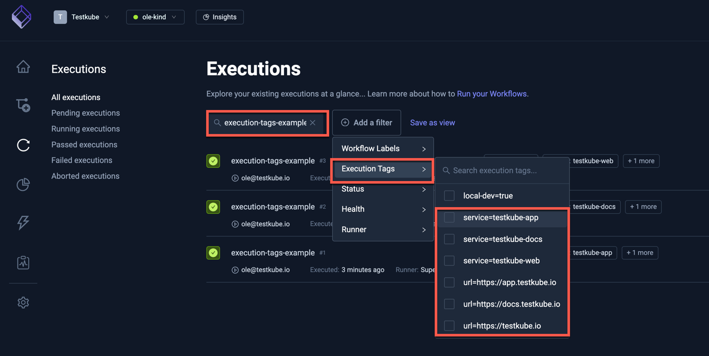
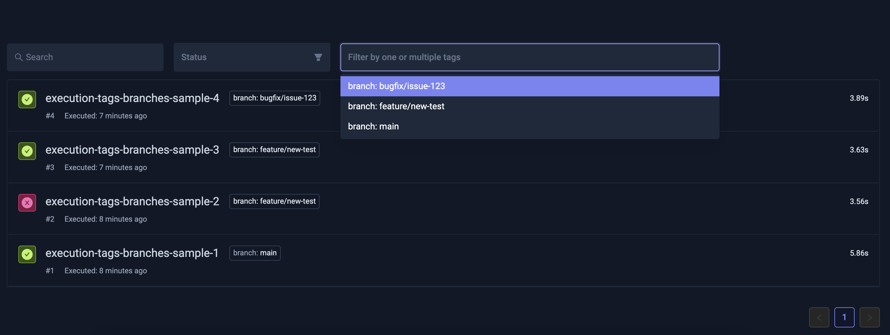

# Filtering Test Workflow Executions Using Tags

Test Workflows allow you to add execution tags, which can be used for filtering and organizing your test executions. These tags are especially useful when you want to categorize your tests based on specific attributes. Here are two common examples:

## Tagging Service and Target URL

This example shows how to tag executions with the service under test and target URL.

### Example Workflow

```yaml
kind: TestWorkflow
apiVersion: testworkflows.testkube.io/v1
metadata:
  name: execution-tags-sample
  labels:
    docs: example
spec:
  config:
    serviceUnderTest:
      type: string
      default: local-service-under-test
    targetUrl:
      type: string
      default: https://testkube.io
  execution:
    tags:
      service: '{{config.serviceUnderTest}}'
      url: '{{config.targetUrl}}'
  steps:
  - name: Run curl
    container:
      image: curlimages/curl:8.7.1
    shell: curl -s -I {{ config.targetUrl }}
```

### How It Works

1. The workflow defines two configuration variables: `serviceUnderTest` and `targetUrl`.
2. These variables are used to set execution tags:

   - `service`: Set to the value of `serviceUnderTest`
   - `url`: Set to the value of `targetUrl`

3. Each execution of this workflow will be tagged with these values.
4. Importantly, you can change the config values on each run, allowing you to use the same workflow definition for testing different services and URLs.
   
### Using Tags for Filtering

You can run this workflow multiple times with different values for `serviceUnderTest` and `targetUrl`. For example:

1. `testkube-docs` and its corresponding URL
2. `testkube-app` and its URL
3. `testkube-web` and its URL

These tags allow you to easily filter and view executions in the Testkube UI or CLI based on the service or URL being tested.



## Tracking Git Branches

This example demonstrates tagging executions with the Git branch being tested. This is particularly valuable when you're managing tests across multiple branches and need to track which tests were run on which branch.

### Example Workflow

```yaml
kind: TestWorkflow
apiVersion: testworkflows.testkube.io/v1
metadata:
  name: execution-tags-branches-sample
spec:
  config:
    branch:
      type: string
      default: main
  execution:
    tags:
      branch: '{{ config.branch }}'
  content:
    git:
      uri: https://github.com/kubeshop/testkube
      revision: '{{ config.branch }}'
  steps:
    - shell: echo running tests
```

### How It Works

1. The workflow defines a configuration variable `branch` with a default value of `main`.
2. This variable is used to set an execution tag:

   - `branch`: Set to the value of `config.branch`

3. The same variable is used in the `content.git.revision` field to specify which branch to check out.
4. Each execution of this workflow will be tagged with the branch name.
5. You can change the `branch` config value on each run, allowing you to easily test different branches.

### Using Branch Tags for Filtering

You can run this workflow multiple times with different values for the branch. For example:

1. `main` branch
2. `feature/new-test` branch
3. `bugfix/issue-123` branch

These branch tags enable you to quickly filter and analyze test results for specific branches in the Testkube UI. This is particularly helpful when you need to verify the test status of a feature branch before merging or when investigating test failures on specific branches.


