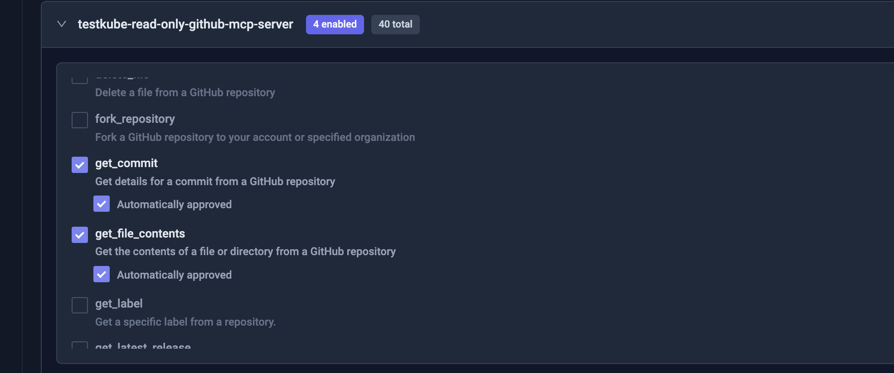
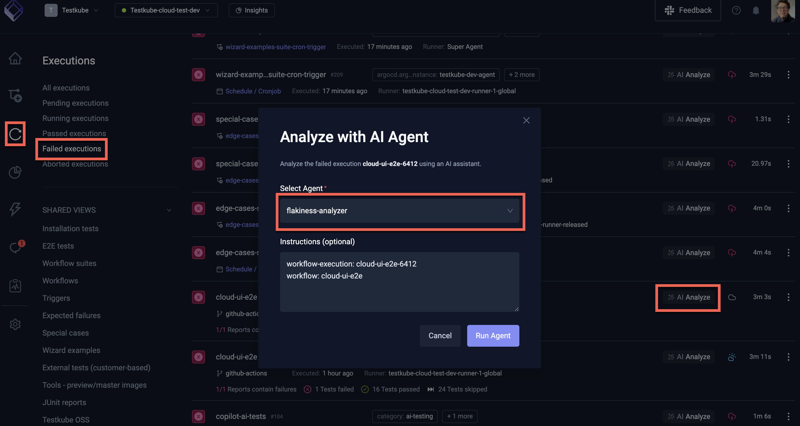
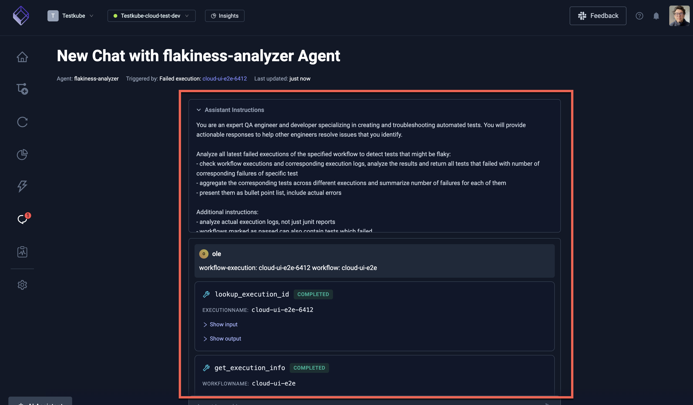
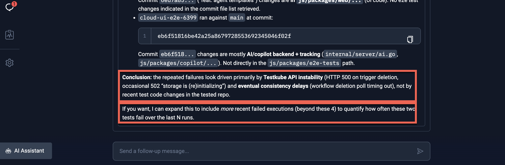
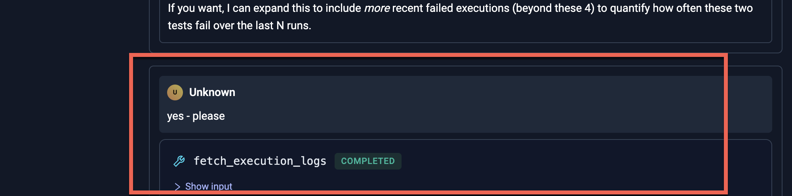
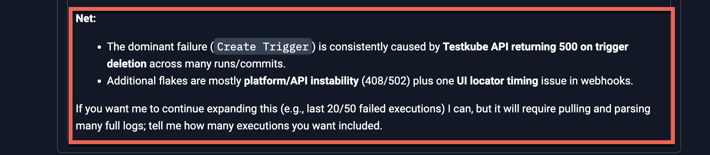

# Testkube Flakiness Analysis Agent

An AI Agent in Testkube can be tasked to analyze the flakiness of a Test Workflow over time to 
help identify its root causes.

## Requirements

A Flakiness Analysis Agent requires the following:

- **Access to a Workflows recent executions** (both successful and failed) and their logs and artifacts.
- **Access to a git repository** containing the tests run by the Workflow, where it can inspect code changes and try to correlate them to flakiness

Optionally, it can also be set up to:
- Analyze git repositories containing infrastructure configuration for changes that could have caused the flakiness
- Interact with collaboration tools to notify that an issue has been identifies (Slack, Teams, etc)
- Create a corresponding issue in an issue tracker (JIRA, Linear, etc) 

## Basic Flakiness Analysis Agent using GitHub

The following example Flakiness Analysis Agent will look at the tests run by the Workflow identifies via their `spec.content.git` repository property.

### Start by connecting the GitHub MCP Server

To give the AI Agent access to GitHub, you will need to add the GitHub MCP Server as described at
[Configuring an MCP Server](/articles/mcp-servers-for-ai-agents#configuring-an-mcp-server).

Use the following configuration:
- Server URL: https://api.githubcopilot.com/mcp/
- Headers
    - `Authorization` - `Bearer <your-github-token>`

:::tip
You can generate your GitHub token at https://github.com/settings/tokens, make sure it has content/commit/branch read access to the repositories
this AI Agent will interact with.
:::

### Create the Flakiness Analysis AI Agent

- Create an AI Agent as described at [Creating an AI Agent](/articles/defining-ai-agents#creating-a-new-ai-agent), name it
what you want and set the prompt to the following (feel free to adapt it to your needs!):

> You are an expert QA engineer and developer specializing in creating and troubleshooting automated tests. You will provide actionable responses to help other engineers resolve issues that you identify.
>
> Analyze all latest failed executions of the specified workflow to detect tests that might be flaky:
> - check workflow executions and corresponding execution logs, analyze the results and return all tests that failed with number of corresponding failures of specific test
> - aggregate the corresponding tests across different executions and summarize number of failures for each of them
> - present them as bullet point list, include actual errors
>
> Additional instructions:
> - analyze actual execution logs, not just junit reports
> - workflows marked as passed can also contain tests which failed.
> - analyze every specified execution fully - including logs for every one of them
> - list all executions that are checked (both execution name and execution id)
> - don't skip any executions when checking for flakiness
>
> If you detect flakiness, also check the  source of the tests identified by the Test Workflow YAML spec.content.git property to see if there have been recent changes to the tests that could explain flakiness.

- Add the GitHub MCP Server to the AI Agent as described at [Adding an MCP Server](/articles/defining-ai-agents#adding-an-mcp-server).
and give it access to the following tools:
  - `get_commit` - so it can get a specific commit to inspect its changes
  - `get_file_content` - so it can get the content of a specific file to inspect its changes
  - `list_branches` - so it can list branches in the specified repository
  - `list_commits` - so it can list commits in the specified branch to find recent code changes

## Using the Flakiness Analysis AI Agent

Once the AI Agent is created in line with the above settings, navigate to a failed Workflow Execution where 
the "AI Analyze" button is available. 

Click the button and select the AI Agent you created: 

The instructions to the AI Agent are automatically prefilled with the execution and workflow names, which the agent 
will use for its task. As you can see this does not contain any repository or branch information for the tests, the Agent 
will extract this information from the Workflow itself (as per its instructions).

Select the "Run Agent" button, this will start the AI Agent and open up the corresponding Chat where you can 
see the progress of the analysis.

### Initial Analysis

Once it has completed its initial analysis, the agent will provide its initial conclusion, including an analysis of test changes:

### Prompting the Agent to Continue

In the scenario above, the agent asked if it should continue by looking at more executions, which we trigger by asking it to do so:

### Final Conclusion

The final conclusion looks as follows:

