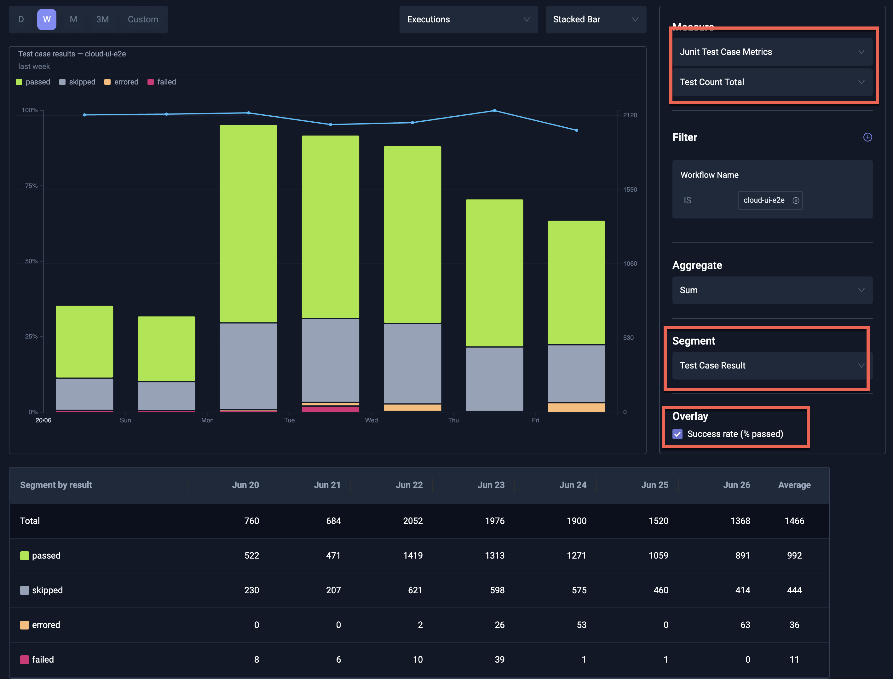
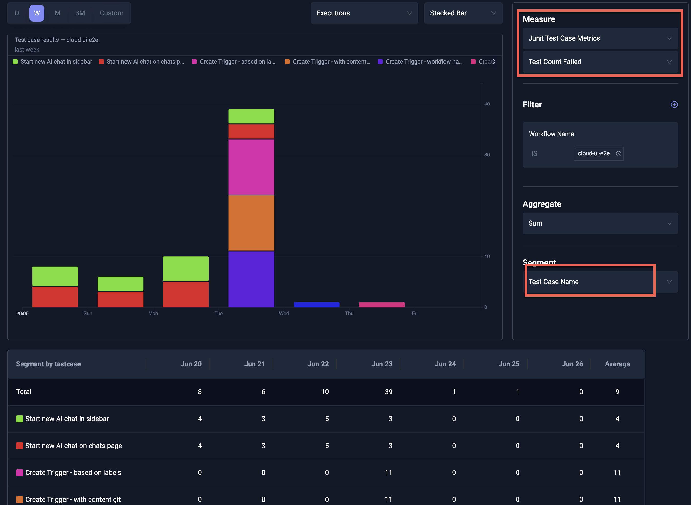
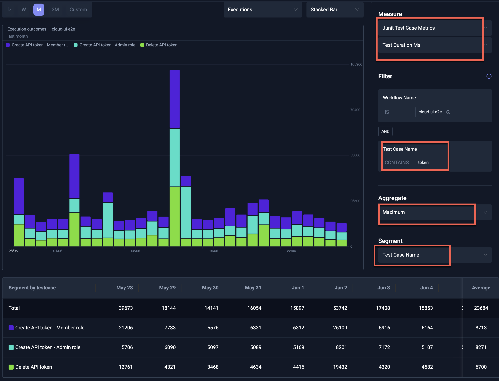

# Functional Metrics in Insights

Granular metrics are automatically ingested for JUnit output when you [create a JUnit report](/articles/test-workflows-reports). These are exposed under the
`Junit Test Case Metrics` measure group. For each test case and test suite in a workflow, six series are created:

- test_count_failed: The number of tests that failed.
- test_count_passed: The number of tests that passed.
- test_count_errored: The number of tests that errored.
- test_count_skipped: The number of tests that were skipped.
- test_count_total: The total number of tests.
- test_duration_ms: The duration of the test case or test suite.

These metrics can be used to understand trends for individual tests over time. For example, viewing `test_duration_ms` segmented
by test case can highlight your slowest tests and tests that suddenly take significantly longer than expected.

## Example: Pass/Fail for Test Cases

The below chart shows the overall pass/fail ratio for test cases in the selected workflow over time.

## Example: Failures segmented by name

The below chart shows the number of failures for test cases in the selected workflow, segmented by name.

## Example: Duration filtered and segmented by name

The below chart shows the duration of test cases in the selected workflow, filtered and segmented by name.

