# GitHub

The **GitHub integration** connects a GitHub repository to a Testkube environment so PR activity runs your Test Workflows and results post back on the PR as check-runs.

:::note
Available on Testkube Cloud and on-prem Control Plane. On-prem requires the GitHub integration enabled in the Helm chart and a GitHub App configured against the target organization. See [Using GitHub Apps with Testkube](/articles/github-actions#using-github-apps-with-testkube).
:::

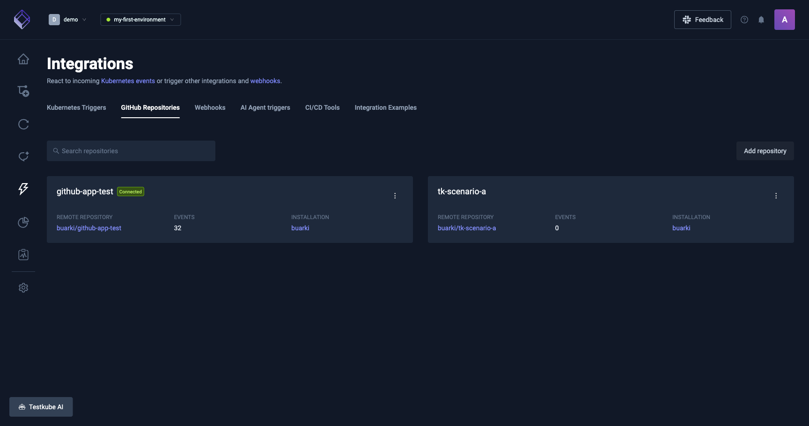

## What it does

For every event received from GitHub, the integration:

1. Matches the event to your configured integration.
2. Runs the Workflows selected for the repository against the commit that produced the event.
3. Posts execution status back to the PR (check-run) or commit (status).

Workflows that run can be:

- **Existing Workflows** already in the environment, attached when the repository is connected.
- **Auto-generated Workflows** materialized from frameworks detected in the repo (Playwright, Cypress, k6, Postman, JMeter, Maven, Gradle, Go, Node).

## Prerequisites

- A Testkube environment with an agent connected. See [Agents Overview](/articles/agents-overview).
- On on-prem, the GitHub integration enabled in `values.yaml`.
- The Testkube GitHub App installed on the target repository.
- The user connecting the repository must have `admin` access to it.

## Installing the GitHub App

On Testkube Cloud, open **Integrations > Git Integration** and click **Connect my first repository**. GitHub asks which organization and which repos the App may access.

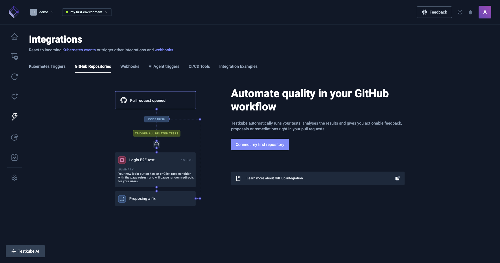

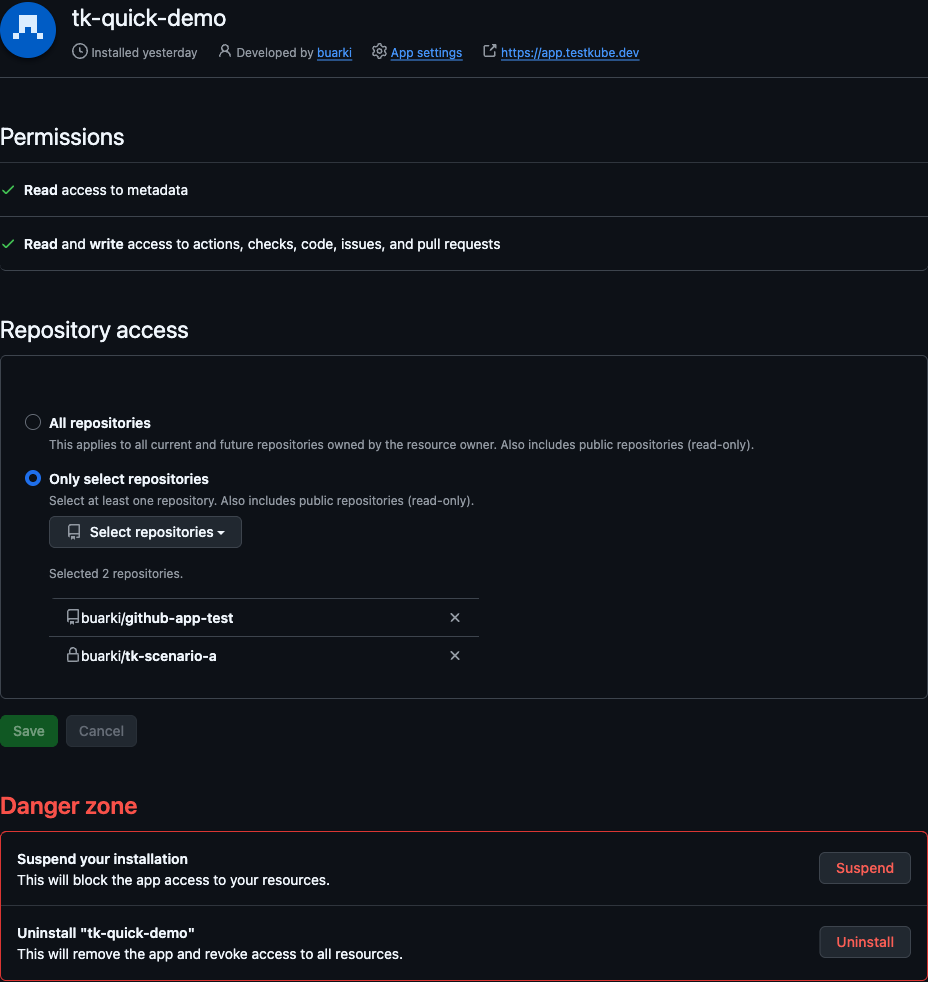

On on-prem, the operator creates the App during deployment. See [Using GitHub Apps with Testkube](/articles/github-actions#using-github-apps-with-testkube).

Required App permissions:

- **Contents**: read
- **Metadata**: read
- **Pull requests**: read & write
- **Checks**: read & write
- **Issues**: read (for the `@testkube` comment trigger)

## Connecting a repository

From the dashboard, open **Integrations > Git Integration > Connect repository**:

1. Pick the org and repo (only repos the App is installed on show up).
2. Choose what runs against it:
   - **Attach existing Workflows** already in this environment, or
   - **Scan the repo** and let Testkube propose a starting point based on the detected stack (Playwright, Cypress, k6, Postman, JMeter, Maven, Gradle, Go, Node). Detection is best-effort, review and adjust the proposed set before confirming.
3. Confirm. Testkube persists the selection, materializes one auto-gen Workflow per selected framework (for the scan path), and starts receiving webhook events.

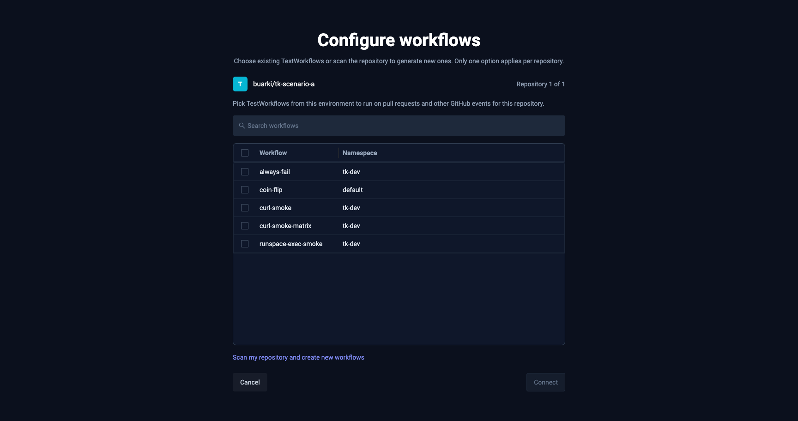

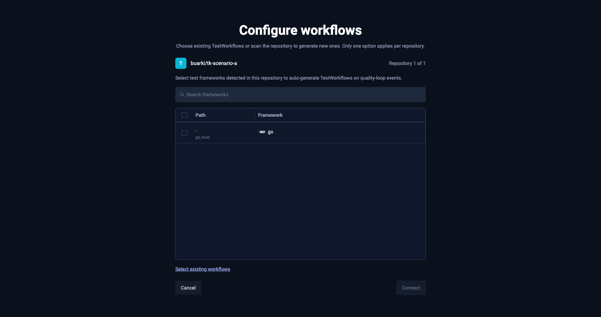

## What triggers a run

| Event           | Action                      | Notes                                                            |
| --------------- | --------------------------- | ---------------------------------------------------------------- |
| `pull_request`  | `opened`                    | `draft == false`                                                 |
| `pull_request`  | `ready_for_review`          |                                                                  |
| `pull_request`  | `synchronize`               | new commit pushed to the PR head                                 |
| `issue_comment` | `created` on a PR           | body must mention `@testkube` (editing a comment does not count) |
| `push`          |                             | branches matched by config                                       |
| `tag push`      |                             | tag globs matched by config                                      |
| `release`       | `published` / `prereleased` | prereleases opt-in                                               |

Toggle event types per integration from the dashboard configuration panel.

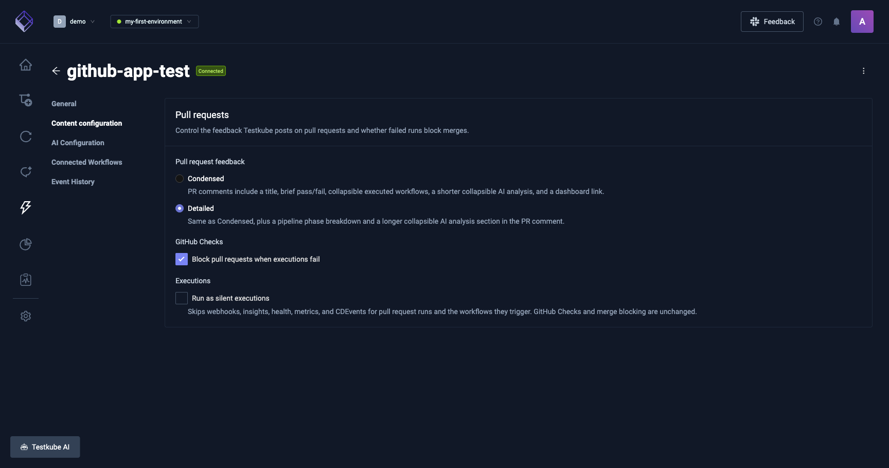

## Configuration

Every integration has a **Configuration** panel that controls PR feedback, AI analysis, and merge gating.

### Pull request feedback

Chooses how the PR comment looks:

- **Condensed** (default): title, brief pass/fail, collapsible executed Workflows, a short collapsible AI analysis, and a link back to the dashboard.
- **Detailed**: everything in Condensed, plus a pipeline phase breakdown and a longer collapsible AI analysis section.

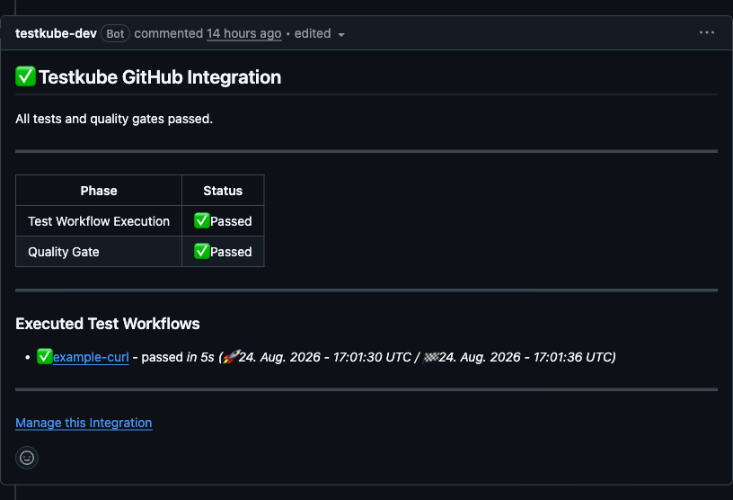

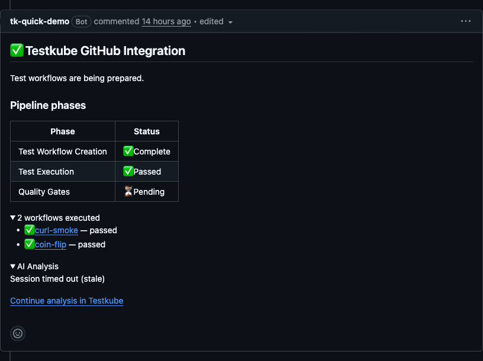

### GitHub Checks

- **Block pull requests when executions fail**: when on, a failed required Workflow marks the aggregate check-run as failed and blocks merge (if branch protection requires the check to pass). Off means the check-run still reports the result, but does not block.

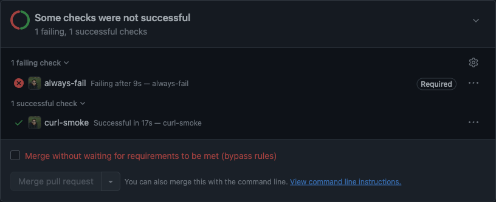

### AI Summary

Adds an AI-generated execution summary to the PR comment.

- **Enable AI analysis on pull requests**: master toggle for the block.
- **Agent**: the AI agent that produces the summary. Only agents available in the environment show up.
- **Model**: model used by the agent. Leave on **Platform default** unless you need to pin a specific one.
- **Run when**:
  - **On fail or abort**: only run the summary when the execution does not pass, useful for keeping AI cost tied to real signal.
  - **Always**: run after every execution on a PR.

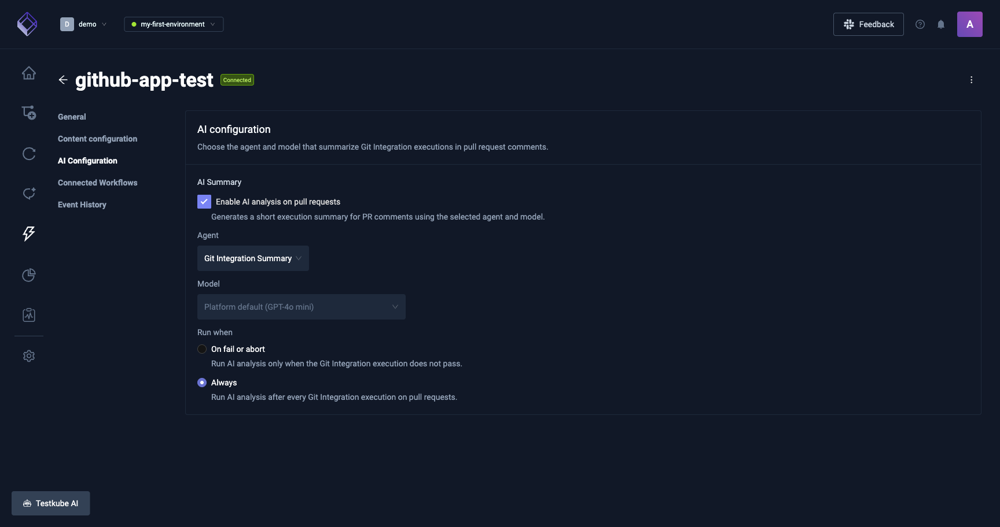

## AI sessions

When AI Summary is on, Testkube creates one **AI session** per pull request. It is the assistant conversation that produces the **AI Analysis** block posted on the PR comment.

- **One session per PR**. Every subsequent push to the PR appends into the same session, so context builds up as the PR evolves rather than being lost between commits.
- **Where to open it**:
  - From the PR comment, click **Continue analysis in Testkube** at the bottom of the AI Analysis block.
  - From the dashboard, open the integration's **GitHub events** tab. Events whose analysis produced a session show a **View chat** link in the AI Session column.
- Both entry points land on the same conversation under the environment's **Chats** section. From there you can keep asking follow-ups, inspect the assistant's reasoning, or dig into the tool calls it made against your executions.

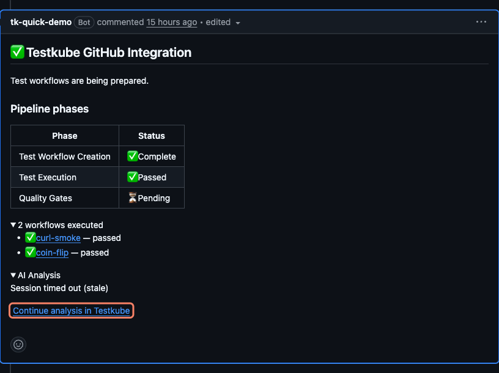

## Auto-generated Workflows

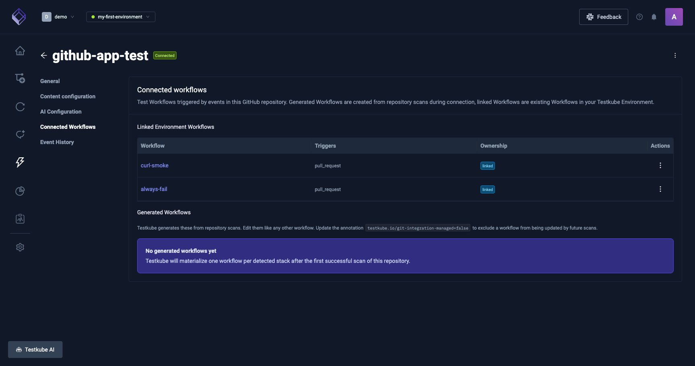

Every auto-gen Workflow is labelled so the GitHub integration can reconcile it:

| Label / Annotation                                 | Value                                  |
| -------------------------------------------------- | -------------------------------------- |
| `testkube.io/git-integration-integration-id`       | ID of the owning integration           |
| `testkube.io/git-integration-framework`            | Detected framework (e.g. `playwright`) |
| `testkube.io/git-integration-provider`             | `github`                               |
| `testkube.io/git-integration-managed` (annotation) | set to `"false"` to detach             |
| `testkube.io/managed-by`                           | `git-integration`                      |

### Detaching a generated Workflow

Add `testkube.io/git-integration-managed: "false"` as an annotation on the Workflow to opt it out of reconcile:

- Testkube no longer overwrites your edits on rescan.
- The Workflow is not deleted when the integration is removed.
- It keeps running on every triggering event until you remove it from the integration selection.

Re-set the annotation to `"true"` (or remove it) to bring the Workflow back under management.

### Event parameters available to your Workflows

Declare the ones you need under `spec.config`:

| Key           | Meaning                                                                                                                                                               |
| ------------- | --------------------------------------------------------------------------------------------------------------------------------------------------------------------- |
| `PR_NUMBER`   | PR number. Empty on push/tag/release.                                                                                                                                 |
| `PR_SHA`      | Head commit SHA of the PR.                                                                                                                                            |
| `PR_BASE_REF` | Base branch of the PR (e.g. `main`).                                                                                                                                  |
| `PR_HEAD_REF` | Head branch of the PR.                                                                                                                                                |
| `PR_AUTHOR`   | GitHub login of the PR author.                                                                                                                                        |
| `revision`    | Git ref for the event (commit SHA on push, `refs/pull/<n>/head` on PRs), consumed as-is by `spec.content.git.revision` so the clone step checks out the right commit. |

Workflows that do not declare these ignore them.

## Filtering executions by the GitHub integration

Every execution scheduled by the GitHub integration carries `actor.type = gitintegration`. The **Executions** page has a **Git Integration** filter chip that returns those runs.

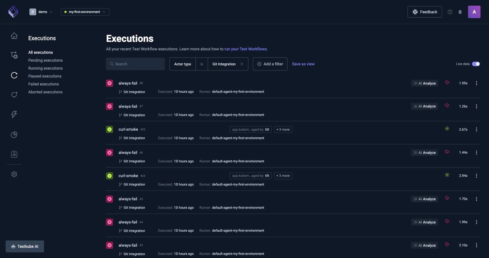

## Re-scanning a repository

Framework detection is refreshed automatically when a PR event touches a stack anchor: `go.mod`, `package.json`, `pom.xml`, `build.gradle`, `build.gradle.kts`, `Cargo.toml`, `requirements.txt`, `pyproject.toml`, `Pipfile`, `Gemfile`, or `composer.json`. The GitHub integration re-runs detection on the PR head and updates the set of auto-gen Workflows before executing.

There is no dashboard button for a manual rescan today. To force one when needed, disconnect the integration and connect again; the connection flow re-runs detection.

## Results on GitHub

Each run reports a single aggregate **check-run** on the PR (or a commit status on push/tag/release). Clicking it opens the execution details in Testkube.

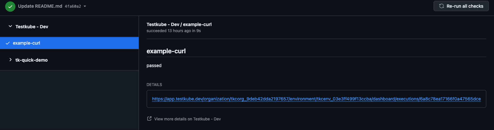

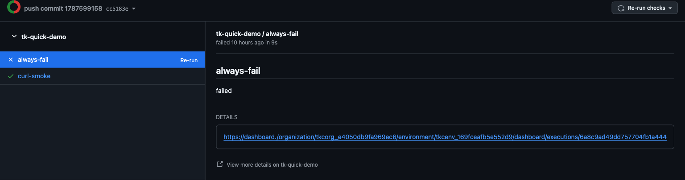

- Any Workflow that does not pass (failed, aborted, cancelled, timed out) marks the aggregate check-run as **failure**.
- Executions that never start (queued indefinitely, agent disconnected) time out after the environment's queue timeout and mark the check-run as failed with a "did not run" reason.
- Runs superseded by a newer push on the same PR are silently skipped, they do not overwrite the check-run.

## Re-running a check

Every re-trigger path routes through the same pipeline:

- **Re-run** on a single check in the PR's Checks tab
- **Re-run failed** or **Re-run all** on the check-suite header
- **Run again** on a Testkube execution in the dashboard (only for executions scheduled by the GitHub integration)
- Comment `@testkube` on the PR

None of these replay the original run's snapshot. The pipeline resolves the Workflow against the current integration state and schedules fresh:

- The latest Workflow YAML wins if it changed between runs.
- A Workflow detached from the integration between runs is dropped, its historical result stays visible in the sticky comment but no new execution runs for it.
- Config parameters come from the PR event context, not from the original execution's config.

Practical framing: re-run means "run this again against the current head, with the current definitions", not "replay this exact run".

## Tips and recipes

### I just want to re-run without pushing anything

Comment `@testkube` on the PR. GitHub emits an `issue_comment` event and the GitHub integration runs the selected Workflows against the PR's current head. Useful for retrying a flake, re-checking after a base-branch fix, or triggering a run on a PR that opened before the integration was added.

Notes:

- Only newly created comments trigger a run, editing an existing one is ignored.
- The body must contain the string `testkube`.
- The comment does not need to be the first one, any subsequent `@testkube` re-triggers the run.

### Can I replace my GitHub Actions test job with a Test Workflow?

Yes. You can keep Actions for build, lint, and deploy, and move the test run itself onto a Test Workflow that the GitHub integration executes. History, filtering, and AI summaries then live on the Testkube side and the aggregate check-run replaces your Actions test job.

Minimal example, a Playwright job that today lives in `.github/workflows/e2e.yml`:

```yaml
name: e2e
on: [pull_request]
jobs:
  e2e:
    runs-on: ubuntu-latest
    steps:
      - uses: actions/checkout@v4
      - run: npm ci
      - run: npx playwright test
```

Same job as a Test Workflow attached to the GitHub integration:

```yaml
apiVersion: testworkflows.testkube.io/v1
kind: TestWorkflow
metadata:
  name: pr-e2e
spec:
  config:
    revision: { type: string }
  content:
    git:
      uri: https://github.com/<org>/<repo>.git
      revision: "{{ config.revision }}"
  container:
    image: mcr.microsoft.com/playwright:v1.62.1-jammy
    workingDir: /data/repo
  steps:
    - shell: npm ci
    - shell: npx playwright test
```

Attach the Workflow when connecting the repository (or from the integration configuration panel later). On the next PR event, Testkube clones the head commit, runs the steps, and reports one aggregate check-run back to GitHub.

## Troubleshooting

**The check-run never appears on the PR**
Confirm the GitHub App has **Checks: write** on the repo. If the dashboard shows events as `dispatch_failed`, the agent logs will typically show `403 Resource not accessible by integration`. Update App permissions and re-trigger.

**`@testkube` comment did nothing**
The parser accepts `action: created` only. Editing an existing comment doesn't count (delete and post a new one). The body must contain `testkube`.

**A generated Workflow keeps coming back after I delete it**
Delete alone doesn't remove it from the desired state. Either remove the framework from the integration selection in the dashboard, or set `testkube.io/git-integration-managed=false` on it and then delete.

**Generated Workflow runs in the wrong namespace**
Auto-gen Workflows land in the namespace of the agent registered with the environment. With multiple agents, point manual `testkube run testworkflow` calls at the same namespace, or attach the Workflow to the intended agent.

## Related

- [Integrations Overview](/articles/integrations-dashboard-explore)
- [Kubernetes Event Triggers](/articles/integrations-triggers)
- [Webhooks](/articles/integrations-webhooks)
