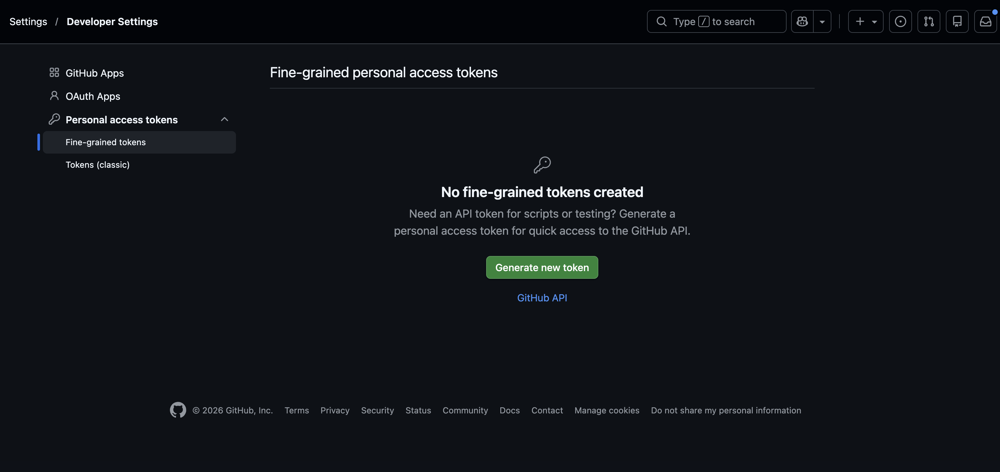
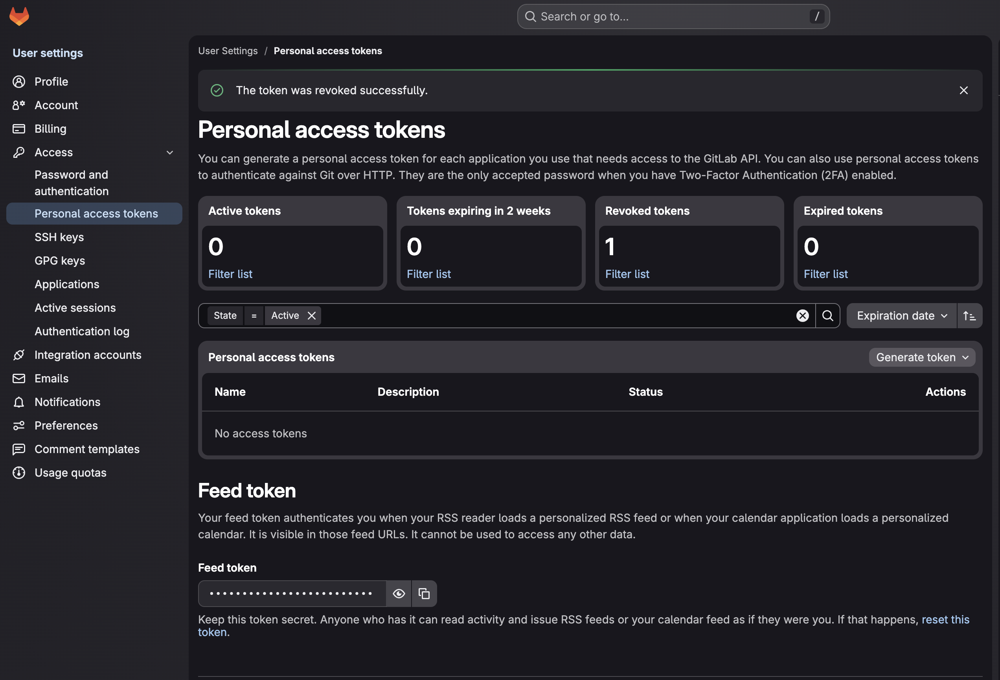
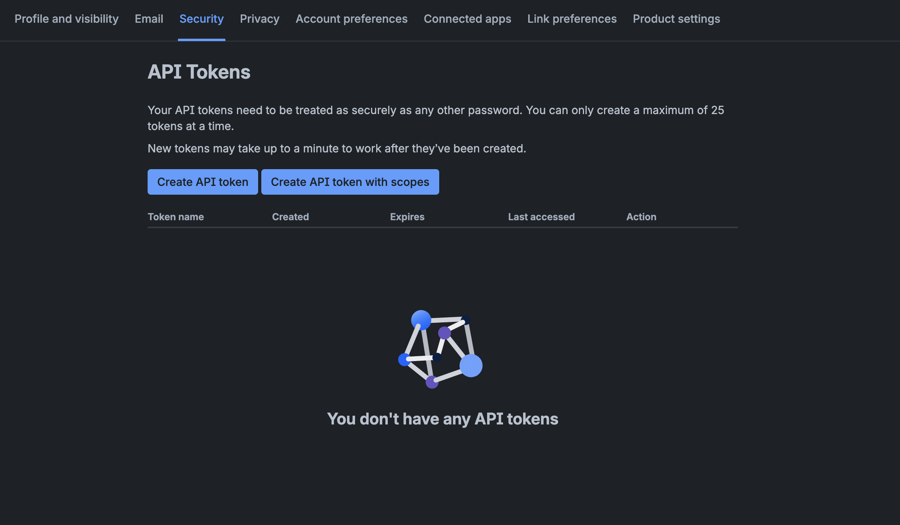

import Tabs from "@theme/Tabs";
import TabItem from "@theme/TabItem";

# Finding Your Git Provider Token

:::tip

Always grant the **minimum** permission the workflow needs — for cloning test code that is
**read-only access to repository contents**. Set an expiration and rotate tokens periodically.

:::

---

## GitHub

GitHub offers **fine-grained** personal access tokens and **classic** tokens.

**Create a fine-grained token:**

1. In the upper-right corner of any GitHub page, click your profile picture, then **Settings**.
2. In the left sidebar, click **Developer settings**.
3. Under **Personal access tokens**, click **Fine-grained tokens**, then **Generate new token**.
   Direct link: [github.com/settings/personal-access-tokens](https://github.com/settings/personal-access-tokens)
4. Set a **name** and **expiration**, then under **Repository access** select the repositories the workflow clones.
5. Under **Permissions → Repository permissions**, set **Contents** to **Read-only**.
6. Click **Generate token** and copy the value — you won't be able to see it again.

---

## GitLab

1. In the upper-right corner, select your avatar, then **Edit profile** (this opens **User Settings**).
2. In the left sidebar, under **Access**, select **Personal access tokens**.
   Direct link: [gitlab.com/-/user_settings/personal_access_tokens](https://gitlab.com/-/user_settings/personal_access_tokens)
   (on self-managed GitLab, replace `gitlab.com` with your instance host).
3. Select **Generate token**, then choose the token type:
   - **Legacy token** (simplest for read-only) — under **Scopes** select **`read_repository`**.
     This grants read-only clone/pull access and nothing else.
   - **Fine-grained token** (Beta, GitLab 18.10+) — there is **no single "read-only" switch**.
     Under the **Repository** resource, enable only **Code** with the **Read** action; leave the
     other Repository permissions (Merge Request, Protected Branch, etc.) unchecked. The **Code**
     permission is what allows `git clone`/read.
4. Give the token a name and an expiration date.
5. Select **Create personal access token** and copy the value.

---

## Bitbucket

**Create an API token:**

1. Select your **profile icon** (top right) → **Profile**, then open the **Security** tab
   on your Atlassian Account page.
2. Under the **API token** section, select **Create and manage API tokens**.
   Direct link: [id.atlassian.com/manage-profile/security/api-tokens](https://id.atlassian.com/manage-profile/security/api-tokens)

   :::note

   The "API token" section describes Jira/Confluence basic auth, but the linked page is also where
   Bitbucket tokens live — you want **Create API token with scopes** (not the plain "Create API token").

   :::
3. Select **Create API token with scopes**, give it a name and an **expiry date**.
4. Select **Bitbucket** as the app, then assign the **`read:repository:bitbucket`** scope.
5. Create the token and copy the value.

:::tip

If you connect Testkube to GitHub across a whole organization, the
[Centralized GitHub App](/articles/github-app-auth) avoids per-repository tokens entirely.

:::
