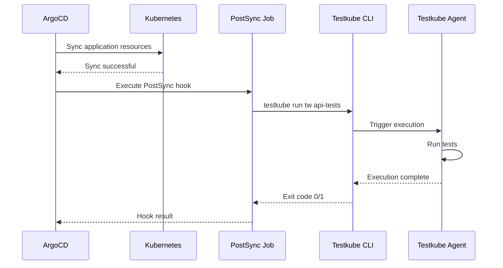
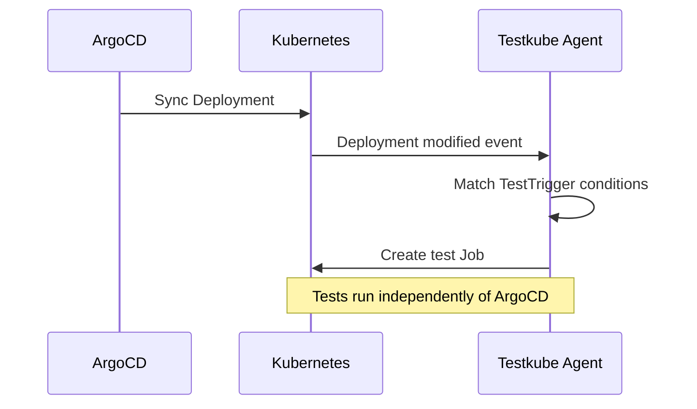
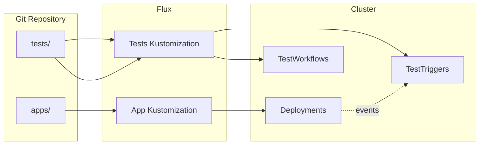
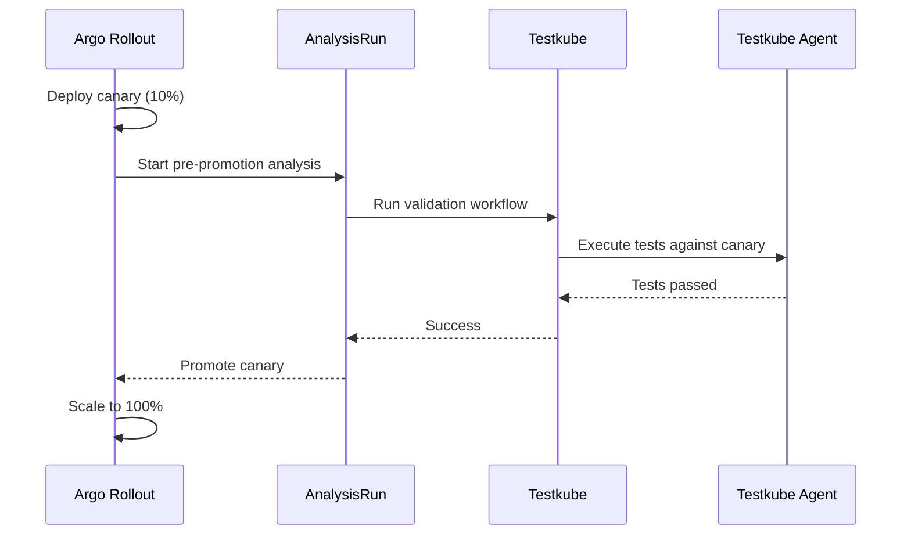
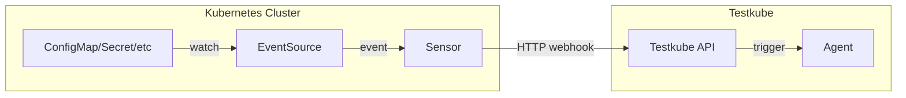

# GitOps with Testkube

Testkube is designed from the ground up to integrate seamlessly with GitOps workflows. As a Kubernetes-native 
Continuous Testing Platform, Testkube stores all its core resources as Custom Resource Definitions (CRDs), making 
Git the natural source of truth for your TestWorkflow, TestTrigger and Webhook definitions.

This guide provides a high-level overview of how Testkube fits into GitOps-managed infrastructure.

## Why Testkube for GitOps?

Traditional CI/CD-driven testing approaches often create a disconnect between your application deployment state 
and your test execution. Tests are triggered by pipeline events rather than actual cluster state changes, 
making it difficult to validate deployments consistently.

Testkube addresses this by:

- **Storing tests as Kubernetes CRDs** - TestWorkflows, Triggers, Webhooks, etc. live alongside your application 
  manifests in Git, versioned and reviewed through the same processes.
- **Executing tests inside your cluster** - No need to expose services externally for testing; tests run where 
  your applications run.
- **Reacting to cluster state** - Kubernetes Event Triggers and GitOps tool hooks ensure tests run when 
  deployments actually change, not just when pipelines complete.
- **Supporting declarative execution** - TestWorkflowExecution CRDs allow you to trigger tests declaratively, 
  perfect for GitOps reconciliation loops.

## Core Concepts

### Test Workflows as CRDs

Test Workflows are Kubernetes Custom Resources that define how your tests are orchestrated. They can be 
stored in your Git repository and managed through your GitOps tooling:

```yaml
apiVersion: testworkflows.testkube.io/v1
kind: TestWorkflow
metadata:
  name: api-integration-tests
  namespace: testkube
  labels:
    app: my-api
    test-type: integration
spec:
  content:
    git:
      uri: https://github.com/myorg/api-tests
      branch: main
  steps:
    - name: Run tests
      run:
        image: postman/newman:latest
        args: ["run", "collection.json"]
```

When your GitOps controller syncs this resource to your cluster, the Testkube Agent automatically 
registers it and makes it available for execution.

### Kubernetes Event Triggers

TestTriggers allow you to automatically execute Test Workflows when Kubernetes resources change. 
This is particularly powerful in GitOps scenarios where you want tests to run after deployments 
are reconciled:

```yaml
apiVersion: tests.testkube.io/v1
kind: TestTrigger
metadata:
  name: test-on-deployment-update
  namespace: testkube
spec:
  selector:
    matchLabels:
      testkube.io/resource-kind: Deployment
      app: my-api
  event: modified
  conditionSpec:
    conditions:
      - type: Available
        status: "True"
  action: run
  execution: testworkflow
  testSelector:
    name: api-integration-tests
```

This trigger executes the `api-integration-tests` workflow whenever a Deployment with the label 
`app: my-api` is modified and becomes available.

### Declarative Test Execution

For scenarios where you need to trigger a specific test execution as part of a GitOps sync, 
TestWorkflowExecution CRDs provide a declarative approach:

```yaml
apiVersion: testworkflows.testkube.io/v1
kind: TestWorkflowExecution
metadata:
  name: release-validation
  namespace: testkube
spec:
  testWorkflow:
    name: full-regression-suite
  executionRequest:
    config:
      environment: staging
    tags:
      release: "v2.1.0"
```

Creating or updating this resource triggers an execution of the specified workflow.

## GitOps Tool Integrations

Testkube integrates with popular GitOps tools through both native Kubernetes mechanisms and 
tool-specific hooks:

| Tool | Integration Method | Use Case |
|------|-------------------|----------|
| **ArgoCD** | Resource Hooks, Kubernetes Triggers | Post-sync validation, continuous testing |
| **Flux** | Kubernetes Triggers, Kustomizations | Automated sync-based testing |
| **Argo Rollouts** | AnalysisTemplates | Progressive delivery validation |
| **Argo Events** | HTTP Triggers, Sensors | Event-driven test orchestration |

### ArgoCD Integration

ArgoCD is the most common GitOps tool used with Testkube. There are two primary patterns:

**Pattern 1: Post-Sync Resource Hooks**

Execute tests after ArgoCD successfully syncs your application:



**Pattern 2: Kubernetes Event Triggers**

React to resource changes regardless of how they were applied:



For detailed setup instructions, see [Using Testkube with ArgoCD](/articles/argocd-integration).

### Flux Integration

Flux users can leverage Kustomizations to sync Test Workflows alongside application resources:



For detailed setup instructions, see [GitOps Testing with Flux](/articles/flux-integration).

### Progressive Delivery with Argo Rollouts

Testkube can serve as an analysis provider for Argo Rollouts, validating canary or blue-green 
deployments before promotion:



For detailed setup instructions, see [Using Testkube with Argo Rollouts](/articles/argorollouts-integration).

### Event-Driven Testing with Argo Events

For complex event-driven scenarios, Argo Events can trigger Testkube executions via webhooks:



For detailed setup instructions, see [Integrating Testkube with Argo Events](/articles/argoevents-integration).

## Best Practices

### Repository Structure

Organize your test resources alongside application manifests:

```
├── apps/
│   ├── api/
│   │   ├── deployment.yaml
│   │   └── service.yaml
│   └── frontend/
│       └── deployment.yaml
├── tests/
│   ├── workflows/
│   │   ├── api-integration.yaml
│   │   └── e2e-tests.yaml
│   ├── triggers/
│   │   └── on-api-update.yaml
│   └── templates/
│       └── common-steps.yaml
└── kustomization.yaml
```

### Preventing Pruning of Testkube Resources

When using ArgoCD with auto-sync and pruning enabled, add annotations to prevent intermediate 
test execution resources from being deleted:

```yaml
apiVersion: testworkflows.testkube.io/v1
kind: TestWorkflow
metadata:
  name: my-test
spec:
  job:
    annotations:
      argocd.argoproj.io/compare-options: IgnoreExtraneous
      argocd.argoproj.io/sync-options: Prune=false
```

Consider creating a [Workflow Template](/articles/test-workflow-templates) to apply these 
annotations consistently across all your workflows.

### Sync Waves for Proper Ordering

Use ArgoCD sync waves to ensure resources are created in the correct order:

```yaml
# TestWorkflow - sync first
metadata:
  annotations:
    argocd.argoproj.io/sync-wave: "1"

# TestTrigger - sync after workflows exist
metadata:
  annotations:
    argocd.argoproj.io/sync-wave: "2"

# Application Deployment - sync last, triggers tests
metadata:
  annotations:
    argocd.argoproj.io/sync-wave: "3"
```

### Environment-Specific Configuration

Use Kustomize overlays or Helm values to configure environment-specific test parameters:

```yaml
# base/workflow.yaml
apiVersion: testworkflows.testkube.io/v1
kind: TestWorkflow
metadata:
  name: api-tests
spec:
  config:
    - name: API_URL
      type: string

# overlays/staging/patch.yaml
- op: add
  path: /spec/config/0/default
  value: "https://api.staging.example.com"
```

## Related Documentation

- [Using Testkube with ArgoCD](/articles/argocd-integration) - Detailed ArgoCD integration guide
- [GitOps Testing with Flux](/articles/flux-integration) - Flux-specific setup instructions
- [Using Testkube with Argo Rollouts](/articles/argorollouts-integration) - Progressive delivery validation
- [Integrating Testkube with Argo Events](/articles/argoevents-integration) - Event-driven test execution
- [Kubernetes Event Triggers](/articles/test-triggers) - Native Testkube triggering
- [Testkube Execution CRDs](/articles/test-executions) - Declarative test execution
- [Test Workflow Templates](/articles/test-workflow-templates) - Reusable workflow components
- [Testkube CRD Reference](/articles/crds) - Complete CRD documentation
