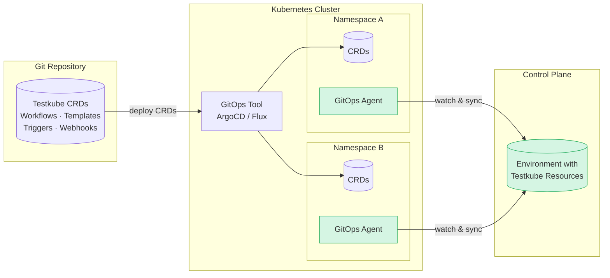

# GitOps with Testkube

Testkube is designed from the ground up to integrate seamlessly with GitOps workflows. As a Kubernetes-native 
Test Orchestration Platform, Testkube manages all its core resources as Custom Resource Definitions (CRDs), making 
Git the natural source of truth for your TestWorkflow, TestTrigger and Webhook definitions.

This guide provides a high-level overview of how Testkube fits into GitOps-managed infrastructure.

## Why GitOps with Testkube?

Traditional CI/CD-driven testing approaches often create a disconnect between your application deployment state 
and your test execution. Tests are triggered by pipeline events rather than actual cluster state changes, 
making it difficult to validate deployments consistently.

GitOps with Testkube addresses this by:

- **Managing tests as Kubernetes CRDs** - TestWorkflows, Triggers, Webhooks, etc. live alongside your application 
  manifests in Git, versioned and reviewed through the same processes.
- **Executing tests inside your cluster** - No need to expose services externally for testing; tests run where 
  your applications run.
- **Reacting to cluster state** - Kubernetes Event Triggers and GitOps tool hooks ensure tests run when 
  deployments actually change, not just when pipelines complete.
- **Supporting declarative execution** - TestWorkflowExecution CRDs allow you to trigger tests declaratively, 
  perfect for GitOps reconciliation loops.

## The Testkube GitOps Agent

Allthough Testkube Resources are stored in the Testkube Control Plane, they can still be provided and managed as CRDs in an external/GitOps setup by using 
the GitOps Agent introduced with Testkube 2.7.0. 

Once deployed, a GitOps-Agent will monitor its namespace for any Testkube Resources and copy those to the connected Environment in the Control-Plane. 
Coupled with a GitOps tool like ArgoCD or Flux, this can be used to effectively sync Testkube Resources from any number of Git repositories 
and deployments/namespaces into your Testkube Environment(s).



:::tip
Read more about different types of Testkube Agents at [Testkube Agents](/articles/agents-overview).
:::

### Unidirectional Sync

Syncing is uni-directional, i.e. from GitOps Agent to Control Plane only - changes in the Control Plane are not synced back to the Resource in the Agent Namespace.

Synced resources are left in the monitored namespace to enable the deletion behaviour described below.

### Resource Update Behaviour

The GitOps Agent will currently overwrite any existing/conflicting Testkube Resources already in the Control Plane:

- If you make changes to a Resource via the Testkube Dashboard or any other mechanism, those changes will be overwritten when a new version of the Resource is detected
  and synced by a GitOps Agent.
- If you have multiple GitOps Agents syncing the same Teskube Resources into the same Testkube Environment, these will overwrite each other.

### Deleting Resources

A GitOps Agent will only delete Resources in the Control Plane if those are initially available and deleted locally, i.e. it won't delete 
resources not initially available in its namespace. For example:

> A GitOps Agent is deployed inte Namespace A which contains Workflow B. The Testkube Environment the Agent is connected to already contains another Workflow C.
>
> - the Agent will sync Workflow B to the Environment, Workflow C will be left as is
> - if Workflow B is deleted from Namespace A, the Agent will delete it from the Testkube Environment also

### Enable GitOps Agent via Helm

Enable Kubernetes-to-Control-Plane sync in your agent Helm values.

If you install the full `testkube` chart:

```yaml
testkube-api:
  next:
    gitops:
      syncKubernetesToCloud: true
```

For self-registering Runner Agents (`testkube-runner` chart):

```yaml
gitops:
  enabled: true
```

## Triggering Testkube Workflows in GitOps

Testkube provides several native mechanisms for triggering Workflows in GitOps scenarios, while specific GitOps tools provide
their own mechanisms for triggering Workflows (for example, ArgoCD Resource Hooks and Flux Kustomizations).

## Using Kubernetes Event Triggers

TestTriggers allow you to automatically execute Test Workflows when Kubernetes resources change. 
This is particularly powerful in GitOps scenarios where you want tests to run after deployments 
are reconciled:

```yaml
apiVersion: tests.testkube.io/v1
kind: TestTrigger
metadata:
  name: test-on-deployment-update
  namespace: testkube
spec:
  selector:
    matchLabels:
      testkube.io/resource-kind: Deployment
      app: my-api
  event: modified
  conditionSpec:
    conditions:
      - type: Available
        status: "True"
  action: run
  execution: testworkflow
  testSelector:
    name: api-integration-tests
```

This trigger executes the `api-integration-tests` workflow whenever a Deployment with the label 
`app: my-api` is modified and becomes available.

### Declarative Test Execution

For scenarios where you need to trigger a specific test execution as part of a GitOps sync, 
TestWorkflowExecution CRDs provide a declarative approach:

```yaml
apiVersion: testworkflows.testkube.io/v1
kind: TestWorkflowExecution
metadata:
  name: release-validation
  namespace: testkube
spec:
  testWorkflow:
    name: full-regression-suite
  executionRequest:
    config:
      environment: staging
    tags:
      release: "v2.1.0"
```

Creating or updating this resource triggers an execution of the specified workflow.

## GitOps Tool Integrations

Testkube integrates with popular GitOps tools through both native Kubernetes mechanisms and 
tool-specific hooks:

| Tool | Integration Method | Use Case | Instructions |
|------|-------------------|----------| -------------- |
| **ArgoCD** | Resource Hooks, Kubernetes Triggers | Post-sync validation, continuous testing | [Read More](/articles/argocd-integration)
| **Flux** | Kubernetes Triggers, Kustomizations | Automated sync-based testing | [Read More](/articles/flux-integration)

:::tip Related Integrations
Testkube also integrates with tools for [Progressive Delivery](/articles/argorollouts-integration) (Argo Rollouts, Keptn) 
and [Event-Driven Automation](/articles/argoevents-integration) (Argo Events, Argo Workflows, CDEvents) which complement 
GitOps workflows but serve different purposes.
:::

## Best Practices

### Repository Structure

Organize your test resources alongside application manifests:

```
├── apps/
│   ├── api/
│   │   ├── deployment.yaml
│   │   └── service.yaml
│   └── frontend/
│       └── deployment.yaml
├── tests/
│   ├── workflows/
│   │   ├── api-integration.yaml
│   │   └── e2e-tests.yaml
│   ├── triggers/
│   │   └── on-api-update.yaml
│   └── templates/
│       └── common-steps.yaml
└── kustomization.yaml
```

### Preventing Pruning of Testkube Resources

When using ArgoCD with auto-sync and pruning enabled, add annotations to prevent intermediate 
test execution resources from being deleted:

```yaml
apiVersion: testworkflows.testkube.io/v1
kind: TestWorkflow
metadata:
  name: my-test
spec:
  job:
    annotations:
      argocd.argoproj.io/compare-options: IgnoreExtraneous
      argocd.argoproj.io/sync-options: Prune=false
```

Consider creating a [Workflow Template](/articles/test-workflow-templates) to apply these 
annotations consistently across all your workflows.

### Temporarily Pausing GitOps Sync to Control Plane

If you need to temporarily protect a Testkube resource from being changed by the GitOps sync agent,
add the `testkube.io/no-gitops-sync` annotation to the resource:

```yaml
apiVersion: testworkflows.testkube.io/v1
kind: TestWorkflow
metadata:
  name: api-integration-tests
  annotations:
    testkube.io/no-gitops-sync: "true"
```

When the value is set to `"true"`, Control Plane sync for that resource is skipped:

- Update/create sync requests are accepted but ignored.
- Delete sync requests are accepted but ignored.

This allows temporary manual edits in the Control Plane without being overwritten by GitOps sync.

To re-enable sync, remove the annotation (or set it to `"false"`) and then apply your desired
resource state again from Git.

### Sync Waves for Proper Ordering

Use ArgoCD sync waves to ensure resources are created in the correct order:

```yaml
# TestWorkflow - sync first
metadata:
  annotations:
    argocd.argoproj.io/sync-wave: "1"

# TestTrigger - sync after workflows exist
metadata:
  annotations:
    argocd.argoproj.io/sync-wave: "2"

# Application Deployment - sync last, triggers tests
metadata:
  annotations:
    argocd.argoproj.io/sync-wave: "3"
```

### Environment-Specific Configuration

Use Kustomize overlays or Helm values to configure environment-specific test parameters:

```yaml
# base/workflow.yaml
apiVersion: testworkflows.testkube.io/v1
kind: TestWorkflow
metadata:
  name: api-tests
spec:
  config:
    - name: API_URL
      type: string

# overlays/staging/patch.yaml
- op: add
  path: /spec/config/0/default
  value: "https://api.staging.example.com"
```

## Related Documentation

### GitOps Integrations
- [Using Testkube with ArgoCD](/articles/argocd-integration) - Detailed ArgoCD integration guide
- [GitOps Testing with Flux](/articles/flux-integration) - Flux-specific setup instructions

### Progressive Delivery
- [Using Testkube with Argo Rollouts](/articles/argorollouts-integration) - Canary and blue-green deployment validation
- [Keptn Integration](https://testkube.io/learn/leveraging-testkube-as-a-quality-gate-in-multi-stage-deployments-with-keptn) - Quality gates in multi-stage deployments

### Event-Driven Automation
- [Integrating Testkube with Argo Events](/articles/argoevents-integration) - Event-driven test execution
- [Using Testkube with Argo Workflows](/articles/argoworkflows-integration) - Workflow orchestration
- [CDEvents Integration](/articles/cd-events) - CI/CD event interoperability

### Core Testkube Features
- [Kubernetes Event Triggers](/articles/test-triggers) - Native Testkube triggering
- [Testkube Execution CRDs](/articles/test-executions) - Declarative test execution
- [Test Workflow Templates](/articles/test-workflow-templates) - Reusable workflow components
- [Testkube CRD Reference](/articles/crds) - Complete CRD documentation
