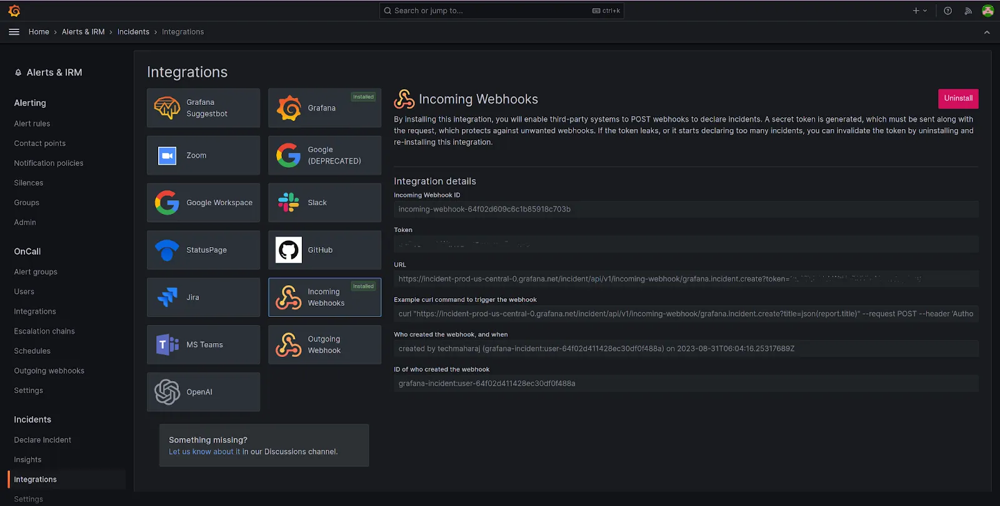
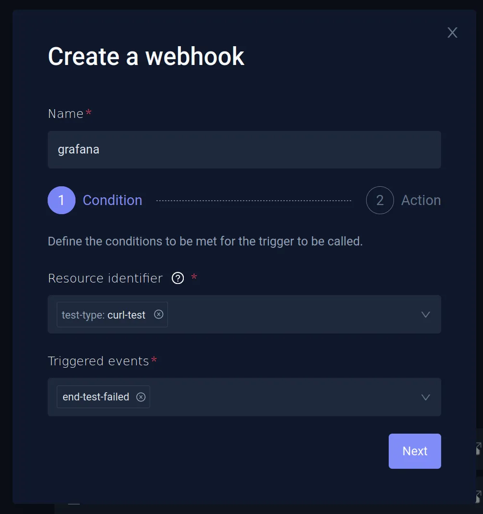
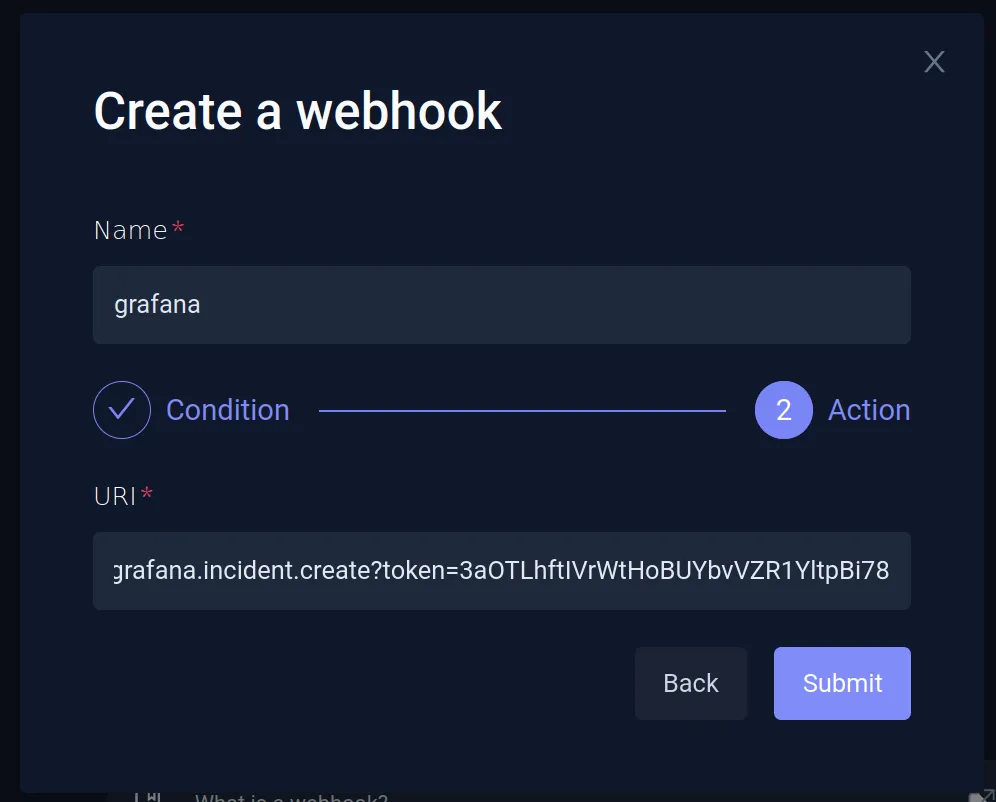
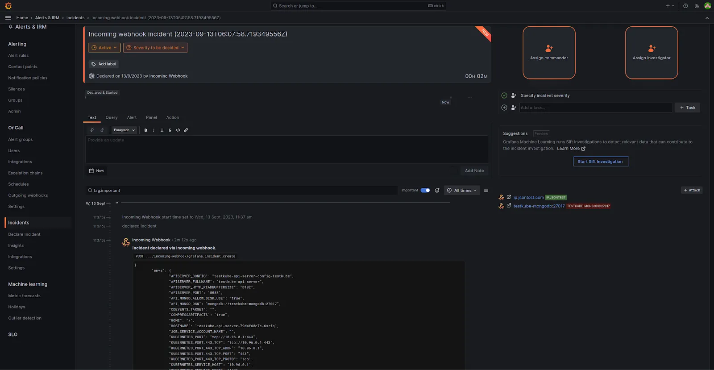

# Integrating with Grafana Using Webhooks

When creating webhooks to integrate Testkube with external systems, you can update Grafana's incident dashboard when the test fails. In this document, we'll configure Grafana to receive notifications. Please visit the [Webhooks](..//articles/webhooks.mdx) page for the details for using Webhooks with Testkube.

## Setting Up Grafana Integration

This example uses Grafana cloud; you can also use a self-hosted Grafana instance. The steps would mostly be the same. Create a Grafana Cloud account if you don't already have one. The free account is sufficient for these steps.

Once logged in, navigate to **Alerts & IRM -> Incidents -> Integrations**. Grafana will provide you with a multitude of integration options, choose **Incoming Webhooks**. Click on the **Install Integration** button and Grafrana will set the endpoint and provide you with the details.

Note down the URL for the endpoint. You’ll need this while configuring the webhook in Testkube.

## Creating a Webhook in Testkube

Testkube allows you to create Webhooks using the Dashboard as well as the CLI.

### Using the Testkube Dashboard

We'll set up a webhook for Grafana using the dashboard. This webhook will trigger on the test-end-failure event and send the data to the Grafana webhook incident that we configured.

Launch the Testkube dashboard, navigate to the Webhooks section and **Create a new webhook**. Provide a name and choose the **Resource Identifier** as **test-type: curl-test**, which refers to the cURL test. For **Triggered events**, choose **end-test-failed**.

On the next screen, provide the Grafana endpoint URL that you generated while setting up Grafana integration. This will result in a successfully configured Grafana webhook.

## Testing the Webhook

To test the Grafana webhook, run the curl-test that was created.

When the test fails, an incident will appear on the Grafana incident dashboard. You can click on the individual incident to get more details, assign it to other members, etc.

Watch the following video to see these steps in action:

<iframe width="560" height="315" src="https://www.youtube.com/embed/osbGsoPpdiQ" title="Set up Grafana Dashboard for your tests in Kubernetes with Testkube" frameborder="0" allow="accelerometer; autoplay; clipboard-write; encrypted-media; gyroscope; picture-in-picture; web-share" referrerpolicy="strict-origin-when-cross-origin" allowfullscreen></iframe>
