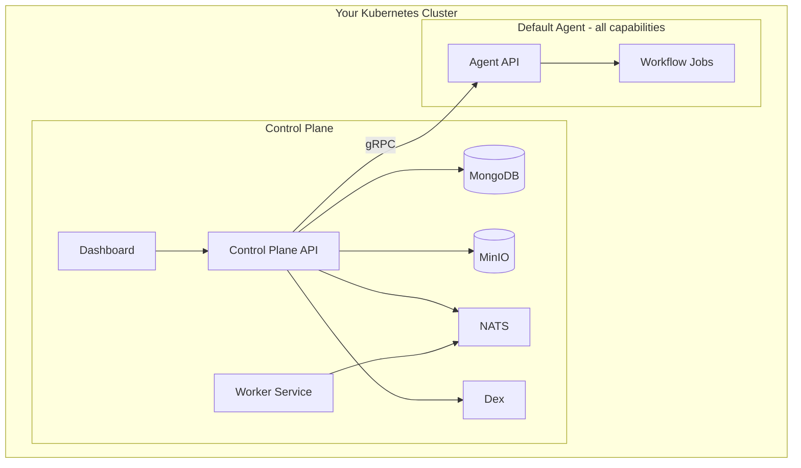
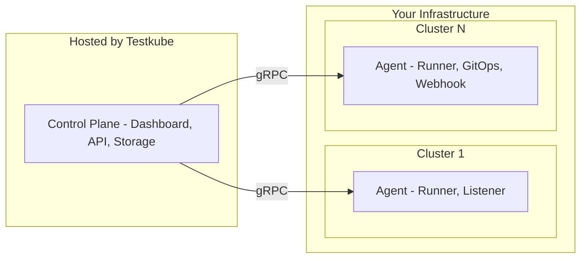
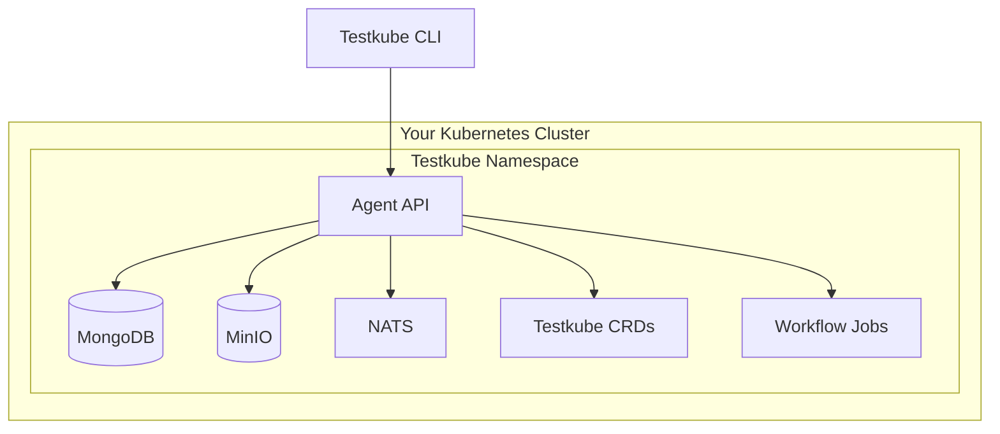

# Testkube Installation Overview

## Overview

Testkube contains two main components:

1. The **Testkube Control Plane**, which includes the [Dashboard](/articles/testkube-dashboard-explore), Storage for Resources/Results/Logs/Artifacts, Scheduling, User/Role mgmt, Insights, 3rd party integrations, etc. - [Read More](/articles/control-plane-source-of-truth)

2. One or more **Testkube Agents** with specific [capabilities](/articles/agents-overview): executing Test Workflows (Runner), listening for Kubernetes Events (Listener), syncing CRDs via GitOps (GitOps), and emitting Webhooks/CDEvents (Webhook).

   The Agent is **Open-Source** and can be deployed both Standalone and connected to the Control Plane.

   **Agents are _always_ deployed by you in your own infrastructure.**

## Deployment Options

You can deploy Testkube in one of the following ways:

| Deployment Option         | &nbsp;&nbsp;&nbsp;Licensing&nbsp;&nbsp;&nbsp; | &nbsp;&nbsp;&nbsp;&nbsp;&nbsp;&nbsp;&nbsp;&nbsp;Agent&nbsp;&nbsp;&nbsp;&nbsp;&nbsp;&nbsp;&nbsp;&nbsp; | &nbsp;&nbsp;&nbsp;&nbsp;&nbsp;&nbsp;&nbsp;&nbsp;Control&nbsp;Plane&nbsp;&nbsp;&nbsp;&nbsp;&nbsp;&nbsp;&nbsp;&nbsp; | &nbsp;&nbsp;&nbsp;Dashboard&nbsp;&nbsp;&nbsp; | &nbsp;&nbsp;&nbsp;&nbsp;&nbsp;CLI&nbsp;&nbsp;&nbsp;&nbsp;&nbsp; |
|---------------------------|:---------------------------------------------:|:-----------------------------------------------------------------------------------------------------:|:------------------------------------------------------------------------------------------------------------------:|:---------------------------------------------:|:---------------------------------------------------------------:|
| **On-Prem Control Plane** |   [Commercial](https://testkube.io/pricing)   |                                             Hosted by you                                             |                                                   Hosted by you                                                    |                       ✅                       |                                ✅                                |
| **Cloud Control Plane**   |   [Commercial](https://testkube.io/pricing)   |                                             Hosted by you                                             |                                                 Hosted by Testkube                                                 |                       ✅                       |                                ✅                                |
| **Standalone Agent**      |     [Open Source](/articles/open-source)      |                                             Hosted by you                                             |                                                         ❌                                                          |                       ❌                       |                                ✅                                |

The high-level deployment architecture and how to get started with each of these is described below.

:::note
An architectural overview of Testkube and its components is available in the [Architecture Reference](../architecture).
:::

## On-Prem Control Plane

Testkube with the On-Prem Control Plane runs entirely in your infrastructure and can also run in air-gapped environments.
The default installation deploys both the Control Plane and a default Testkube Agent (with all capabilities enabled) within the same namespace.

You can install a preconfigured version of Testkube On-Prem [with the CLI][install-cli] for an out-of-the-box experience
or install [with Helm][install-helm] for more configurability in production scenarios.

A trial license will be required during installation - **[schedule time with our Solutions Engineering team](https://testkube.io/demo)** to get 
your license and answers to any questions you have.

A high-level deployment architecture for Testkube On-Prem is shown below.

:::tip
Check out [Helm Components](/articles/helm-components) to see all the actual components used by Testkube.
:::

## Cloud Control Plane

When using the Testkube Cloud Control Plane (available at https://app.testkube.io), the Control Plane is managed by the Testkube team. You can create Environments and manage Resources (Workflows, Triggers, etc.) directly from the Dashboard. You then deploy [Testkube Agents](/articles/agents-overview) in your infrastructure when you want to execute Workflows, listen for events, etc.

A trial account will be required for evaluating the Cloud Control Plane - **[schedule time with our Solutions Engineering team](https://testkube.io/demo)** to get 
your account and answers to any questions you have.

Once onboarded, you will be prompted to create an initial Testkube Environment, which will provide you with the required CLI/Helm commands to
deploy the corresponding Testkube Agent in your infrastructure - [Read More](/articles/environment-management#creating-a-new-environment)

A high-level deployment architecture for the Testkube Cloud Control Plane is shown below.

:::info
Even when using the Testkube Cloud Control Plane, your actual tests are never run or stored on our servers, only test
logs and artifacts will be stored.
:::

## Standalone Agent

The Testkube Agent is Open Source and can be deployed without being connected to the Testkube
Control Plane. All management and test execution tasks are done through the [Testkube CLI](/articles/cli).

- Learn more about how to [deploy the Standalone Agent][deploy-standalone].

[cloud]: https://app.testkube.io/
[install-cli]: /articles/tutorial/quickstart/individual-evaluation
[install-helm]: /articles/install/install-with-helm
[deploy-standalone]: /articles/install/standalone-agent
[testkube-repo]: https://github.com/kubeshop/testkube
