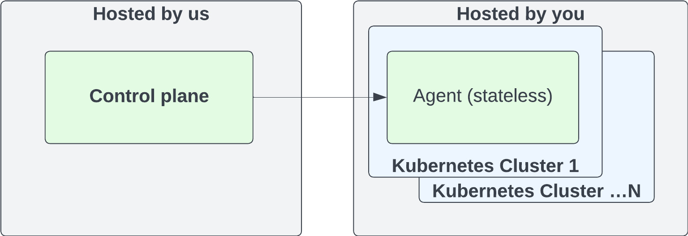

# Testkube Cloud Control Plane

If you don't want to host the Testkube Control Plane in your infrastructure, you can use the Cloud Control Plane provided
by the Testkube team at https://app.testkube.io. You can create Environments and manage Resources (Workflows, Triggers, etc.) directly from the Dashboard. You then deploy [Testkube Agents](/articles/agents-overview) in your infrastructure when you want to execute Workflows, listen for Kubernetes events, etc.

## Getting Started

To get started with the Cloud Control Plane, go to https://app.testkube.io and sign up for a trial account. During the onboarding, 
you will be prompted to create an initial Testkube Environment. You can start creating Workflows and other resources right away. When you are ready to execute your Workflows, you can deploy [Testkube Agents](/articles/agents-overview) in your infrastructure using the provided CLI/Helm commands. You can then add as many Environments and Agents as you need - [Read More](/articles/environment-management#creating-a-new-environment).

For local deployment of the Agent (for example during evaluation) you can create your own local Kubernetes cluster - [Read More](quickstart-no-k8s).

## Deployment Architecture

A high-level deployment architecture for the Testkube Cloud Control Plane is shown below.



## Network traffic control

### Egress

To allow the agent to connect to the Control Plane, you will need to allow
egress connections to the `agent.testkube.io` host on port `443`. If this
connection is proxied, make sure the proxy supports HTTP/2 as the agent uses
a bidirectional gRPC connection to communicate with the control plane and that
works best over HTTP/2.

Test executions will need to send artifacts and logs to a Cloud Storage bucket
on GCP so egress traffic to the `storage.googleapis.com` host on port `443`
should also be allowed.

Testkube includes a background service that checks the latest Agent version by 
querying the GitHub Releases API. In environments with restricted egress, 
allow access to `api.github.com` or disable the check by setting 
`DISABLE_AGENT_VERSION_CHECK=true` on the Testkube Enterprise API:
```yaml
testkube-cloud-api:
  additionalEnv:
    DISABLE_AGENT_VERSION_CHECK: true
```
The check is informational only and does not affect core functionality. 
For offline installations, it is disabled by default.

### Ingress

When using the Testkube Cloud Control Plane, all network traffic is initiated from the Agent to
the Control Plane. If you are using a stateful firewall you will not need
to add any additional ingress rules, but if not then you will need to allow
ingress connections on the ephemeral ports for your particular OS.
