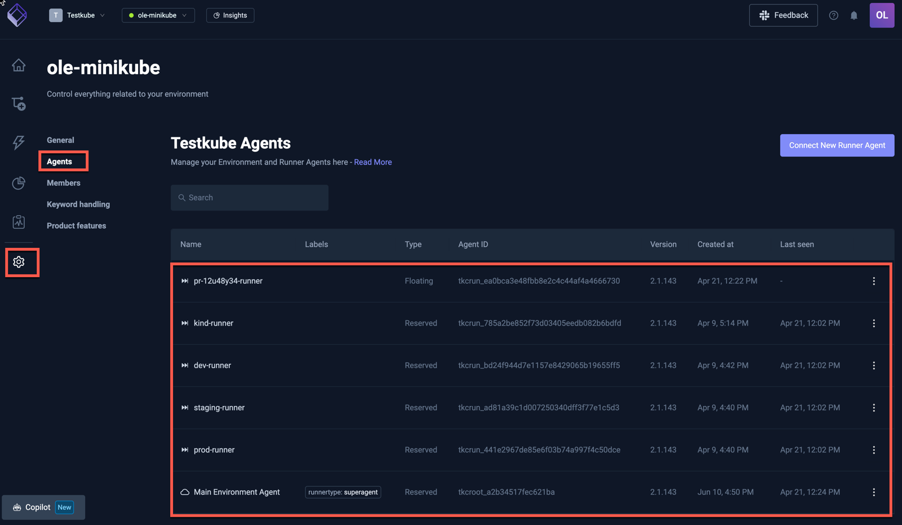
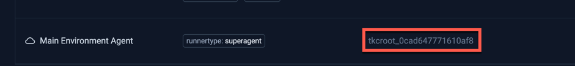

# Multi-Agent Environments 

Testube 2.X introduces the concept of Multi-Agent Environments, which adds two major new capabilities:

1. The ability to **run the same Workflow in multiple namespaces/clusters**, (possibly at the same time!).
2. The ability to easily **add ephemeral Runners** to an Environment and run your Test Workflows on them. 

Both of these scenarios were previously hard to achieve efficiently, and required elaborate scripting as 
described in [Remote Workflow Execution](/articles/remote-workflow-execution) and [Ephemeral Environments](/articles/ephemeral-environments).

The Multi-Agent functionality is available to any existing and new Testkube Environment, provided it has been
upgraded to the latest version of the Testkube Control Plane and Testkube Agent.

## Runner Agents

To provide this capability, Testkube now allows you to add an arbitrary number of **Runner Agents** to an environment from 
the [Agent Management](/testkube-pro/articles/agent-management) section of your Environment Settings or 
directly with the CLI (see below).

Runner Agents (or just "Runners") are lightweight agents that can be installed in any namespace/cluster where you need to
run your Testkube Workflows. Each Runner Agent has a name, an internal id, and an optional list of labels which
can be used to select Agents for execution:



:::note
Testkube Environments always require a Standalone Agent for core functionality - [Read More](#the-standalone-agent-in-multi-agent-environments).
:::

## Running Workflows on Runner Agents

Once Runner Agents have been added to an Environment, they can be used to execute your Workflows:

- Via the Dashboard as described at [Running a Workflow](/articles/testkube-dashboard-workflow-details#running-a-workflow).
- Via the CLI by using the `--target` argument for the `testkube run testworkflow` command (see below).

When a Workflow has been executed on multiple Runner Agents, the Dashboard provides an expandable section for the corresponding 
executions, see [Multi-agent Executions](/articles/testkube-dashboard-workflow-details#multi-agent-executions).

:::warning
Runner Agents do **not** support execution of legacy Tests and TestSuites.
:::

## Runner Agent Quickstart

### 1. Install your first Runner Agent

After installing the [Testkube CLI](/articles/cli) and using `testkube login` to log in to your 
Testkube Environment, use `testkube install runner <name> --create` command to install your first Runner Agent:

```sh
$ testkube install runner staging-runner --create 
```

This will create and install a Runner Agent named `staging-runner` that can now be used to run your Workflows. 

### 2. Run your Workflows 

Run your Workflows on a specific Runner Agent by specifying the name of the agent with the `--target` argument:

```sh
testkube run testworkflow my-k6-test --target name=staging-runner
```

This schedules the `my-k6-test` Workflow to run on the `staging-runner` Runner we created above.

:::tip
Check out the [Multi-Agent CLI Overview](/articles/multi-agent-cli) for an overview of all available CLI 
commands related to Multi-Agent Environments.
:::

## Runner Agent modes

Runner Agents can be created in one of three different modes, impacting how they are selected for execution:

- **Independent Runners** (default) need to be targeted explicitly by name to run a Workflow (as in the Getting Started above).
- **Grouped Runners** can be targeted/filtered by labels/groups - allowing you to run a Workflow on either a single available 
  Runner (of several) or on multiple Runners at once.
- **Global Runners** do not need to be targeted by name but can be filtered by labels, the default Standalone Agent works as a Global Runner.

:::note
If you need to change the type of Runner Agent, you'll need to remove it first and re-add with the new type.
:::

### Independent Runners

A Runner not defined as either Grouped or Global as described below, will work as an "Independent Runner" and thus
_needs_ to be targeted explicitly by name to for Workflow execution.

```sh
testkube run testworkflow my-k6-test --target name=staging-runner
```

Specifying multiple `--target name=XXX` arguments will run your Workflow on one of the selected runners, if you want to 
run on all of them use the `--target-replicate` argument [described below](#running-workflows-on-multiple-runners).

:::tip
Independent Runners are useful for ephemeral use-cases when you need to target specific Workflow Executions, for example when 
provisioning an ephemeral cluster/namespace for testing a Pull Request you could:

- Provision the ephemeral cluster/namespace containing the application/components to be tested.
- Create/Install an Independent Runner named after the Pull Request in this cluster/namespace.
- Run Workflow(s) to test your application/components using this Runner explicitly.
- Tear down the cluster/namespace and its Runner once tests are run (or keep it around to debug failed tests).
- View corresponding Workflow Execution results in the Testkube Dashboard. 
:::

### Grouped Runners

Grouped Runners are defined by a `--group` argument when creating/installing:

```sh
# install grouped runner
$ testkube install runner staging-runner --create --group staging-runners
```

Grouped Runners _need_ to be either targeted by name (as independent runners above), or by group, which will 
use any available Runner in that group for execution:

```sh
# run Workflow on an available Runner in the staging-runners group
testkube run testworkflow my-k6-test --target group=staging-runners
```

If you want to run on _all_ Runners in a group, use the `--target-replicate name` argument:

```sh
# run Workflow on all Runners in the staging-runners group
testkube run testworkflow my-k6-test --target group=staging-runners --target-replicate name
```

:::tip
You can use `--target-replicate` to enable execution across multiple runners as described [below](#running-workflows-on-multiple-runners). 
:::

### Global Runners

Global Runners are created with the `--global` argument:

```shell
# install Global Runner
$ testkube install runner global-runner --create --global 
```

Global runners will be used either when no target is specified to the run command, or when a corresponding
label-filter (see below) applies to them.

```sh
# Run Workflow on an available Global Runner
testkube run testworkflow my-k6-test 
```

:::note 
The required Standalone Agent always works as a Global Runner.
:::

## Runner Targeting

### Using labels for filtering

Labels can be added to any type of Runner with the `-l <name=value>` argument during creation, these 
can then be used to filter out Runners that are used for execution:

```sh
# run Workflow on a Runner in the staging-runners group with the region=europe label
testkube run testworkflow my-k6-test --target group=staging-runners --target region=europe
```

```sh
# run Workflow on a Global Runner with the region=europe label
testkube run testworkflow my-k6-test --target region=europe
```

:::note
Since Independent Runners always need to be targeted by name, adding labels to them provides no added benefit
in regard to targeting/execution.
:::

### Running on Multiple Runners

If your target argument(s) select multiple Runners as shown above, Testkube will by default execute your Workflow
on one of the selected Runners (randomly selected). If you instead want to execute your Workflow on all selected Runners
simultaneously you can add `--target-replicate <label>` to the `testkube run testworkflow` command, which will "shard"
the Workflow Execution across all unique matches for the specified `label` (which could be `name`). 

For example:

```
testkube run testworkflow my-k6-test --target name=runner1 --target name=runner2 --target-replicate=name
```

will run the specified Workflow on both Runners since their names are unique. 

A more advanced use-case: For Grouped Runners created with these arguments:

```
name=1 group=my-group team=users
name=2 group=my-group team=users
name=3 group=my-group team=something
```

When executing a Workflow with

```
testkube run testworkflow my-k6-test --target group=my-group --target-replicate=team
```

Makes there two groups, sharded by team:
- The `users` team: `name=1 group=my-group team=users` and `name=2 group=my-group team=users`
- The `something` team: `name=3 group=my-group team=something`

Because of that, the execution will be run twice:
- any (1) of: `name=1 group=my-group team=users` and `name=2 group=my-group team=users`
- any (1) of: `name=3 group=my-group team=something`

### Targeting Runners in Testkube Resources

There are several situations where you might want to target specific Runners in your actual Testkube Resource
definitions:

- **Workflows** - you might want to ensure that a Workflow always runs on a Runner with a specific name or label - [Read More](/articles/test-workflows#runner-target).
- **Workflow CronJobs** - you might want to target scheduled Workflow Executions to specific Runner(s) - [Read More](/articles/test-workflows#targeting-specific-runners-in-cronjobs).
- **Triggers** - you might want Kubernetes Event Triggers to trigger Workflow Executions on specific Runner(s) - [Read More](/articles/test-triggers#targeting-specific-runners).
- **Execution CRDs** - you might want an `WorkflowExecution` CR to trigger Workflow Executions on specific Runner(s) - [Read More](/articles/test-executions#targeting-specific-runners).

Each of these definitions supports a corresponding `target` property:

```yaml
...
    target:
      match: [ <label>: <values> ]
      not: [ <label>: <values> ]
      replicate: [<labels>]
...
```

The following targets a specific Runner by name:

```yaml
...
    target:
      match: 
       - name: staging-runner
...
```

or run on a Grouped Runner:

```yaml
...
    target:
      match: 
       - group: region-us
...
```

Add `replicate` to mimic `--target-replicate` behavior described above, and `not` to exclude specific Runners, for example:

Run on all Runners in the `region-us` group, except the `k8s-1.21-spain` Runner:

```yaml
...
    target:
      match: 
        - group: region-eu
      not:
        - name: k8s-1.21-spain 
      replicate: 
        - name
...
```

## Queuing of Workflow Executions

When requesting to run a Workflow on a specific Runner, either by name or label(s), and no
matching Agent is available, Testkube will queue the execution of the Workflow indefinitely; once a corresponding
Runner is available (barring licensing restrictions [described below](#licensing-and-implications)) the queued
Workflow will be executed accordingly.

You can abort queued executions using the corresponding [CLI Command](/cli/testkube-abort-testworkflowexecution) or
from the Dashboard as before.

## The Standalone Agent in Multi-Agent Environments

Each Testkube Environment requires a **[Standalone Agent](standalone-agent)** (as before) which
provides core functionality for Triggers, Webhooks, Prometheus metrics, etc.

Standalone Agents are installed when initially creating an Environment and shown on the bottom of 
the list of Agents with the label `runnertype: superagent` and work as a Global Runner (described below).

You can target the Standalone Agent in several ways:

- By Label: `testkube run tw my-k6-test --target runnertype=superagent`
- By Name: `testkube run tw my-k6-test --target name=tkcenv_xxxxxxxxxx`
- By ID: `testkube run tw my-k6-test --target id=tkcroot_xxxxxxxxxx`

The ID is shown in the list of Agents (see below), the Name is the same `xxxx` prefixed with tkcenv instead.



## Migrating existing Environments

If you have an existing Environment that already has Workflows being executed by CI/CD, CronJobs, Kubernetes Event Triggers,
etc., these will continue to be executed on _any_ [Global Runner Agent](#global-runners) (including the required
Standalone Agent) connected to your Environment unless you update the corresponding triggering commands / configuration to target
a specific Runner Agent, either by name, group or label as described above.

## Licensing and implications

Runner Agents are licensed by concurrently active Runners, allowing you to add as many Runners as you want but only 
run Workflows concurrently on as many Runners as you have licensed. Workflows that cannot be executed because of unavailable 
Runners due to licensing constraints will be queued and executed as soon as a concurrent runner seat "frees up" to execute 
the queued Workflow.

Furthermore: 
- The concurrent runner limit is counted and enforced at the organization level, i.e., across all your environments.
- By default, you are given the same number of concurrent active runner seats as you have environments, please get in touch
  if you need more to evaluate this functionality.
