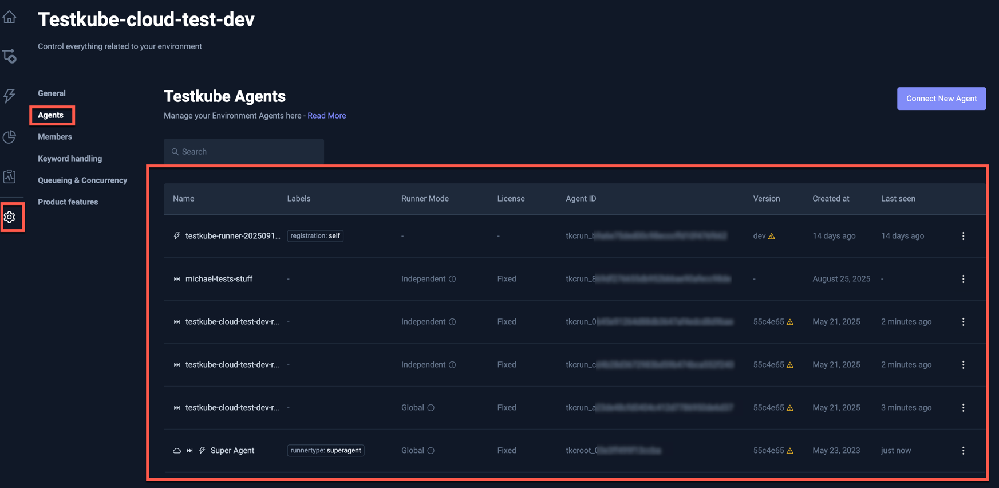

# Multi-Agent Environments

Testube 2.X introduces the concept of Multi-Agent Environments, which adds two major new capabilities:

1. The ability to **run the same Workflow in multiple locations**, (possibly at the same time!).
   - Previously, this would have required you to create separate Environments with dedicated Agents and manually 
     copy/sync/schedule your Workflows and their executions across these, 
     as described in [Remote Workflow Execution](/articles/remote-workflow-execution).
2. The ability to **add ephemeral Runners** to an Environment and run tests with them
   - Previously you would have had to manually create/manage Testkube Environments for your ephemeral Agents, or use
     a non-ephemeral Agent to run tests against ephemeral applications, with possible security implications - see
     [Ephemeral Environments](/articles/ephemeral-environments).

The Multi-Agent functionality is available to any existing and new Testkube Environment, provided it has been
upgraded to the latest version of the Testkube Control Plane and Testkube Agent.

## Two Types of Agents

To provide this capability, Testkube now supports two types of Agents for an Environment:

- Lightweight **Runner Agents** for running your tests wherever needed.
- The existing **Standalone Agent** which is required as before.

The Multi-Agent functionality is available to any existing and new Testkube Environment, provided it has been
upgraded to the latest version of the Testkube Control Plane and Testkube Agent

##  Runner Agents

Testkube now allows you to add an arbitrary number of **Runner Agents** to an environment from 
the [Agent Management](/testkube-pro/articles/agent-management) section of your Environment Settings.

Runner Agents are lightweight agents that can be installed in any namespace/cluster where you need to
run your Testkube Workflows. Each Runner Agent has a name, an id, and an optional list of labels which
can be used to select Agents for execution (see below).

Runner Agents are managed via the testkube CLI, as described below.



## Running Workflows on Runner Agents

Once Runner Agents have been added to an Environment, they can be used to execute your Workflows:

- Via the Dashboard as described at [Running a Workflow](/articles/testkube-dashboard-workflow-details#running-a-workflow).
- Via the CLI by using the `-target` argument on `testkube run testworkflow` (see below), either
    - specifying the name(s) of the runner(s) to run on
    - specifying label(s) applied to any number of Agents

:::note
Runner Agents do not support execution of legacy Tests and TestSuites.
:::

## Runner Agent CLI commands

The Testkube CLI provides a number of commands to work with Runner Agents.

### List Agents

Use `testkube get agents` to get a list of all Agents installed in your organization, including existing Environment Agents 
which are shown with the label `runnertype=superagent`.

```shell
➜  ~ testkube get agents

Context: cloud (2.1.117)   Namespace: testkube   Org: Testkube   Env: ole-kind
------------------------------------------------------------------------------
server version not set

Recognized agents in current cluster
None

Agents outside of current cluster
  TYPE       | NAME                    | VERSION | NAMESPACE | ENVIRONMENTS                 | LABELS
-------------+-------------------------+---------+-----------+------------------------------+------------------------
  SuperAgent | tkcenv_a7a9f692d2248d3e |         |           | ole-kind                     | runnertype=superagent
  SuperAgent | tkcenv_84019fff03aac934 |         |           | testkube-cloud-basic         | runnertype=superagent

Unknown agents in current cluster
  TYPE | NAME | VERSION | NAMESPACE  | ENVIRONMENTS | LABELS
-------+------+---------+------------+--------------+---------
  -    |      | -       | •:testkube | -            | -
➜  ~
```

### Create Runner Agents

Add new Runner Agents to your current Environment with `testkube install runner <name> --create`, for example 

```sh
$ testkube install runner staging-runner --create -l env=staging
```

This creates a new runner named `staging-runner` with the label `env=staging`, both which can be used when 
selecting a target when scheduling a Workflow Execution (see below).

### Delete a Runner Agent

Delete an existing Runner Agent by name using `testkube delete runner <name>`:

```sh
$ testkube delete runner staging-runner
```

### Change Runner Agent Status

It is possible to temporarily disable/enable a runner, for example when there are maintenance windows. Any executions
scheduled for that specific runner will be queued until it becomes available again. 

Use `testkube disable/enable runner <name>` for this:

```sh
$ testkube disable runner staging-runner
$ testkube enable runner my-runner
```

### Update Runner Agent Labels

You can add as many labels as you want to your runners to help you target them for your executions, for example
when creating a runner for an ephemeral use-case, you might label it with some identifier of that ephemeral 
instance which you can then use to target your Workflow Executions to that runner.

```sh
# update agents labels
$ testkube update runner my-runner -l myReadiness=true # add label
$ testkube update runner my-runner -L myReadiness      # delete label
```

### Running Test Workflows on specific Runners

Add the `--target` argument to your `testkube run testworkflow` command to target runners with specific names or labels. 
Note that if you specify a label that is available on multiple runners, the Workflow will run on all of them. 

```sh
# run on runner named staging-runner
$ testkube run testworkflow k6-workflow-smoke --target name=staging-runner

# run on all runners with myReadyness=true label
$ testkube run testworkflow k6-workflow-smoke --target myReadiness=true
```

### Running Workflows across multiple Agents

Once additional Runner agents have been added to an Environment you can run your Workflows on these:

- Via the Dashboard as described at [Running a Workflow](/articles/testkube-dashboard-workflow-details#running-a-workflow).
- Via the CLI by using the `-target` argument on `testkube run testworkflow`, either 
  - specifying the name(s) of the runner(s) to run on
  - specifying label(s) applied to any number of Agents 

The Dashboard provides an expandable section for executions that run across multiple runners,
see [Multi-agent Executions](/articles/testkube-dashboard-workflow-details#multi-agent-executions).

## The Standalone Agent

The original Standalone Agent is still required for your Environment to work as before, as it manages Triggers and Webhooks defined in
your Environment and also makes it possible to distribute Workflows in that Environment to the other Runner Agents when
needed.

The Standalone Agent is by default labeled with `runnertype: superagent` in the list of agents 
(as you can see int the screenshot and cli output above).

