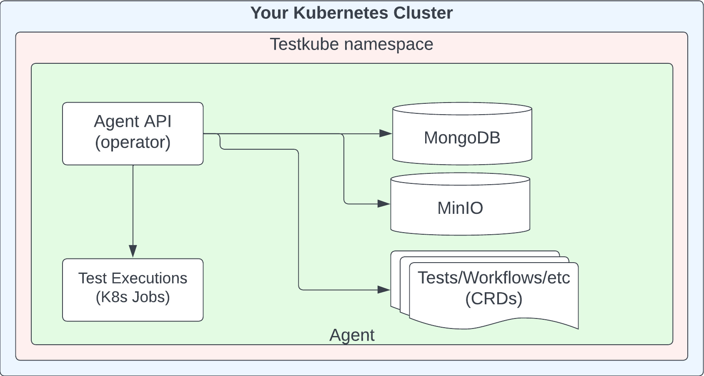
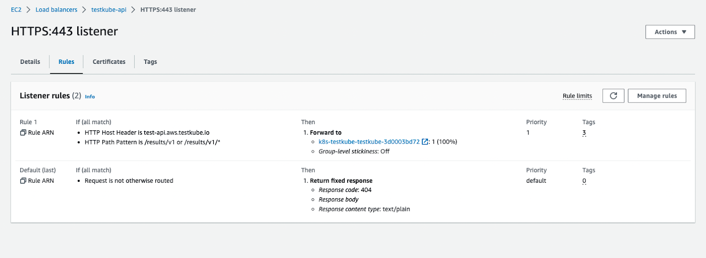

# The Testkube Agent 

## Overview

The Testkube Agent is 100% Open Source and includes the Testkube execution and orchestration engine 
(with some [limitations](#agent-limitations-in-standalone-mode)). It is _always_ hosted in your infrastructure and 
can be deployed in two modes:

- **Standalone Mode** - not connected to a Testkube Control Plane.
- **Connected Mode** - connected to a Testkube Control Plane.

This document shows how to use the Agent in Standalone mode, see the corresponding documentation for 
[On Prem](/articles/install/overview#on-prem-control-plane) and [Cloud](/articles/install/cloud-overview)
deployment of the Testkube Control Plane to learn how to use the Agent in Connected Mode.

:::tip
See the [Feature Comparison](feature-comparison) to understand the differences in functionality between these two modes.
:::

## Running in Standalone Mode

When running the Agent in Standalone Mode there is no [Dashboard](/articles/testkube-dashboard-explore) and it has to be managed entirely through the [Testkube CLI](/articles/cli). 

The following functionality is available directly in the agent in Standalone Mode

- **Test Workflows** : Manage Workflows and Templates, Run/Schedule executions (see below for limitations).
- **Logs/Artifacts** : Retrieve Workflow executions, logs, artifacts via CLI or API.
- **Webhooks** : Manage Webhooks that the Agent executes.
- **Event Triggers** : Manage Event Triggers that the Agent reacts to.
- **Tests, TestSuites, Sources, Executors** : Deprecated - but still available during a transition period - [Read More](/articles/legacy-features).

### Agent Limitations in Standalone Mode

The following Workflow features are _not_ available when using the Open Source Agent without connecting it to a
Testkube Control Plane:

- **Complex Test Orchestration** with `execute` - see [Test Suites](/articles/test-workflows-test-suites.mdx)
- **Parallel execution** with `parallel` - see [Parallelization](/articles/test-workflows-parallel.mdx)
- **Parameterization** with `matrix` (and `count`, `shards`, `maxCount`) - see [Sharding & Matrix Params](/articles/test-workflows-matrix-and-sharding.mdx)
- **Spawning dependencies** for your tests with `services` - see [Services](/articles/test-workflows-services.mdx)
- **Concurrency Policies** with `concurrency` - see [Concurrency](/articles/test-workflows-concurrency-queueing)

:::tip
Deploying the Testkube Agent in Standalone Mode provides **extensive** test execution capabilities even 
without these features available, check out the [Open Source Overview](/articles/open-source) to get started.
:::

## Installing the Standalone Agent

The following steps are required to install the Standalone Agent into a Kubernetes Cluster:

- Create a Testkube namespace.
- Deploy the Testkube API (see below).
- Use MongoDB or PostgreSQL for test results and Minio for artifact storage (optional; disable with --no-minio).
- In standalone mode, Testkube will listen and manage all the CRDs for TestWorkflows, Triggers, Webhooks, etc. inside the Testkube namespace. In connected mode (v2.7+), resources are managed by the Control Plane instead - [Read More](/articles/testkube-resource-management).

Once installed you can verify your installation and check that Testkube is up and running with
`kubectl get all -n testkube`. Once validated, you're ready to unleash the full potential of Testkube in your environment.
Testkube OSS is here to help you to powering your development and testing workflows seamlessly.

### With the CLI

You can install the standalone agent by executing the following command.
By default it will install within the `testkube` namespace for your
current Kubernetes context.

```sh
testkube init
```

### With Helm

```sh
helm repo add kubeshop https://kubeshop.github.io/helm-charts
helm repo update

helm upgrade --install testkube kubeshop/testkube \
  --create-namespace \
  --namespace testkube \
  --set installCRDs=true
```

By default, the namespace for the installation will be `testkube`. If the `testkube` namespace does not exist, it will be created for you.

Alternatively, you can customize the default `values.yaml` by first fetching the Helm chart, unpacking it, modifying the `values.yaml`, and then installing it from the current directory:

```sh
helm install testkube . --create-namespace --namespace testkube --values values.yaml
```

:::tip
The [Helm Chart Docs](https://github.com/kubeshop/helm-charts/tree/main/charts/testkube#testkube) include a list of all available
[values properties](https://github.com/kubeshop/helm-charts/tree/main/charts/testkube#values).
:::

## Upgrading

See [upgrade][upgrade] for instructions on how to upgrade the standalone agent.

## Uninstalling

### With the CLI

```sh
testkube purge
```

### With Helm

```sh
helm delete --namespace testkube testkube kubeshop/testkube
```

## Deployment Architecture

A high-level deployment architecture for Standalone Agent is shown below. 



The Testkube CRDs are described in [Testkube Custom Resources](/articles/crds).

## Connecting to the Testkube Control Plane

You can connect a standalone Agent to an instance of the Testkube Control Plane to leverage 
corresponding functionality (see [Feature Comparison](feature-comparison)).
All Workflow/Trigger/Webhook definitions will be preserved, but historical test execution results and 
artifacts won't be copied to the control plane.

After connecting, your agent appears in the Control Plane as a single agent with all four capabilities (Runner, Listener, GitOps, Webhook) enabled by default - [Read More](/articles/testkube-resource-management).

The following command which will guide you through the migration process:

```
testkube pro connect
```

To complete the procedure, you will finally have to [set your CLI Context to talk to Testkube][cli-context].

## Advanced

### Log Storage

Testkube can be configured to use different storage for test logs output that can be specified in the Helm values.

```yaml
## Logs storage for Testkube API.
logs:
  ## where the logs should be stored there are 2 possible values : minio|mongo
  storage: "minio"
  ## if storage is set to minio then the bucket must be specified, if minio with s3 is used make sure to use a unique name
  bucket: "testkube-logs"
```

When [mongo](https://www.mongodb.com/kubernetes) is specified, logs will be stored in a separate collection so the execution handling performance is not affected.

When [minio](https://min.io/) is specified, logs will be stored as separate files in the configured bucket of the MinIO instance or the S3 bucket if MinIO is configured to work with S3.

### MongoDB upgrade from 8.0.15 to 8.2.5

Starting with chart version `2.6.0`, MongoDB is upgraded to `8.2.3` and in the later versions to `8.2.5`.  This is a **breaking change** for installations that are not already running MongoDB `8.0.x`, because MongoDB requires the upgrade path to go through `8.0` before moving to `8.2.x`.

To upgrade safely, you must first ensure they you on at least chart version `2.4.0`, which includes MongoDB `8.0.13`. Only after that should you upgrade to the latest chart version.

**Required upgrade path**

1. Upgrade to chart version `2.4.0`: this moves MongoDB to `8.0.13`

2. Upgrade from `2.4.0` to the latest chart version.

3. Enable the MongoDB FCV jobs in your chart values so the compatibility version is updated during the upgrade:

```yaml
mongodb:
  preUpgradeFCVJob:
    enabled: true
```
**How it works**

When the FCV jobs are enabled:

- the pre-upgrade job connects to the current MongoDB instance and checks the current compatibility version; if needed, it updates it to the configured pre-upgrade target – `8.0` before the image upgrade starts
- Helm upgrades the MongoDB image to `8.2.5`
- the post-upgrade job waits for the upgraded MongoDB instance to become ready and then updates the MongoDB Feature Compatibility Version to `8.2`

:::warning Important
If your installation is still on MongoDB `7.x`, do not upgrade directly to a chart version that includes MongoDB `8.2.5`. MongoDB does not support a direct 7.x -> 8.2.x upgrade in a single step. You must first upgrade to chart version `2.4.0`, and only then continue to the latest version.
:::

The FCV jobs are configurable and can also be used for future supported MongoDB upgrades by changing the compatibility values in the chart.


### Artifact Storage

Testkube allows you to save supported files generated by your tests, which we call **Artifacts**.

The engine will scrape the files and store them in [Minio](https://min.io/) in a bucket named by execution ID and collect all files
that are stored in the location specific to each workflow.

The available configuration parameters in Helm charts are:

| Parameter                        | Is optional | Default                              | Default                                               |
| -------------------------------- | ----------- | ------------------------------------ | ----------------------------------------------------- |
| testkube-api.storage.endpoint    | yes         | testkube-minio-service-testkube:9000 | URL of the S3 bucket                                  |
| testkube-api.storage.accessKeyId | yes         | minio                                | Access Key ID                                         |
| testkube-api.storage.accessKey   | yes         | minio123                             | Access Key                                            |
| testkube-api.storage.location    | yes         |                                      | Region                                                |
| testkube-api.storage.token       | yes         |                                      | S3 Token                                              |
| testkube-api.storage.SSL         | yes         | false                                | Indicates whether SSL communication is to be enabled. |

The API Server accepts the following environment variables:

```sh
STORAGE_ENDPOINT
STORAGE_BUCKET
STORAGE_ACCESSKEYID
STORAGE_SECRETACCESSKEY
STORAGE_LOCATION
STORAGE_REGION
STORAGE_TOKEN
STORAGE_SSL
```

Which can be set while installing with Helm:

```sh
helm install testkube oci://us-east1-docker.pkg.dev/testkube-cloud-372110/testkube/testkube --version <version> --set STORAGE_ENDPOINT=custom_value --create-namespace --namespace testkube
```

Alternatively, these values can be read from Kubernetes secrets and set:

```yaml
- env:
 - name: STORAGE_ENDPOINT
   secret:
  secretName: test-secret
```

### Deploying on OpenShift

To install the standalone agent Testkube on an Openshift cluster you will need to include the following configuration:

1. Add security context for MongoDB or PostgreSQL to `values.yaml`:

```yaml
mongodb:
  securityContext:
    enabled: true
    fsGroup: 1000650001
    runAsUser: 1000650001
  podSecurityContext:
    enabled: false
  containerSecurityContext:
    enabled: true
    runAsUser: 1000650001
    runAsNonRoot: true
  volumePermissions:
    enabled: false
  auth:
    enabled: false
```

2. The Testkube Operator is deprecated and disabled by default. If your installation previously used it, ensure it is disabled in `values.yaml`:

```yaml
testkube-operator:
  enabled: false
```

3. Install Testkube specifying the path to the new `values.yaml` file

```
helm install testkube oci://us-east1-docker.pkg.dev/testkube-cloud-372110/testkube/testkube --version <version> --create-namespace --namespace testkube --values values.yaml
```

Please notice that since we've just installed MongoDB with a `testkube-mongodb` Helm release name, you are not required to reconfigure the Testkube API MongoDB connection URI. If you've installed with a different name/namespace, please adjust `--set testkube-api.mongodb.dsn: "mongodb://testkube-mongodb:27017"` to your MongoDB service.

## Using PostgreSQL as a database

Starting with release `3.0`, PostgreSQL will be used as the primary database instead of MongoDB. Since both options are currently supported, you must first disable MongoDB and then enable PostgreSQL in your `values.yaml` file. We strongly recommend using `CloudNativePG` instead of plain PostgreSQL, as it offloads much of the database management, and the installation of PostgreSQL by Bitnami will be deprecated by the end of 2026.

The operator-based path has two parts:

1. The `cloudnative-pg` operator, which manages PostgreSQL lifecycle in Kubernetes.
2. A `Cluster` custom resource, created by the `postgresqlOperatorCluster` chart values.

To enable this, update your `values.yaml` as follows:
```yaml
mongodb:
  enabled: false
  
cloudnative-pg:
  enabled: true
  
postgresqlOperatorCluster:
  enabled: true
  
testkube-api:
  mongodb:
    enabled: false
  postgresql:
    enabled: true
```

If you deploy the CloudNativePG operator separately, or you already have it running in your k8s cluster, set `postgresqlOperatorCluster.enabled=false` in the `values.yaml`.

:::warning

Do not enable both `postgresql.enabled` (standard chart installation) and `postgresqlOperatorCluster.enabled` at the same time as you will have 2 databases in the cluster.

:::

### Migrating Testkube PostgreSQL to the CloudNativePG Operator

Moving from the bundled Bitnami PostgreSQL chart to CloudNativePG is a breaking infrastructure change for existing installations.

The resource model changes from a Helm-managed PostgreSQL `StatefulSet` to an operator-managed PostgreSQL `Cluster`, so this is not a direct in-place database upgrade.

### Recommended Migration Strategy

1. Keep the existing bundled PostgreSQL deployment running.
2. Install the CloudNativePG operator and create a new PostgreSQL cluster.
3. Copy data from the existing database to the new operator-managed database with `pg_dump`/`pg_restore`.
4. Switch Testkube services to the operator-managed database.
5. Observe the system and keep the old database available in case rollback is needed.
6. Remove the old database only after the migration is confirmed stable.

**Treat this migration as a database migration, not just a Helm upgrade.**

### Using an external PostgreSQL instance

You can easily connect PostgreSQL to an external database by creating a Kubernetes secret with the database connection details and wiring it into `testkube-api.postgresql.secretName`. 

### New installation with CloudNativePG Operator

During Helm installation you may encounter an error: `no matches for kind "Cluster" in version "postgresql.cnpg.io/v1"`. This happens because `cloudnative-pg` and `postgresqlOperatorCluster` are both subcharts in the same Helm release, defined in `testkube/Chart.yaml`. The PostgreSQL Cluster custom resource depends on the `clusters.postgresql.cnpg.io` CustomResourceDefinition (CRD). On a fresh Kubernetes cluster, Helm cannot create that custom resource until the CRD has already been installed and registered.
To tackle this you may install Testkube in two steps.

First, install the operator and its CRDs only:

```yaml
helm upgrade --install testkube oci://us-east1-docker.pkg.dev/testkube-cloud-372110/testkube/testkube --version <version> \
  -n testkube \
  --create-namespace \
  -f values.yaml \
  --set postgresqlOperatorCluster.enabled=false
```

Once the CRDs are installed and registered in the cluster, run Helm again with the PostgreSQL cluster enabled:

```yaml
helm upgrade --install testkube oci://us-east1-docker.pkg.dev/testkube-cloud-372110/testkube/testkube --version <version> \
  -n testkube \
  -f values.yaml \
  --set postgresqlOperatorCluster.enabled=true
```

This second step allows Helm to create the PostgreSQL Cluster resource after the required CRD is available.


### Deploying on AWS

If you are using **Amazon Web Services**, this tutorial will show you how to deploy Testkube OSS in EKS and expose its API to the Internet with the AWS Load Balancer Controller.

#### Prerequisites

First, we will need an existing Kubernetes cluster. Please see the official documentation on how to get started with an Amazon EKS cluster [here](https://docs.aws.amazon.com/eks/latest/userguide/getting-started.html).

Once the cluster is up and running we need to deploy the AWS Load Balancer Controller. For more information, see [Installing the AWS Load Balancer Controller add-on](https://docs.aws.amazon.com/eks/latest/userguide/aws-load-balancer-controller.html).

Another important point is [ExternalDNS](https://github.com/kubernetes-sigs/external-dns). It is not compulsory to deploy it into your cluster, but it helps you dynamically manage your DNS records via k8s resources.

And last, but not least - install the Testkube CLI. You can download a binary file from our [installation][install-cli] page. For how to deploy Testkube to your cluster with all the necessary changes, please see the next section.

:::caution

Please mind that is it necessary to install [EBS CSI driver](https://docs.aws.amazon.com/eks/latest/userguide/ebs-csi.html) to mount PV into your k8s cluster.

:::

#### Ingress and Service Resources Configuration

To deploy and expose Testkube API to the outside world, you will need to create an Ingress resource for Testkube's API server. In this tutorial, we will be updating `values.yaml` that later will be passed to the `helm install` command.

In order to use the AWS Load Balancer Controller we need to create a `values.yaml` file and add the following annotation to the Ingress resources:

```yaml
annotations:
  kubernetes.io/ingress.class: alb
```

Once this annotation is added, Controller creates an ALB and the necessary supporting AWS resources.

The example configuration using HTTPS protocol might look like the following:

**Testkube API Ingress:**

```yaml
uiIngress:
  enabled: true
  annotations:
    kubernetes.io/ingress.class: alb
    alb.ingress.kubernetes.io/load-balancer-name: testkube-api
    alb.ingress.kubernetes.io/target-type: ip
    alb.ingress.kubernetes.io/backend-protocol: HTTP
    alb.ingress.kubernetes.io/listen-ports: '[{"HTTP": 80},{"HTTPS": 443}]'
    alb.ingress.kubernetes.io/scheme: internet-facing
    alb.ingress.kubernetes.io/healthcheck-path: "/health"
    alb.ingress.kubernetes.io/healthcheck-port: "8088"
    alb.ingress.kubernetes.io/ssl-redirect: "443"
    alb.ingress.kubernetes.io/certificate-arn: "arn:aws:acm:us-east-1:*******:certificate/*****"
  path: /v1
  hosts:
    - test-api.aws.testkube.io
```

Once we are ready with the `values.yaml` file, we can deploy Testkube into our cluster:

```sh
helm install testkube oci://us-east1-docker.pkg.dev/testkube-cloud-372110/testkube/testkube --version <version> --values values.yaml --namespace testkube --create-namespace
```

After the installation command is complete, you will see the following resources created into your AWS Console.



Please note that the annotations may vary, depending on your Load Balancer schema type, backend-protocols, target-type, etc. However, this is the bare minimum that should be applied to your configuration.

Except for the Ingress annotation, you need to update the Service manifests with a healthcheck configuration as well. Include the lines below into your `values.yaml` file.

**Testkube API Service:**

```yaml
service:
  type: ClusterIP
  port: 8088
  annotations:
    alb.ingress.kubernetes.io/healthcheck-path: "/health"
    alb.ingress.kubernetes.io/healthcheck-port: "8088"
```

#### Examples of AWS S3 Bucket configuration

If you plan to use AWS S3 Bucket for storing test artifacts, you can follow below examples

**Terraform aws iam policy:**

```yaml
data "aws_iam_policy_document" "testkube" {
  statement {
    sid    = "S3Buckets"
    effect = "Allow"
    actions = [
      "s3:ListAllMyBuckets", # see https://github.com/kubeshop/testkube/issues/3965
    ]
    resources = [
      "arn:aws:s3:::*",
    ]
  }
  statement {
    sid    = "S3Bucket"
    effect = "Allow"
    actions = [
      "s3:ListBucket",
      "s3:GetBucketLocation",
    ]
    resources = [
      "arn:aws:s3:::*-testkube-${terraform.workspace}",
    ]
  }
  statement {
    sid    = "S3Object"
    effect = "Allow"
    actions = [
      "s3:GetObject*",
      "s3:PutObject*",
      "s3:DeleteObject",
    ]
    resources = [
      "arn:aws:s3:::*-testkube-${terraform.workspace}/*",
    ]
  }
}
```

**Testkube helm values:**

```yaml
testkube-api:
  jobServiceAccountName: testkube-api-server # reuse the service-account from testkube-api
  minio:
    enabled: true # required to be able to access AWS S3 (minio is used as a proxy)
    minioRootUser: ""
    minioRootPassword: ""
    serviceAccountName: testkube-api-server # reuse the service-account from testkube-api
  serviceAccount:
    annotations:
      eks.amazonaws.com/role-arn: arn:aws:iam::111111111111:role/my-dev-testkube
  storage:
    endpoint: s3.amazonaws.com
    accessKeyId: ""
    accessKey: ""
    location: eu-central-1
    bucket: my-testkube-dev
    skipVerify: true
    endpoint_port: ""
  logs:
    storage: "minio"
    bucket: my-testkube-dev
```

[secrets-endpoint]: /articles/secrets-enable-endpoint
[secrets-creation]: /articles/secrets-disable-creation
[upgrade]: /articles/upgrade-uninstall
[mongo-config]: https://github.com/bitnami/charts/tree/master/bitnami/mongodb#parameters
[nats-config]: https://docs.nats.io/running-a-nats-service/nats-kubernetes/helm-charts
[install-cli]: /articles/install/cli
[cli-context]: /cli/testkube-set-context
