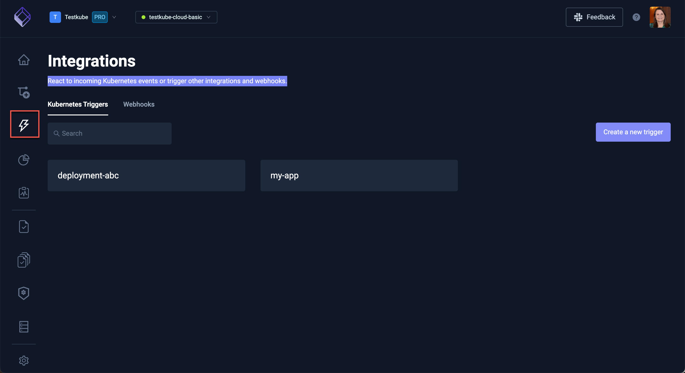
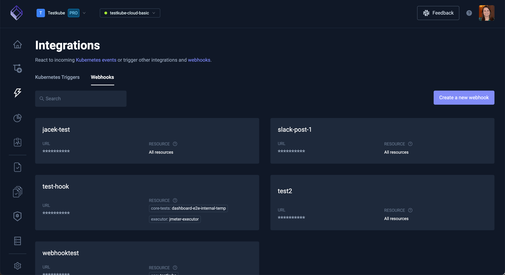

# Explore the Integrations Dashboard

React to incoming Kubernetes events or trigger other integrations and webhooks.

See the existing Kubernetes Triggers available for create a a new trigger.

The same functionality is available on the **Webhooks** tab.

Read more information on [Triggering Tests](/docs/articles/triggering-tests.md) and [Webhooks](/docs/articles/webhooks.mdx).