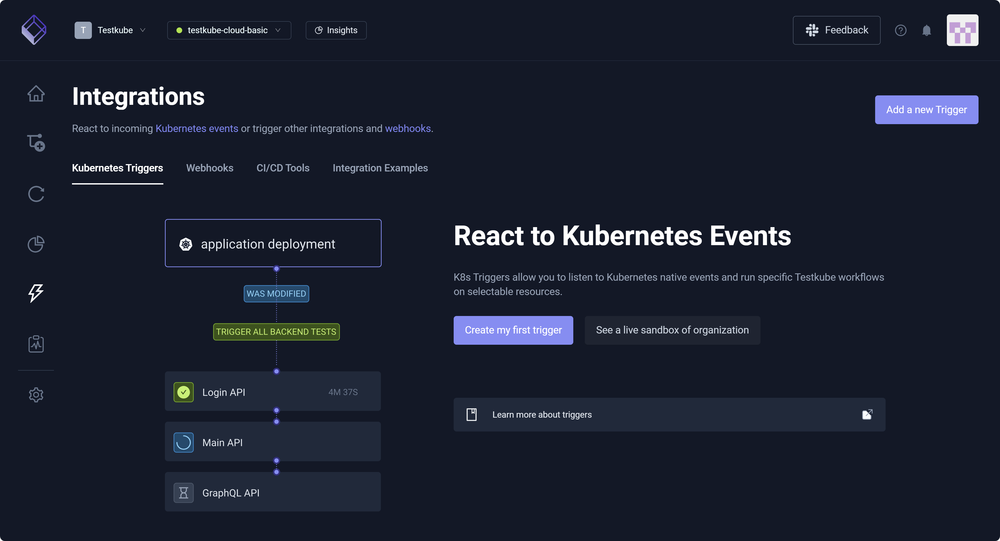
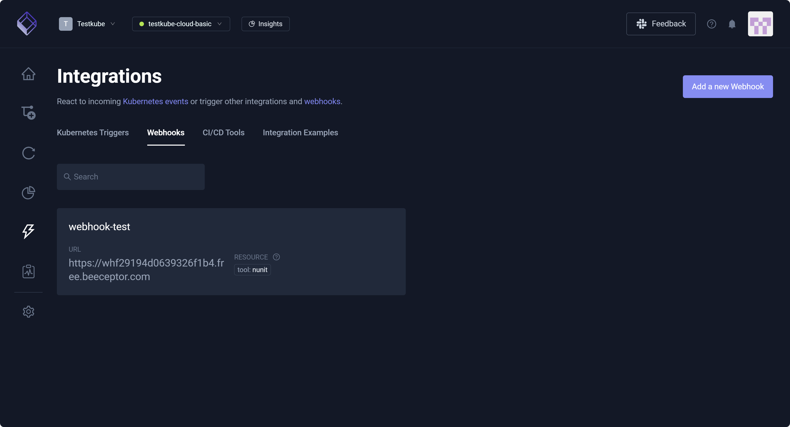
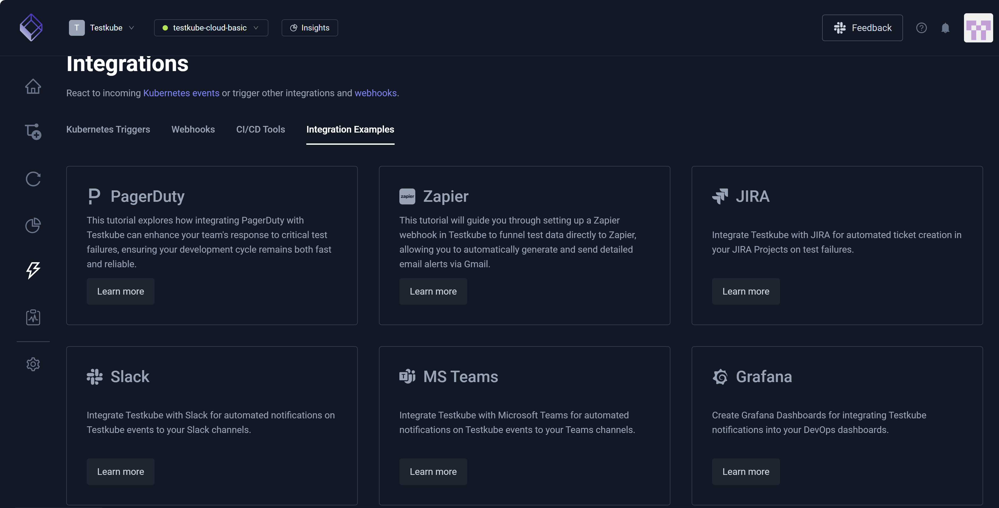

# Integrations Overview

The **Integrations Overview** provides insight into how Testkube connects with tools you already use, such as
Kubernetes and CI/CD systems (GitHub Actions, GitLab CI, and Jenkins) along with Slack and other collaboration tools.
Integrations allow you to automate testing and trigger Workflows based on system events. They also help you run tests 
as part of deployments, react to infrastructure changes, and stay informed without adding manual steps.

## Kubernetes Triggers 

You can integrate Testkube with Kubernetes to automatically trigger Workflows when specific Kubernetes events occur. For example, you can 
trigger a Workflow when a new Pod is created in a namespace. For additional information, read [Kubernetes Triggers](/articles/integrations-triggers).

## Webhooks

A webhook is an HTTP call that sends information automatically when an event occurs. Webhooks integrate with external tools such as Slack and Zapier based on internal Testkube events.
You can send a Slack message when a test fails, for example, or trigger Zapier automation when a test run completes. For additional information, read [Webhooks](/articles/integrations-webhooks).

## CI/CD Tools
 
Testkube integrates with CI/CD tools (such as GitHub Actions, GitLab CI, and Jenkins) to run tests automatically as part of your software delivery process. CI/CD tools automate building, 
testing, and deploying code, helping you deliver software faster and more reliably. For example, you can automatically run integration or end-to-end tests 
after code is merged or before deploying to production.

This tab displays CI/CD tools, and you can select each to learn more.

## Integration Examples

You can view tutorials and access examples specific to integration tools, such as **PagerDuty**, **Zapier**, **Slack**, and **MS Teams**.
You can send an alert to a Slack channel when a critical test fails, for example, or you can notify the on-call team when performance tests exceed defined thresholds.
You can also integrate Testkube with your existing infrastructure processes and Workflows. 

This tab displays integration examples, and you can select each to learn more.

