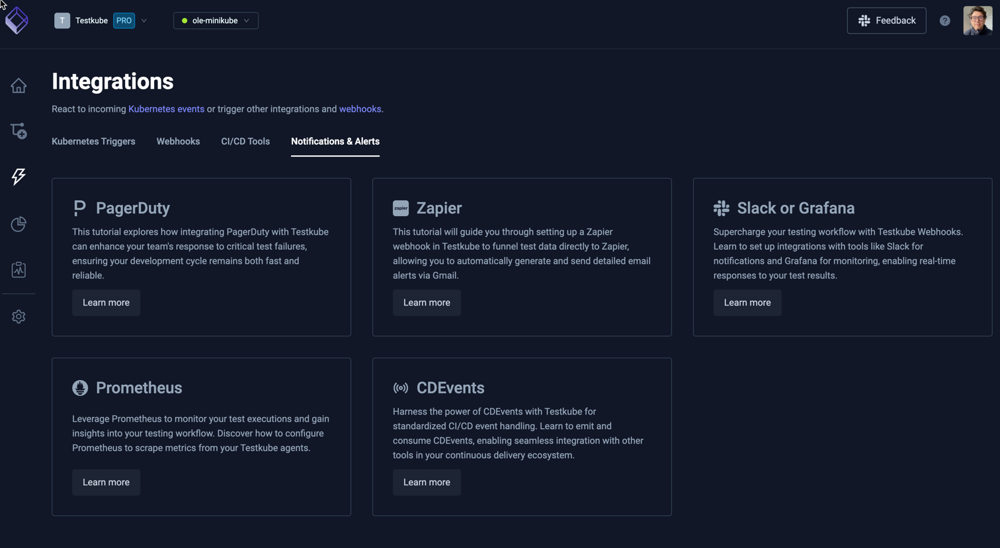

# Integrations Overview

The Integrations Overview provides access to Testkube functionality for integrating with your
existing tooling and infrastructure.

## Kubernetes Triggers 

Integrate Testkube with Kubernetes for triggering Workflows based on Kubernetes Events - [Read More](/articles/integrations-triggers)

## Webhooks

Integrate with external tools (Slack, Zapier, etc) based on internal events in Testkube - [Read More](/articles/integrations-webhooks)

## CI/CD Tools

Shows how to integrate Testkube with most popuple CI/CD tools, click on each corresponding item to learn more.

## Notifications & Alerts

Shows how to integrate Testkube with your existing infrastructure processes and workflows, click on each corresponding item to learn more.

