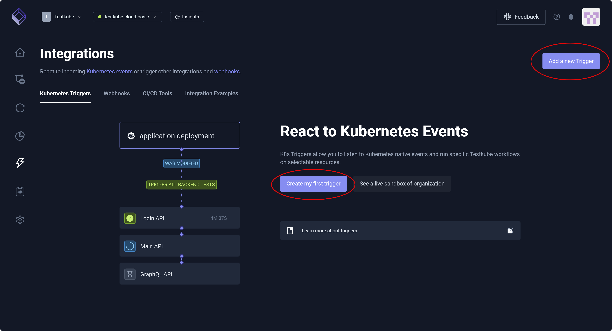
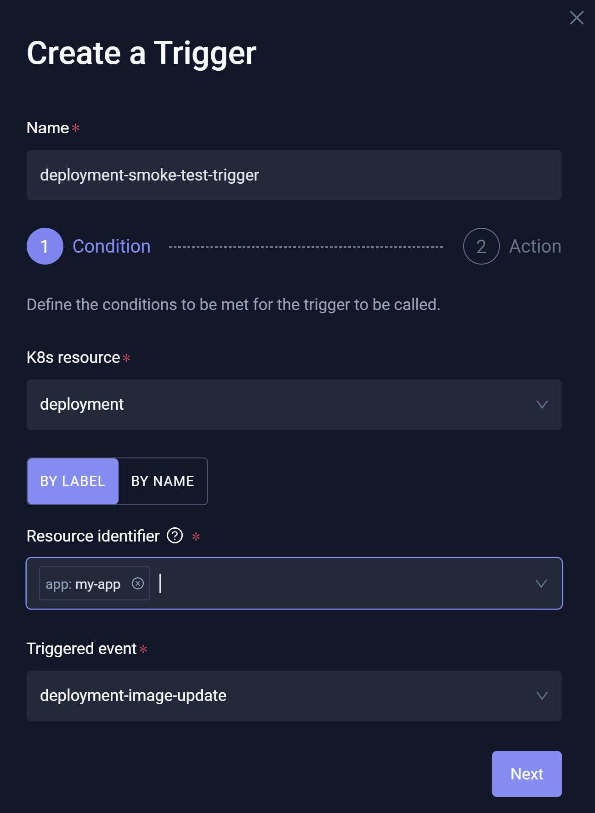
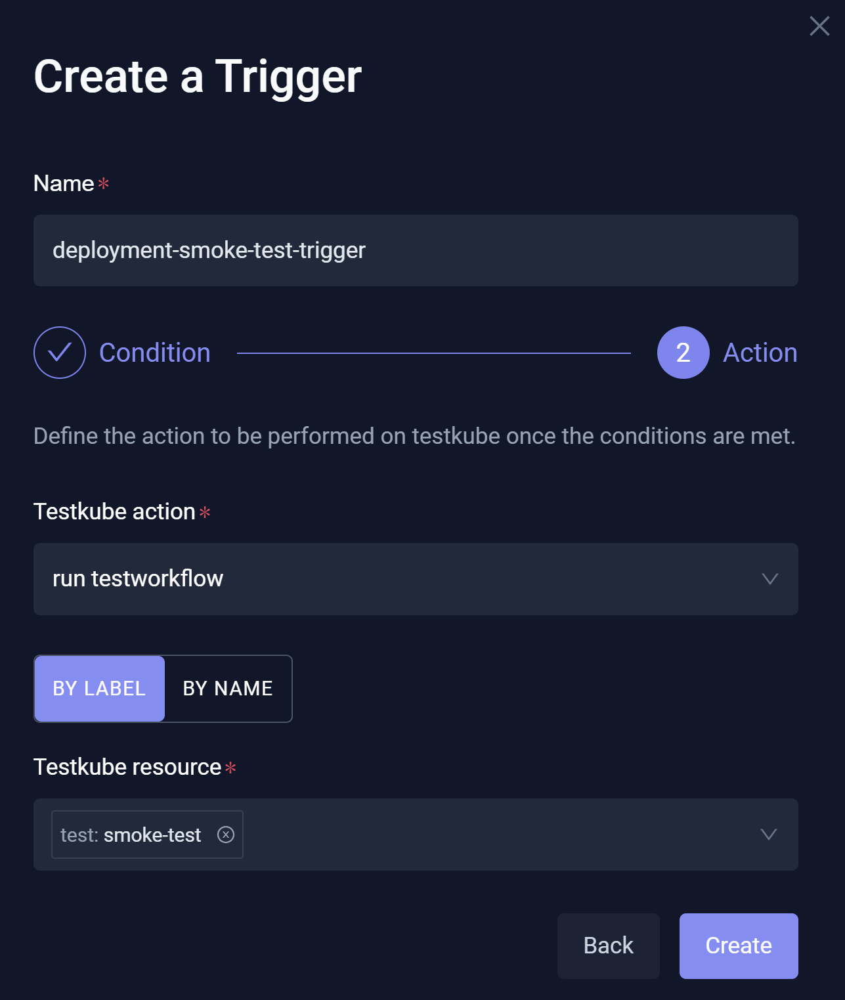

# Kubernetes Triggers

**Kubernetes Triggers** allow you to automatically run Testkube actions based on Kubernetes events. You might add a Trigger, for example, to run smoke
or regression tests after a deployment to validate application health. 

You can create and manage Triggers in your **Environment** via the Testkube Dashboard, 
selecting **Integrations** from the left navigation pane then proceeding to the **Kubernetes Triggers** tab. For additional information, read [Kubernetes Event Triggers](/articles/test-triggers).

The **Kubernetes Triggers** tab displays a list of any available Triggers, allowing you to select each for review, update, or deletion.

:::info
Triggers respond to Kubernetes events; webhooks respond to external HTTP calls. More specifically, Triggers are event-driven and internal 
to Kubernetes – reacting automatically to Kubernetes resource events (such as create/update/delete) inside a cluster. Webhooks are request-driven 
and external – exposing an HTTP endpoint that runs a Testkube action when called by external systems, such as CI/CD tools, GitHub, or other services.
:::

## Add a new Trigger

You can select **Add a new Trigger** or **Create my first trigger** (as appropriate) to access the **Create a Trigger** modal.

:::tip
**Add a new Trigger** exposes basic configurations. For additional information, read [Resource Conditions](/articles/test-triggers#resource-conditions) and 
[Action Parameters](../articles/test-triggers#action-parameters). You can modify the generated YAML directly in the [Definition](/articles/integrations-triggers#definition) for this Trigger. 
:::

### New Trigger Condition

The **Create a Trigger** modal displays:

* **Name** – Unique identifier that must represent a valid Kubernetes name, as Triggers are stored as Custom Resource Definitions (CRDs) in your cluster.
* **K8s resource** – Cluster object (Pod/deployment/job) that Testkube monitors to determine if an event Triggers.
* **Resource identifier** – A way to select which specific Kubernetes resources to monitor, using either a resource name or labels.
* **Triggered event** – The specific Kubernetes action (such as create/update/delete) that causes the Testkube Trigger to run.

**EXAMPLE**  
When a new version of an app is deployed to Kubernetes, automatically run a smoke test to confirm that the app started correctly.
This Trigger will help identify deployment issues early and without manual testing.

1. Enter the **Name**, **K8s resource**, **Resource identifier**, and **Triggered event**.
1. Select **Next**.

   

1. Enter **Testkube Action** and **Testkube Resource**.
1. Select **Create**.

   

## Trigger Settings

You can select an existing Trigger to view its Settings.

:::tip
**Create a Trigger** exposes basic configurations. For additional information, read [Resource Conditions](/articles/test-triggers#resource-conditions) and 
[Action Parameters](../articles/test-triggers#action-parameters). You can modify the generated YAML directly in the [Definition](/articles/integrations-triggers#definition) for this Trigger. 
:::

### General

This setting allows you to modify the **Trigger name** or **Delete this trigger**, if needed.

### Trigger Condition

This setting specifies the conditions that must be satisfied to invoke this Trigger.

### Trigger Action

This setting defines what happens once the Trigger conditions are satisfied.

### Resource Group

This setting identifies the Resource Group that contains this Trigger. For additional information, read [Resource Groups](/articles/resource-groups).

### Definition

This setting displays the underlying YAML for your Trigger, enabling you to manually configure the Trigger as opposed to using the tabs.

