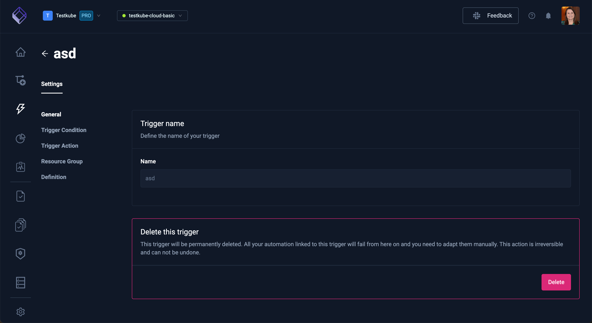
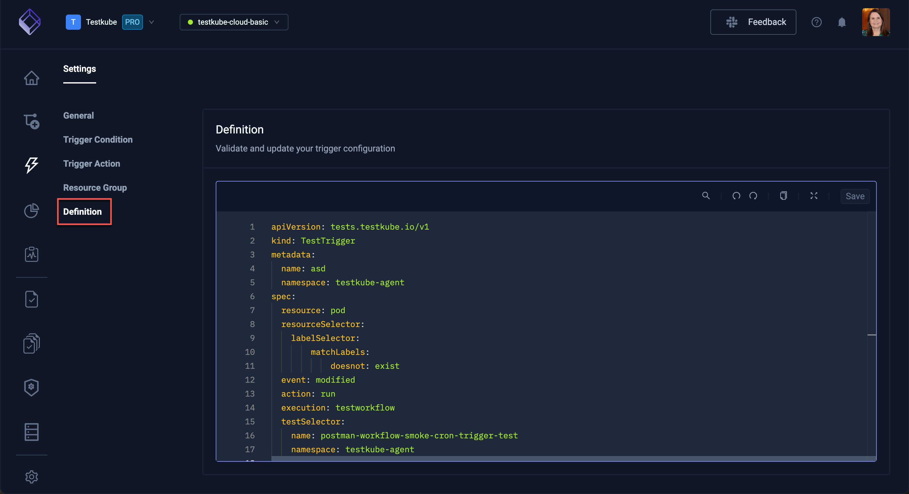

# Integrations Triggers

In Testkube, there are integrations to react to Kubernetes triggers:

You will see the list of currently available triggers. Select one of these to review, update or delete.

## Trigger Condition

**Trigger Condition** shows the conditions met for the current trigger to be called.

## Trigger Action

**Trigger Action** defines the action to be performed in Testkube once the conditions are met.

## Resource Group

**Resource Group** defines the Resource Group this resource belongs to.

## Definition

**Definition** shows the code to validate and update your trigger configuration.

## Create a New Trigger 

Select the **Create a new trigger** button to create your own trigger:

