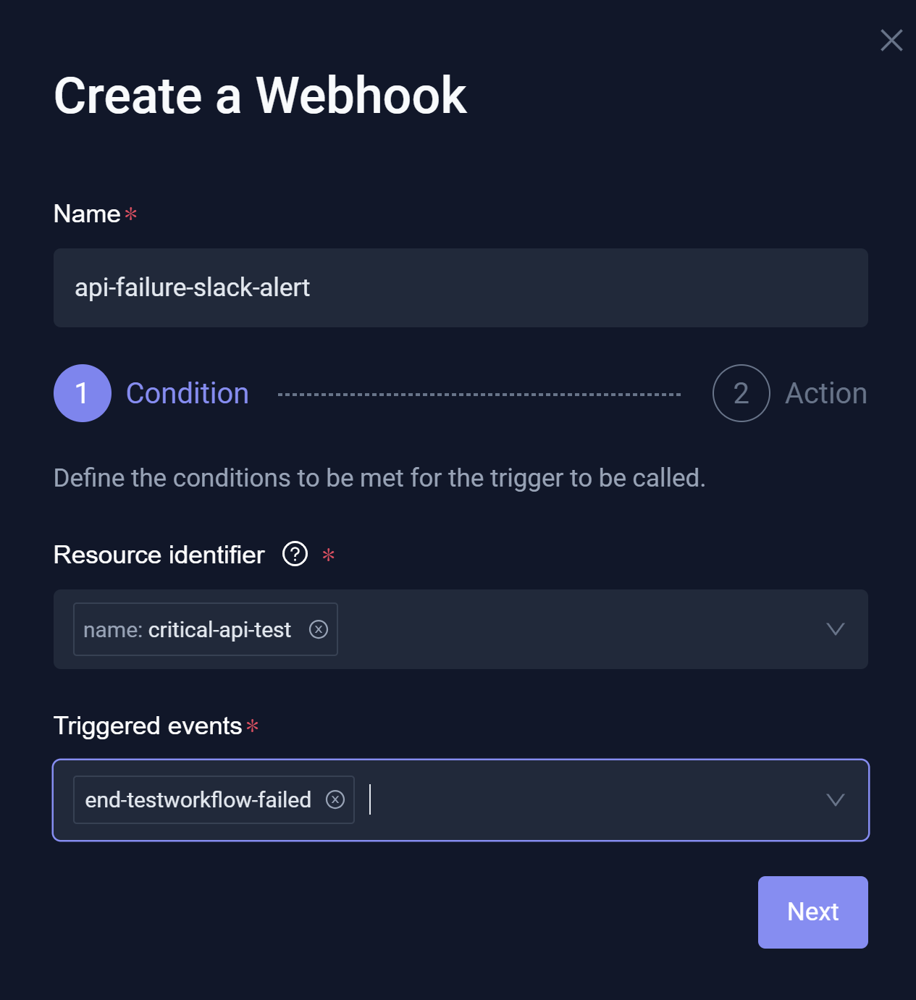
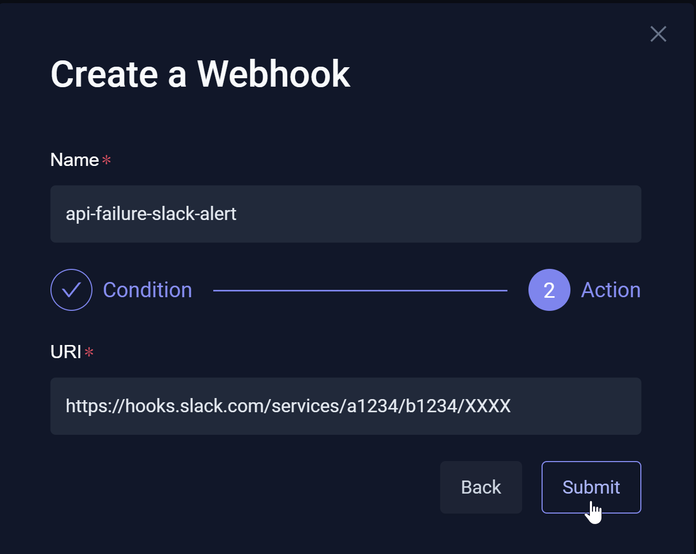
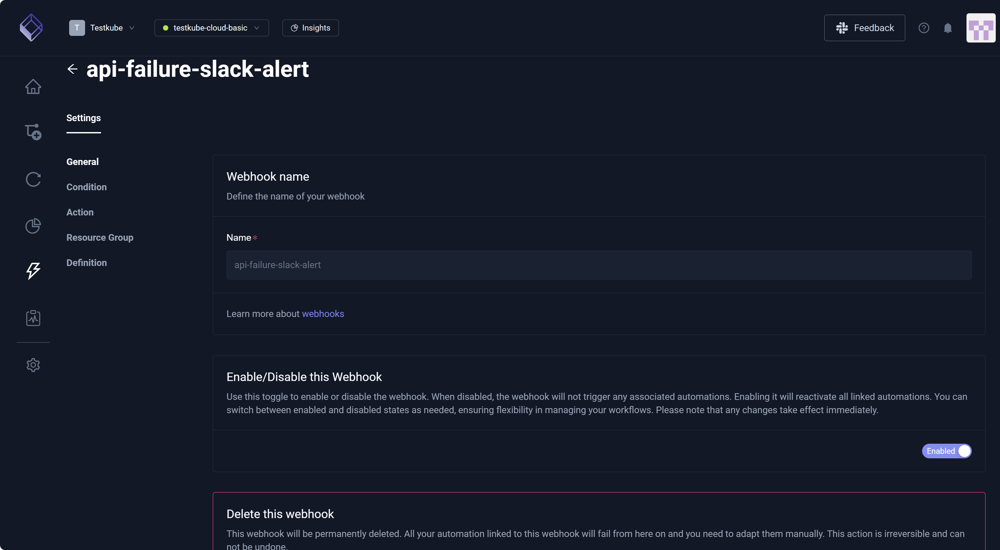
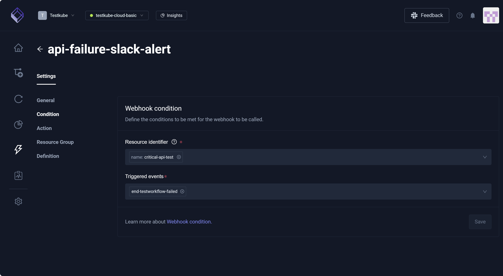
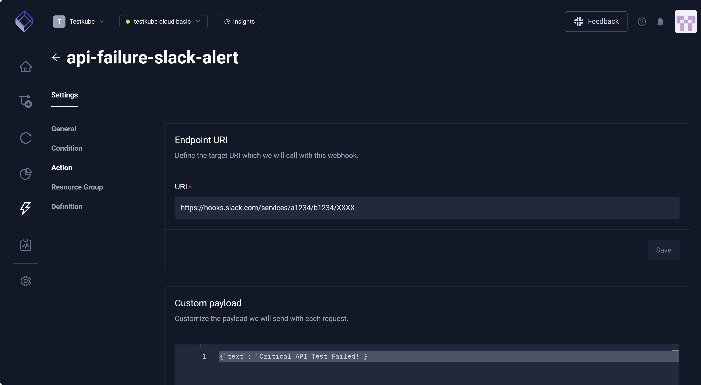
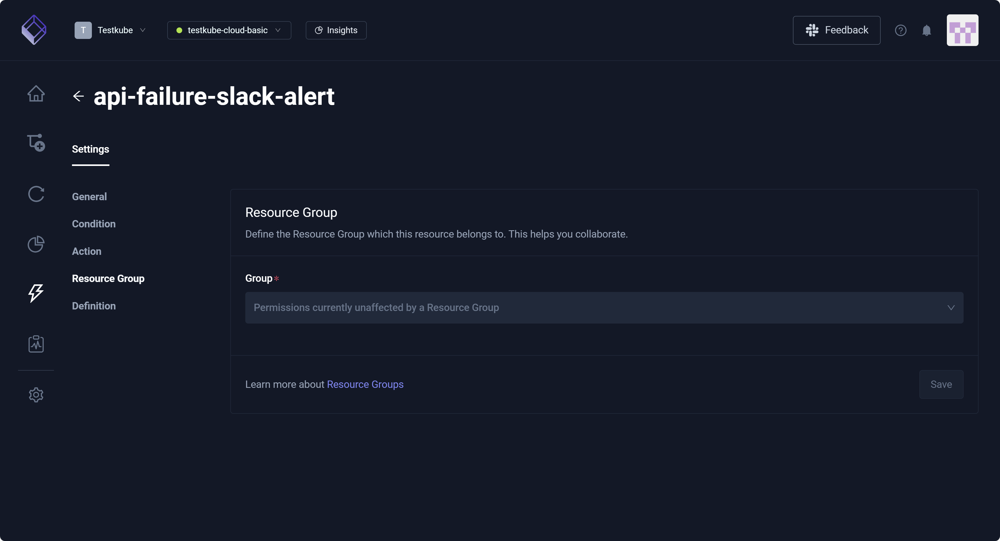
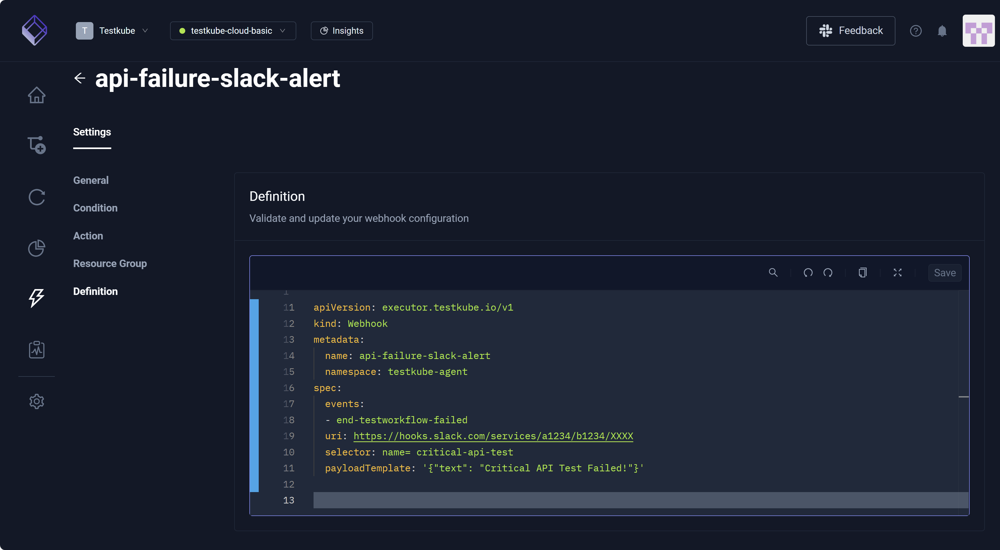

# Integrations Webhooks

Webhooks are event-driven and invoke HTTP endpoints exposed by external systems, such as CI/CD tools, GitHub, Slack, or other services. You might
create a Webhook, for example, to notify your team if a critical API test fails so the team can fix the issue immediately. If this test finishes with a *Failed* status,
Testkube (based on your Webhook configuration) sends an HTTP POST request to a Slack Webhook URL which then posts a message in the *Alerts* channel. The Slack Webhook URL is a private entrance (of sorts) to the *Alerts* channel,
automatically turning data into a chat message for your team. This allows Testkube to communicate with Slack without the need for you to manually copy/paste this message. 

You can create and manage **Webhooks** in your **Environment** via the **Testkube Dashboard**, selecting **Integrations** from the left navigation pane then proceeding to the **Webhooks** tab. 
For additional information, read [Webhooks](/articles/webhooks).


## Creating a New Webhook

You can select **Add a new Webhook** to access the **Create a Webhook** modal.

### Webhook Condition

The **Create a Webhook** modal displays:

* **Name** – Unique identifier that must represent a valid Kubernetes name, as Webhooks are stored as Custom Resource Definitions (CRDs) in your cluster.
* **Resource Identifier** – The *who* watched, such as a specific test. Resources follow the official Kubernetes selector pattern. Multiple selectors are grouped by the **AND** operator.
* **Triggered events** – The *what* or specific Kubernetes action that causes the Testkube Webhook to run, such as a *Failed* test status.

**EXAMPLE**

When a Testkube test finishes with a *Failed* status, Testkube sends an HTTP POST request to a Slack Webhook URL which then posts a message in your *Alerts* Slack channel to notify team members.
For additional information, read [Slack Integration](../articles/slack-integration.mdx).

1. Enter the **Name**, **Resource identifier**, and **Triggered events**.
1. Select **Next**.
1. **Name** auto-populates from the **Name** field on previous screen.
1. Enter the **URI** or digital *mailing address* of the external app where Testkube should send the update, such as a Slack channel.
1. Select **Submit**.





## Webhook Settings

You can select an existing Webhook to view its **Settings**, which provides access to **General**, **Condition**, **Action**, **Resource Group**, and **Definition**.

:::note
**Settings** exposes basic configurations. For additional information, read
[Resource Selector](/articles/webhooks#resource-selector-labels) and [Webhook Payload](/articles/webhooks#webhook-payload). You can modify the
generated YAML directly in the [Definition](/articles/integrations-webhooks#definition) associated with the Webhook you selected.
:::

### General 

The **General** setting allows you to access **Name**, **Enable/Disable this Webhook**, and **Delete this webhook**.

:::tip
You can disable a Webhook for specific Workflow Executions. For additional information, read [Disabling Webhooks](../articles/webhooks#disabling-webhooks).
:::



### Condition

You must define the **Condition** that must be satisfied such that there are *calls* to this Webhook. This setting includes **Webhook condition**, **Resource identifier**,
and **Triggered events**.



### Action & Payload

**Action** defines the target URI associated with this Webhook. The **Custom Payload** field allows you to 
customize the payload you will send with each request. In the context of our Example, the payload is the Slack message sent to team members. For additional information, 
read [Webhook-Payload](/articles/webhooks#webhook-payload). This setting also displays **Headers** (customizable and can be sent with each request) and **Add a new variable**.



### Resource Group

This setting identifies the **Resource Group** that contains this Webhook. For additional information, read [Resource Groups](/articles/resource-groups).



### Definition

This setting displays the underlying YAML for your Webhook, enabling you to manually configure the Webhook as opposed to navigating each **Setting**.

:::tip
If you want to hide the Webhook YAML definition in the Dashboard because it contains sensitive information, you can 
enable Webhooks URL Masking under [Organization Product Features](/articles/organization-management#product-features) 
which hides the **Definition** tab under the Webhook Settings.
:::



### Credentials

Webhooks often need to call external systems that require authentication (for example, API tokens or secrets).
Instead of hard coding these sensitive values into your Webhook definition,
Testkube allows you to securely inject them from **Credentials** using the `{{credentials(<NAME>)}}` template function.

You can reference **Credentials** in:
* Webhook URL
* Headers
* Payload template

Example:
```yaml
apiVersion: executor.testkube.io/v1
kind: Webhook
metadata:
  name: example-webhook
spec:
  events:
    - end-testworkflow-success
  uri: https://webhook.example.com/test?token={{credential('TOKEN')}}
  headers:
    X-API-Token: "{{credential('HEADER_TOKEN'}}"
  selector: test-type=k6
  payloadTemplate: "This template includes an inline secret: {{credential('SECRET'}}"
```

Visit our [Testkube Credentials](/articles/credential-management) docs to learn how to create and manage Credentials used in Webhooks.
