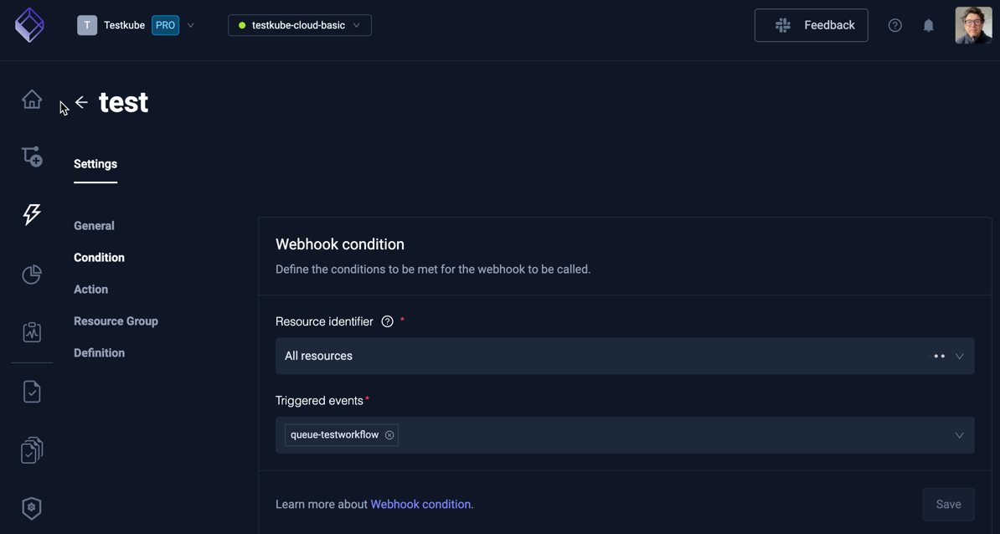
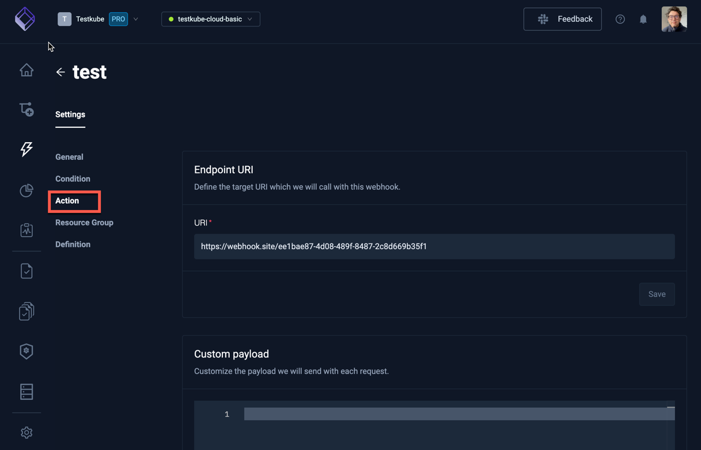
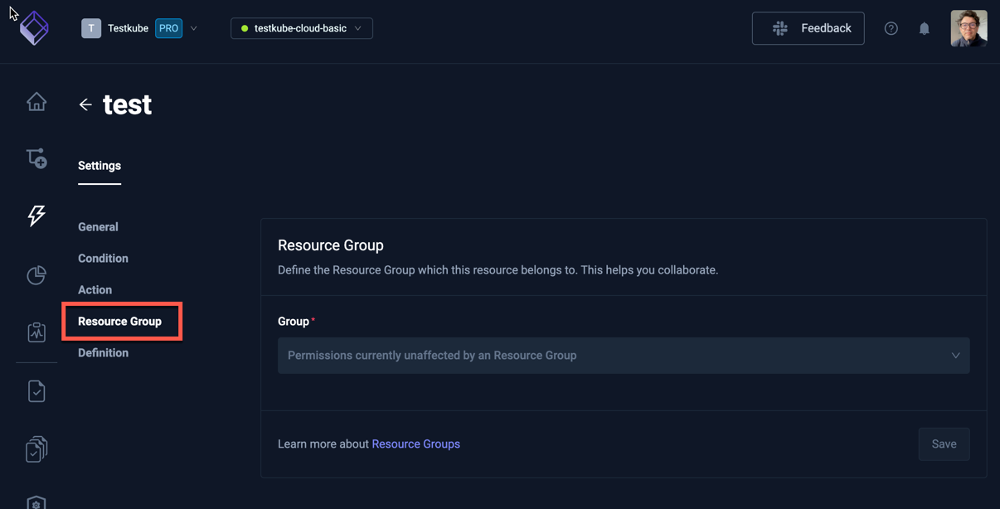

# Integrations Webhooks

The Testkube Dashboard allows you to easily create and manage the Webhooks defined for your Environment.

:::tip
Check out the [Webhooks](/articles/webhooks) document to learn how Webhooks can be used in Testkube.
:::

Webhooks are created under an Environment and are managed from the "Webhooks" tab in the integrations panel:

## Creating a New Webhook

Select the **Create a new webhook** button to create a new Webhook. 

### Webhook Condition

You will initially be prompted for:

- the **Name** of the Webhook - must be a valid Kubernetes name as Webhooks are stored as CRDs in your cluster.
- the **Resources Identifier** for which resources to monitor, can either be a list of Kubernetes Labels or a specific resource name.
- the **Triggered events** that will execute the Webhook.

### Webhook Action

The next step will prompt you for the target URI that will be invoked for your Webhook:

## Webhook Settings

Selecting a Webhook from the list of Webhooks shows its Settings.

:::note
As with the wizard above to create a Webhook, the Settings tab only expose basic Webhook configurations, for more
advanced [selector](/articles/webhooks#resource-selector-labels) and [payload](/articles/webhooks#webhook-payload) you can modify the
generated YAML directly in the [Definition tab](/articles/integrations-webhooks#definition) for your Webhook.
:::

### General 

The **General** tab allows you to modify the name of the Webhook, temporarily enable/disable it, and delete it if needed.

:::tip
You can disable a Webhook for specific Workflow Executions also - [Read More](/articles/webhooks#disabling-webhooks-on-tests)
:::

### Condition

**Condition** shows the conditions met for the current Webhook to be called.

### Action & Payload

**Action** defines the target URI we will call with this Webhook. The **Custom Payload** field allows you to 
modify the payload to be sent - [Read More](/articles/webhooks#webhook-payload).

### Resource Group

**Resource Group** defines the Resource Group this Webhook belongs to - [Read More about Resource Groups](/articles/resource-groups)

### Definition

**Definition** shows the underlying YAML for your Webhook, allowing you to manually configure your Webhook vs using the
previous tabs.

* add screenshot *
