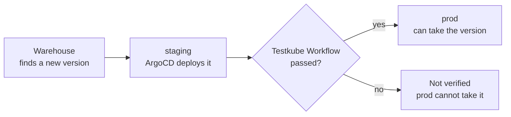
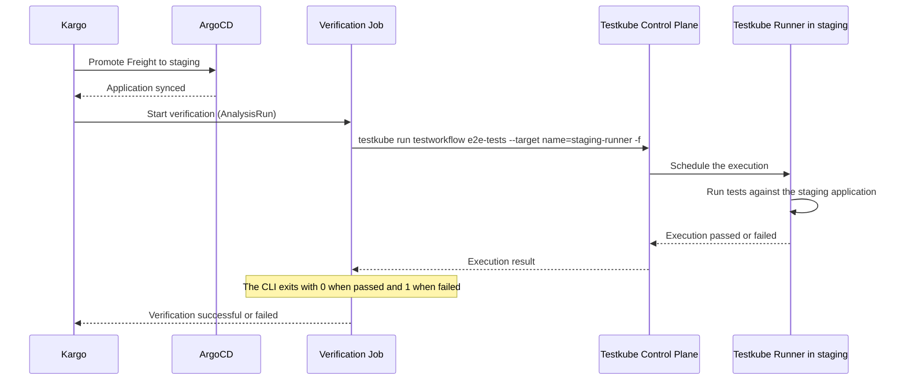

# Using Testkube with Kargo

This document describes how you can use Testkube with [Kargo](https://docs.kargo.io/) to verify a new version of your application in one Stage before Kargo lets it move on to the next. As a prerequisite, you should have a good understanding
of Testkube, Kargo and ArgoCD.

:::note
Verification is how Kargo adds a QUALITY GATE to your delivery pipeline. A new version moves on to the next Stage only after the checks in its
current Stage pass. With Testkube as the verification, the QUALITY GATE is a Test Workflow that runs in the cluster of the Stage being verified.
:::

## Overview

Kargo promotes versions of your application, called Freight, through a series of Stages, for example from `staging` to `prod`. A Stage can define a
[verification](https://docs.kargo.io/user-guide/how-to-guides/verification) that Kargo runs after every promotion to that Stage. Kargo only marks the
Freight as verified in that Stage when the verification passes, and Stages further down the line can be set up to only take Freight that was verified upstream.

Testkube can act as that verification. Kargo runs verifications with Argo Rollouts [AnalysisTemplates](https://argo-rollouts.readthedocs.io/en/stable/features/analysis/),
so the Job-based pattern described in [Using Testkube with Argo Rollouts](/articles/argorollouts-integration) applies here as well: the AnalysisTemplate starts a
Kubernetes Job that runs a Test Workflow with the [Testkube CLI](/articles/cli) and waits for the result. The exit code of the CLI decides whether the Freight is verified.



The sequence below shows what happens during one promotion to `staging`:



## Prerequisites

- Kargo installed and managing the Stages of your application, with ArgoCD deploying the application to each Stage.
- Argo Rollouts installed in the cluster where Kargo runs, since Kargo uses its AnalysisTemplate and AnalysisRun resources for verification.
- A [Testkube runner](/articles/agents-overview#runner-agents) in each cluster where tests should run, for example the staging cluster.
- A [Test Workflow](/articles/test-workflows) that tests your application, for example `e2e-tests`.
- A Testkube [API Token](/articles/api-token-management) that can run Workflows.

## Store the Testkube API Token

Kargo runs verification in the namespace of the Kargo Project, so create a Secret with the API Token in that namespace:

```sh
kubectl -n my-project create secret generic testkube-api --from-literal=api-key=tkcapi_XX
```

## Create the Testkube AnalysisTemplate

AnalysisTemplates live in the same Project namespace as the Stage that references them. The AnalysisTemplate below runs a Test Workflow on a specific
runner and waits for it to finish:

```yaml title="testkube-verification.yaml"
apiVersion: argoproj.io/v1alpha1
kind: AnalysisTemplate
metadata:
  name: testkube-verification
  namespace: my-project
spec:
  args:
    - name: workflow-name
      value: e2e-tests
    - name: runner-name
      value: staging-runner
  metrics:
    - name: run-testkube-workflow
      provider:
        job:
          spec:
            backoffLimit: 0
            template:
              spec:
                restartPolicy: Never
                containers:
                  - name: testkube
                    image: kubeshop/testkube-cli:latest
                    env:
                      - name: TK_API_KEY
                        valueFrom:
                          secretKeyRef:
                            name: testkube-api
                            key: api-key
                    command: ["sh", "-c"]
                    args:
                      - |
                        testkube set context -c cloud \
                          --org-id tkcorg_YY \
                          --env-id tkcenv_ZZ \
                          -k "$TK_API_KEY"

                        testkube run testworkflow {{args.workflow-name}} \
                          --target name={{args.runner-name}} \
                          -f || exit 1
      successCondition: result.exitCode == 0
      failureCondition: result.exitCode == 1
      count: 1
```

The `testkube set context` command needs the following values:

- `org-id`, `env-id` : Organization and Environment IDs for the Environment containing the Workflow to run. You can get these from
  the Runner Information section of the Environment Settings - [Read More](/articles/environment-management#environment-connection).
- `-k` : the API Token, read from the Secret created above.
- If you host the Testkube Control Plane yourself, also set `--root-domain` to your internal hostname.

The `testkube run testworkflow` command:

- `--target name=...` runs the Workflow on the runner with that name, so the tests run inside the cluster of the Stage being verified and can
  reach the application at its in-cluster address. You can find the runner names under Settings > Runners in the Testkube Dashboard.
- `-f` waits for the execution to finish. The CLI exits with `0` when the Workflow passes, and `|| exit 1` turns any failure into exit code `1`,
  which matches the `failureCondition` of the metric.

`backoffLimit: 0` keeps Kubernetes from starting the Job again after a failed run, so a failed test fails the verification right away.

## Add verification to the Stage

Reference the AnalysisTemplate in the `verification` section of the Stage. The `args` override the defaults of the AnalysisTemplate, so the same
template can be used by several Stages with different Workflows or runners:

```yaml title="staging-stage.yaml"
apiVersion: kargo.akuity.io/v1alpha1
kind: Stage
metadata:
  name: staging
  namespace: my-project
spec:
  requestedFreight:
    - origin:
        kind: Warehouse
        name: my-app
      sources:
        direct: true
  promotionTemplate:
    spec:
      steps:
        - uses: argocd-update
          config:
            apps:
              - name: my-app-staging
                sources:
                  - repoURL: https://github.com/example/my-app.git
                    desiredRevision: ${{ commitFrom("https://github.com/example/my-app.git").ID }}
  verification:
    analysisTemplates:
      - name: testkube-verification
    args:
      - name: workflow-name
        value: e2e-tests
      - name: runner-name
        value: staging-runner
```

:::note
The `argocd-update` step only updates ArgoCD Applications that allow it. Add the `kargo.akuity.io/authorized-stage: my-project:staging`
annotation to the `my-app-staging` Application, as described in the Kargo documentation.
:::

## Promote only verified Freight

A Stage that requests Freight from `staging` only takes Freight that passed verification in `staging`. In the example below, `prod` can only
be promoted to a version that the Testkube Workflow has already verified in staging:

```yaml title="prod-stage.yaml"
apiVersion: kargo.akuity.io/v1alpha1
kind: Stage
metadata:
  name: prod
  namespace: my-project
spec:
  requestedFreight:
    - origin:
        kind: Warehouse
        name: my-app
      sources:
        stages:
          - staging
  promotionTemplate:
    spec:
      steps:
        - uses: argocd-update
          config:
            apps:
              - name: my-app-prod
                sources:
                  - repoURL: https://github.com/example/my-app.git
                    desiredRevision: ${{ commitFrom("https://github.com/example/my-app.git").ID }}
```

You can add a verification to `prod` in the same way, for example to run smoke tests on a runner in the production cluster after every promotion.

## Viewing results

- **In Kargo**: the Stage shows the result of its verification. Open it to see the AnalysisRun and the metric that ran the Testkube Workflow. To run
  the tests again for the same Freight, use **Reverify** on the Stage.
- **In Testkube**: every verification creates an execution of the Workflow on the targeted runner, with its logs, artifacts and reports,
  so you can see exactly why a version was not verified.

## Tips

- To share one AnalysisTemplate across several Kargo Projects, create it as a `ClusterAnalysisTemplate` and reference it with
  `kind: ClusterAnalysisTemplate` in the Stage. The Secret with the API Token still needs to exist in each Project namespace.
- To also run tests when ArgoCD syncs an application, outside of a Kargo promotion, see [Using Testkube with ArgoCD](/articles/argocd-integration).
- For Canary and Blue-Green deployments within a Stage, see [Using Testkube with Argo Rollouts](/articles/argorollouts-integration).
