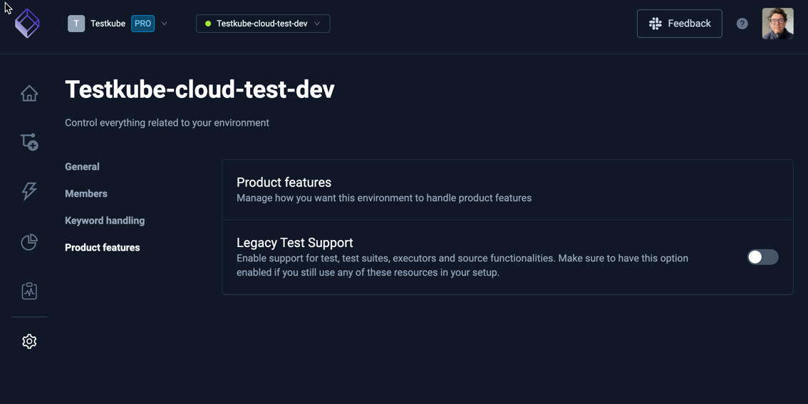
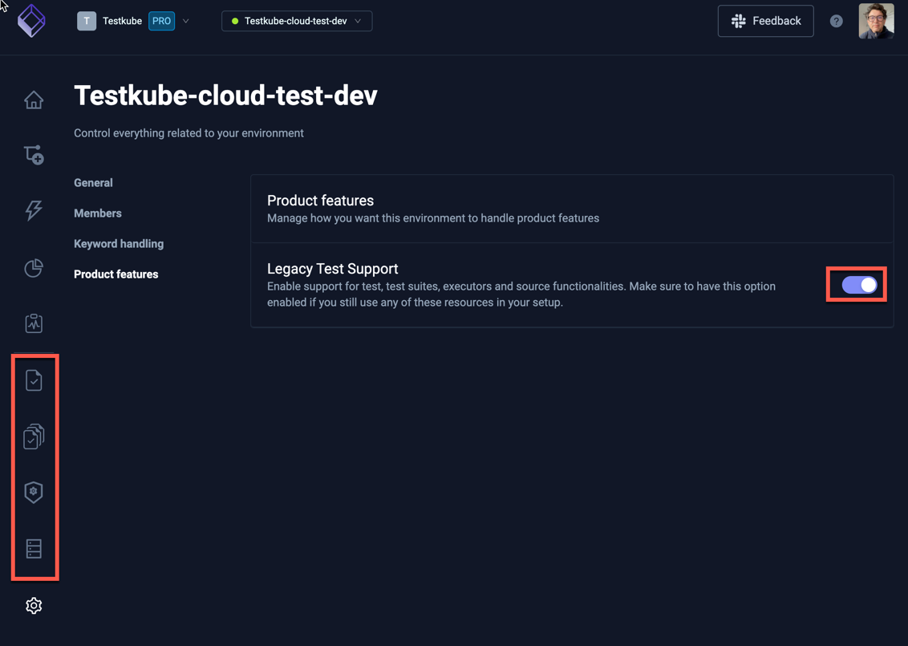

# Legacy Feature Deprecation & Documentation

This section contains the old documentation for deprecated/legacy Testkube functionality.

:::warning
Legacy functionality described in this document will be EOL and removed from Testkube by the end of 2025.
:::

## The move to Test Workflows

While the initial constructs with Tests/Executors/TestSuites made it easy to get basic tests running with Testkube, they often fell
short when users needed to run different version/commands/configurations for their tests than those provided out-of-the-box, resulting
in the need to either create/manage custom executors or use the more generic Container Executor. Furthermore, supporting
more advanced test execution like parallelization and sharding was not possible.

Read more about this transition and on how to get started with Test Workflows 
on [the Testkube blog](https://testkube.io/learn/getting-started-with-test-workflows-for-kubernetes-testing).

## Replacing Tests/Executors/Suites with Test Workflows

[Test Workflows](test-workflows) is Testkubes replacement for Tests/Executors/TestSuites, as it provides both a 
smooth initial onboarding experience for quickly running basic tests/suites, while allowing for customization 
for real-life scenarios without extensive overhead. Workflows also provides advanced features like
[parallelization](test-workflows-parallel.mdx), [sharding](test-workflows-matrix-and-sharding.mdx), 
[services](test-workflows-services.mdx), etc. that were not possible with the legacy approach.

Test Workflows also provide a powerful replacement for [Test Suites](test-workflows-test-suites.mdx), with 
far greater flexibility in regard to orchestrating multiple tests.

## Replacing Sources/Templates with Workflow Templates

[Workflow Templates](test-workflow-templates) provide a generic approach to building configurations that can be 
shared/re-used across workflows, which allows them to replace both Sources and Templates. 

## Migrating to Test Workflows

The Testkube CLI contains a migration command to help you migrate existing Tests to their Test Workflow counterpart - 
[Test Workflow Migration](test-workflow-migration).

## Enabling Legacy Tests Dashboard functionality

The Testkube Dashboard will by default hide functionality related to legacy Tests/Executors/etc, unless if 
your current environment contains legacy Test/TestSuite resources, in which case the corresponding functionality 
will be made available.

Legacy Test functionality can also be toggled manually in the Environment Settings / Product Features tab. Below 
we see Legacy Test Support disabled for the current environment:



Enabling Legacy Test Support makes the corresponding tabs/panels available in the left navigation toolbar:



## Enabling Legacy Tests Agent functionality

Testkube Agents have this feature enabled by default, it means the agent will kepp performing all supported operations with these Legacy Tests and Suites even if the [Dashboard functionality](#enabling-legacy-tests-dashboard-functionality) is disabled. To fully disable it's needed to use a flag in the Testkube Agent deployment, use the following snippet to change your `values.yaml`:

```yaml
testkube-api:
  next:
    legacyTests:
      enabled: false
```