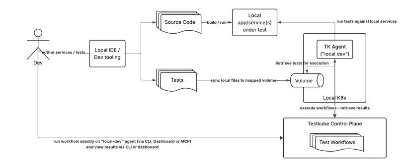

# Local Test Development and Execution

:::tip
If you're new to Testkube, make sure you have a thorough understanding of [Test Workflows](/articles/test-workflows) 
before diving into this topic.
:::

## Background

When developing your tests and/or your applications locally, it is often desirable to run your test against 
a local instance of your application, preferably without having to commit any changes of neither application nor tests to git.


Running tests natively like this is convenient but also has some drawbacks:
- corresponding tools to run tests need to be installed locally
- the tests themselves are often managed separately from source-code, requireing both tests and testing tools to be made available
  locally for test execution
- in either case, tests are not run using the same environment as they would be in your CI/CD pipelines; versions, infrastructure will be different and can ultimately lead to inconsistent test results.

## Testkube for Local Test Execution

One way to overcome these issues is to run your tests in a containerized environment regardless of how/where they run, which is exactly what 
Testkube does for you by packaging them into a container and running them in a Kubernetes cluster. Using a local Kubernetes environment
to run these tests would allow you to run them using the same tools and infrastructure as they would run in your CI/CD pipelines. 

To achieve this with Testkube, you need 
- a local Kubernetes cluster, for example Minikube or Kind
- a Testkube Runner Agent deployed in this cluster
- a Test Workflow that runs your tests on this agent, against your service/app under test
- your tests in a git repository


This solves many of the problems mentioned above:
- You don't need to install any testing tools locally as Testkubes Workflow engine will provision these automatically inside
  Kubernetes when running these tests
- Tests are run using the same execution engine and environment (Kubernetes) as they would run in your CI/CD pipelines
- Tests are run using the same source-code as they would run in your CI/CD pipelines 

There are still a couple of potential drawbacks to this approach:
- Every change to your tests will need to be committed to git before they can be run in Testkube, which makes rapid iteration on tests cumbersome
- Test results while developing tests or code locally will "pollute" the Testkube results database and 
  can skew Health and Result metrics, including associated Testkube Insights boards.

Fortunately, there are ways to overcome these issues.
- Executing silently will discount the resulting test results from any health/metric/reporting perspective
- Using a tool like title to shorten the local dev loop which bypasses the need to commit changes to git
 
## Testkube for Local Test Development

To allow Testkube to bypass (or override) the retrieval of tests from git, we can augment the above flow as follows:
- Map a folder containing local test sources to a volume accessible by the Workflow Pod.
- Make sure that the contents of this folder are in sync with local test sources.
- Update your Test Workflow to override any tests retrieved from git with the files in the local volume.



## Sample Setup with Minikube

Start by installing Minikube in your local environment and deploying a [Testkube Runner Agent](/articles/agents-overview#runner-agents) 
in the created Minikube cluster.

:::tip
If you don't want to use a regular fixed or floating license for your local development agent, the Enterprise 
plan for the Testkube Control Plane includes special licensing of local development agents - [Get in touch](https://testkube.io/contact).
:::

### Mapping a local folder to a volume 

To map local folders into Minikube, use the `minikube mount` command to mount the local folder of the repo containing 
your local test sources to a volume. 

For example, to mount the local copy of the [testkube repo](https://github.com/kubeshop/testkube) in my
`/Users/olensmar/Dev/cursor/testkube`/testkube folder, I can use the following command:

```
minikube mount /Users/olensmar/Dev/cursor/testkube/testkube:/minikube-host/testkube --uid=1000 --gid=1000
```

which will show output similar to the following:

```shell
➜  testkube git:(main) ✗ minikube mount /Users/olensmar/Dev/cursor/testkube/testkube:/minikube-host/testkube --uid=1000 --gid=1000 
📁  Mounting host path /Users/olensmar/Dev/cursor/testkube/testkube into VM as /minikube-host/testkube ...
    ▪ Mount type:   9p
    ▪ User ID:      1000
    ▪ Group ID:     1000
    ▪ Version:      9p2000.L
    ▪ Message Size: 262144
    ▪ Options:      map[]
    ▪ Bind Address: 127.0.0.1:61734
🚀  Userspace file server: ufs starting
✅  Successfully mounted /Users/olensmar/Dev/cursor/testkube/testkube to /minikube-host/testkube

📌  NOTE: This process must stay alive for the mount to be accessible ...
```

Keep this command running while you're developing your tests!

### Updating your Workflow to override tests from the mapped folder

Start by creating a [WorkflowTemplate](/articles/test-workflow-templates) that copies the test sources from the mapped volume into the /data/repo folder 
for the Workflow execution:

```yaml
kind: TestWorkflowTemplate
apiVersion: testworkflows.testkube.io/v1
metadata:
  name: local-dev-override
  namespace: testkube
spec:
  config:
    workingDir:
      type: string 
      description: the folder in the repo containing the tests to overwrite in the cloned repo
  pod:
    volumes:
    - name: local-dev-share
      hostPath:
        path: /minikube-host/testkube
        type: DirectoryOrCreate
  setup:
  - name: Overwrite from local
    optional: true
    container:
      image: busybox
      volumeMounts:
      - name: local-dev-share
        mountPath: /data/local
    shell: |
      # check if mounted volume folder exists
      [ -d "/data/local{{ config.workingDir }}" ] || { echo "Folder /data/local{{ config.workingDir }} for local override not found!"; exit 1; }
      
      # delete existing tests (to correctly mirror deleted tests) and copy local tests into repo
      rm -rf /data/repo{{ config.workingDir }}
      cp -rfv /data/local{{ config.workingDir }} /data/repo{{ config.workingDir }}
```

The WorkflowTemplate uses `spec.setup` to define an "Overwrite from local" step that copies the contents of the mapped 
volume into the specified directory under the `/data/repo` folder before any other steps are executed.

This WorkflowTemplate can then be used in any Workflow that needs to override the tests retrieved from git;

```yaml
kind: TestWorkflow
apiVersion: testworkflows.testkube.io/v1
metadata:
  name: example-cypress
spec:
  use:
  - name: local-dev-override
    config:
      workingDir: /test/cypress/cypress-14
  content:
    git:
      uri: https://github.com/kubeshop/testkube
      paths:
      - test/cypress/cypress-14
...
```

In this case, the tests cloned from the kubeshop/testkube repo in the /test/cypress/cypress-14 folder will be 
overwritten with the local test sources from the mapped volume.

### Running the Workflow

Running the Workflow on the Runner Agent with the mount available will execute as below: 


If the mount is not available because it hasn't been set or the Workflow is running on a Runner Agent that doesn't have 
the mounted volume (for example in CI/CD or a production environment), the step will fail silently:


### Accessing the host network from inside the Workflow

When running your Workflows as described above, it's likely that you'll want to target components running outside of your
Kubernetes cluster. For example, you might want to run your tests against a local instance of your application before
deploying it to your target infrastructure. To enable this, make sure your Workflow has a config parameter that 
allows you to override the target host for your test, and then pass the corresponding endpoint when running the 
Workflow locally.

:::tip
The actual host name or IP address will vary depending on your local Kubernetes environment. For minikube, it
further depends on how/where you are running it. The most common scenario, running minikube under Docker on a Mac or 
Windows, will expose the host to the container at `host.docker.internal`.
:::
