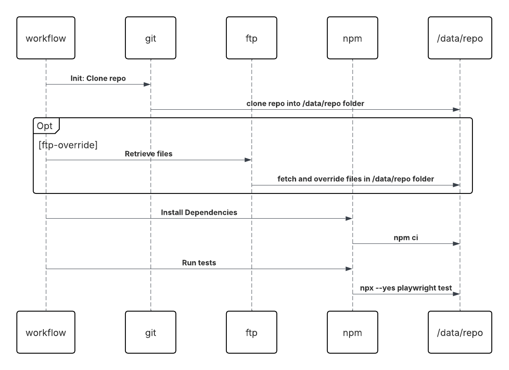

# Local Test Development

While developing the actual tests being run with a Test Workflow, it can be cumbersome to have to commit every
change to git to be able to run tests via Testkube. While there is currently no built-in Workflow functionality that allows
content retrieval from a local filesystem (instead of git), the approach outlined below shows how to achieve this with 
a local ftp server and a dedicated step in your Test Workflow that can be used to (optionally) override the test files
retrieved from git with those retrieved from your local working copy.

:::note
The below approach is a temporary workaround for the lack of local-development functionality in Testkube, which is something
we plan to support natively in the near future.
:::

## Overview

The workaround consists of the following parts:

1) A local ftp server that provides (preferably) read-only access to the folder containing the contents of the git
   repository that your Workflow is using in its `spec.content.git` configuration
2) An optional step first in your Workflow that retrieves the contents of your local git repository via ftp 
   and therefore overrides any files initially cloned from the actual git repository.
3) A local Kubernetes Cluster (minikube, kind, etc.) with a Testkube Runner Agent deployed.

### 1. Local FTP Server

In this example, we will use the [Filezilla Server](https://filezilla-project.org/download.php?type=server) but any FTP Server
should be sufficient.

1. Install the server on your local machine and connect to it with the Filezilla Server Application.
2. Configure the server by adding a user that has read-only access to your local folder containing the git repository referred to 
   by your Workflows `spec.content.git.uri` property


3. Make sure to save the changes and (optionally) use an FTP client to validate that you can connect with the configured user and see the contents
   of the specified folder.

### 2. FTP Retrieval Step

Now let's add an initial step to our Workflow that uses [lftp](https://lftp.yar.ru/) to retrieve the contents of our tests via ftp
into the `/data/repo` folder where our initial repo has been cloned, which effectively overwrites any files cloned from git
with those in your local folders.

```yaml
 steps:
  - name: Override tests from local folder
    condition: config.localOverride
    optional: true
    container:
      image: maurosoft1973/alpine-lftp
    shell: lftp host.docker.internal -u testkube,testkube -e " 
      set ssl:verify-certificate no; 
      set xfer:log 1; 
      set xfer:log-file /dev/stdout; 
      mirror /test/playwright/playwright-project /data/repo/test/playwright/playwright-project;
      quit"
```

A couple of notes:
- Make sure to set the username/password to the same you had configured in the step above - `testkube`/`testkube` in our example.
- The various set commands are used to disable SSL verification and configure logging so we can see which files that were transferred (see screenshot below)
- The step is marked as `optional` to avoid the Workflow failing if the ftp retrieval fails for some reason, you might want to remove this
  if you want to be sure the ftp retrieval works when enabled.

:::warning
For the ftp client to be able to reach the ftp server running on your local machine, the local Kubernetes instance needs to mount 
your local (host) network into the network of the Kubernetes instance itself. 

For example, pods running under Kind with Docker Desktop on MacOS can use `host.docker.internal`
to access the network of the hosting machine (as in the example below).

Refer to the documentation of your Kubernetes provider to find out the corresponding address/hostname (if available).
:::

### 3. Testkube Runner Agent

Next, install a Testkube Runner Agent in your local Kubernetes cluster as described at [Runner Agent Quickstart](/articles/install/multi-agent#runner-agent-quickstart).

Once installed, you should see the Runner Agent in the list of Agents under your Environment:


When running your Workflow, make sure to run it on this Runner Agent as described 
at [Running Workflows on Runner Agents](/articles/install/multi-agent#running-workflows-on-runner-agents).

## Putting it all together

The below Workflow is essentially the in-product example Playwright Workflow - with the additional ftp-retrieval step added. 
This approach should work for any tests/scripts that are first cloned from git and then overridden by the ftp-retrieval.

```yaml
kind: TestWorkflow
apiVersion: testworkflows.testkube.io/v1
metadata:
  name: playwright-sample
  namespace: testkube
  labels:
    docs: example
spec:
  config:
    localOverride:
      type: boolean
      default: "false"
  content:
    git:
      uri: https://github.com/kubeshop/testkube
      revision: main
      paths:
      - test/playwright/playwright-project
  container:
    workingDir: /data/repo/test/playwright/playwright-project
    image: mcr.microsoft.com/playwright:v1.53.2-noble
    resources:
      requests:
        cpu: 2
        memory: 2Gi
  steps:
  - name: override latest from local
    condition: config.localOverride
    optional: true
    container:
      image: maurosoft1973/alpine-lftp
    shell: lftp host.docker.internal -u testkube,testkube -e 
       "set ssl:verify-certificate no;
       set xfer:log 1;
       set xfer:log-file /dev/stdout;
       mirror /test/playwright/playwright-project /data/repo/test/playwright/playwright-project;
       quit"
  - name: Install dependencies
    shell: npm ci
  - name: Run tests
    shell: npx --yes playwright test --trace on
    artifacts:
      paths:
      - playwright-report/**/*
```

### Normal Execution

When running this Workflow you will be prompted to use the localOverride:


Which will run the Workflow as usual and skip the local-override step:


### Execution with Local Override

If we instead set localOverride to true, we can see that the ftp-retrieval kicks in and overwrites the cloned repository
with our local files:


We can also see this in the Filezilla log:


As you can see, the actual file retrieval is more-or-less instantaneous, which allows us to run our Workflow using our
local files before committing them to git without any performance penalty.

### Sequence Diagram

This high-level sequence diagram illustrates the execution of the Workflow:



## Next Steps

If this approach is to your liking, you could extract the ftp-retrieval step into a [WorkflowTemplate](/articles/test-workflow-templates) 
that you include in your Workflows, providing a consistent mechanism for local development (you will still need to add the `localOverride` 
parameter to your Workflow if you want to make this configurable).
