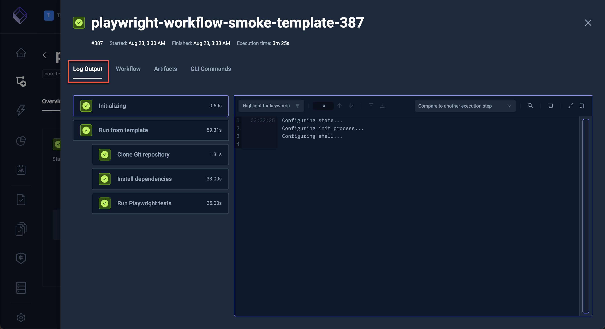
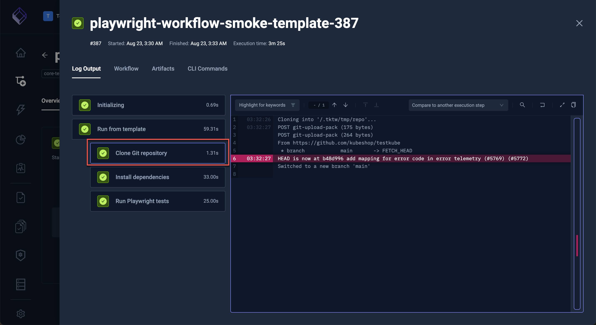
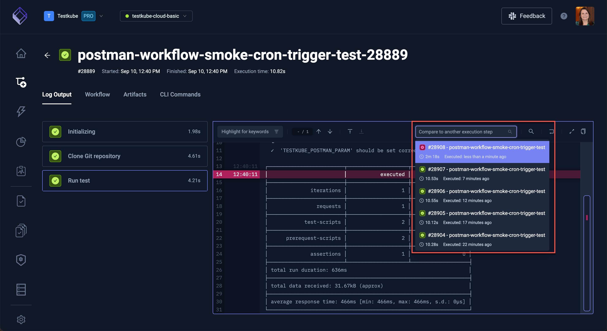
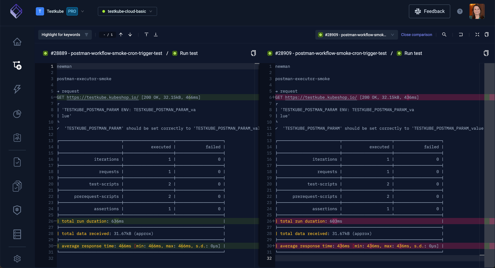
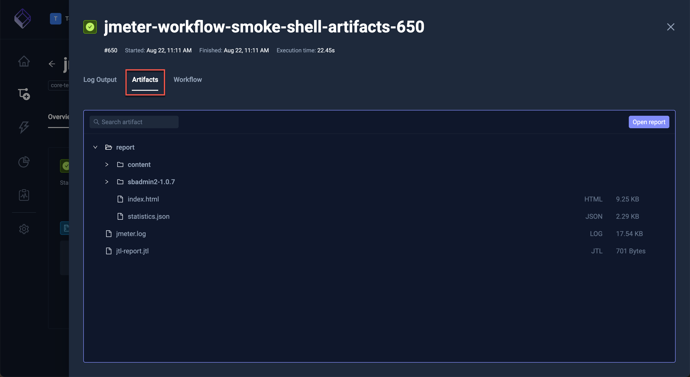
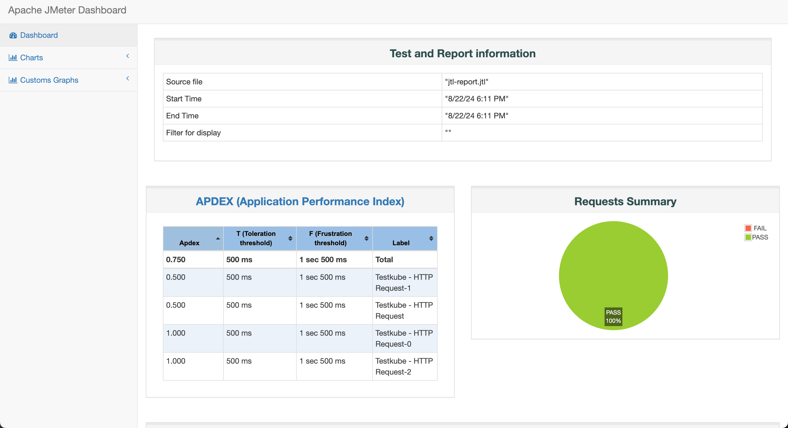

# Logs & Artifacts

## Log Collection

Testkube automatically collects logs from containers running tests within a Workflow and makes these available in
the Dashboard when opening an execution and selecting the "Log Output" tab (which is the default):

Logs are collected individually for each executed container within a workflow and can thus be inspected separately:

:::tip
You can also use Workflows to collect logs from services/components under test to help you get
a more complete picture of why a test failed - [Read More](/articles/tw-capture-logs)
:::

## Compare Log Execution Steps

Select from the **Compare to another execution step** drop down to compare two steps from the selected workflow.

The next screen will show the differences between the two steps:

## Artifact Collection

Workflows that produce artifacts can be configured to upload those to Testkubes Artifact storage - [Read More](test-workflows-artifacts). These 
could be, for example, videos, logs, html-reports, JUnit XML reports, etc. - anything that you want to make available
for inspecting or troubleshooting a test execution. 

Uploaded artifacts are available under the "Artifacts" folder:

Clicking an individual artifact will either display that artifact inline or download it - depending on its content type.
For example, below shows the HTML report available in the screenshot above:

:::tip

You can retrieve logs and artifacts using the Testkube CLI also using the [get testworkflowexecution](/cli/testkube-get-testworkflowexecution).
and [get artifact](/cli/testkube-get-artifact) commands.
:::

