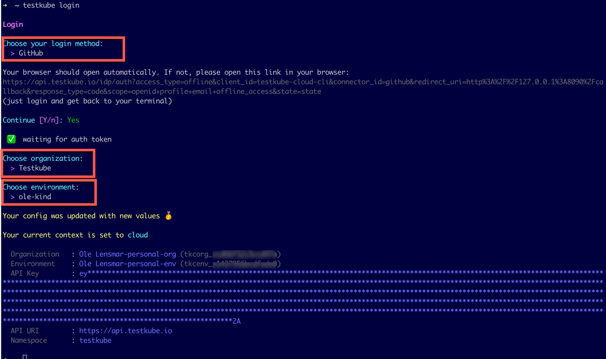

# CLI Authentication

If you're using a commercial Testkube instance, you can use the `testkube login` command to 
authenticate and connect the CLI with your Testkube Control Plane, which ensures that CLI commands 
apply to the correct Testkube Environment and security context. 

When the CLI is installed, authenticate with your Testkube Control Plane:

```bash
testkube login
```

This will prompt to open a browser window to sign in and authenticate with the Testkube Dashboard. Once authenticated, 
the CLI will prompt for the Testkube Organisation and Environment to use with CLI commands. 



## SSO Authentication

If you're using SSO or a self-hosted Testkube instance, you can use the `--email` flag with the login command to trigger the SSO login flow:

```bash
testkube login --email
```

If needed, you can also specify uri-override arguments to make sure you’re hitting the right instance
(not the public cloud):

```bash
testkube login \
--email=email@mycompany.com \
--api-uri-override=https://api.mycompany.com/ \
--auth-uri-override=https://api.mycompany.com/idp
```

## API Token Authentication

An alternative Control Plane authentication approach is to use an API Token, which can be created in the
Testkube Dashboard ([Read More](/articles/api-token-management)) and set the CLI Context accordingly. The CLI will
use this token to authenticate and gain access to corresponding Testkube resources and commands.

When the token is created, you're ready to change the Testkube CLI context using the
[`testkube set context`](/cli/testkube-set-context) command.

## Connecting Using `kubeconfig` Context

If you want to connect to your Testkube instance directly (like you would do with `kubectl`), set the CLI Context to be `kubeconfig`-based:

```sh 
testkube set context --kubeconfig
```
