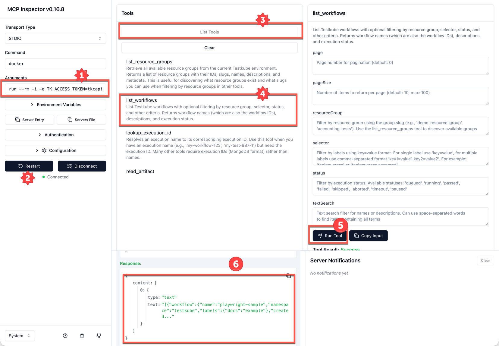

# Docker MCP Server

The Testkube MCP Server is available on [DockerHub](https://hub.docker.com/repository/docker/testkube/mcp-server) and can 
be used in IDEs via stdio and remotely over shttp in local agent scenarios.

:::tip Hosted Alternative
If you don't want to run a local Docker container, consider using the [Hosted MCP Endpoint](./mcp-setup) from the Testkube Control Plane, which provides direct access without local setup.
:::

## Running the Container

### Prerequisites

The MCP Server Container is always started with `TK_MCP_ENV_MODE=true` and requires an API-Token for authentication since it has no Testkube Context configured.

Either set required environment variables (or pass them directly when starting the container):

```bash
export TK_ACCESS_TOKEN="your_testkube_access_token"
export TK_ORG_ID="your_organization_id"
export TK_ENV_ID="your_environment_id"
```

### Required Environment Variables

- `TK_ACCESS_TOKEN` - Testkube API access token
- `TK_ORG_ID` - Testkube organization ID  
- `TK_ENV_ID` - Testkube environment ID

### Optional Environment Variables

- `TK_CONTROL_PLANE_URL` - Testkube API URL (default: https://api.testkube.io), override this for on-prem deployments. 
- `TK_DASHBOARD_URL` - Testkube dashboard URL (auto-derived from control plane URL).
- `TK_DEBUG` - Enable debug output (default: false).

## MCP Client Configuration

The Testkube Docker MCP Server can run using both stdio and shttp transports - [Read More](/articles/mcp-cli#mcp-server-transport-modes)

### VSCode / Cursor

Using `stdio` transport:

```json
{
  "servers": {
    "testkube": {
      "command": "docker",
      "args": [
        "run", "--rm", "-i",
        "-e", "TK_ACCESS_TOKEN=${TK_ACCESS_TOKEN}",
        "-e", "TK_ORG_ID=${TK_ORG_ID}",
        "-e", "TK_ENV_ID=${TK_ENV_ID}",
        "testkube/mcp-server:latest",
        "mcp", "serve"
      ],
      "type": "stdio"
    }
  }
}
```

Using `shttp` transport:

```json
{
  "servers": {
    "testkube": {
      "command": "docker",
      "args": [
        "run", "--rm", "-p", "8080:8080",
        "-e", "TK_ACCESS_TOKEN=${TK_ACCESS_TOKEN}",
        "-e", "TK_ORG_ID=${TK_ORG_ID}",
        "-e", "TK_ENV_ID=${TK_ENV_ID}",
        "testkube/mcp-server:latest",
        "mcp", "serve", "--transport=shttp"
      ],
      "type": "shttp"
    }
  }
}
```

### Claude Desktop Configuration

Using `stdio` transport:

```json
{
  "mcpServers": {
    "testkube": {
      "command": "docker",
      "args": [
        "run", "--rm", "-i",
        "-e", "TK_ACCESS_TOKEN=${TK_ACCESS_TOKEN}",
        "-e", "TK_ORG_ID=${TK_ORG_ID}",
        "-e", "TK_ENV_ID=${TK_ENV_ID}",
        "testkube/mcp-server:latest",
        "mcp", "serve"
      ]
    }
  }
}
```

Using `shttp` transport:

```json
{
  "mcpServers": {
    "testkube": {
      "command": "docker",
      "args": [
        "run", "--rm", "-p", "8080:8080",
        "-e", "TK_ACCESS_TOKEN=${TK_ACCESS_TOKEN}",
        "-e", "TK_ORG_ID=${TK_ORG_ID}",
        "-e", "TK_ENV_ID=${TK_ENV_ID}",
        "testkube/mcp-server:latest",
        "mcp", "serve", "--transport=shttp"
      ]
    }
  }
}
```

### Claude Code Configuration

Use the following to add the Testkube MCP Server to Claude Code

```bash
claude mcp add testkube -- docker run --rm -i \ 
   -e TK_ACCESS_TOKEN=${TK_ACCESS_TOKEN} \
   -e TK_ORG_ID=${TK_ORG_ID} \
   -e TK_ENV_ID=${TK_ENV_ID} \
   testkube/mcp-server:latest mcp serve
```

## Troubleshooting

### Common Issues

1. **Authentication Errors**: Verify `TK_ACCESS_TOKEN`, `TK_ORG_ID`, and `TK_ENV_ID` are correct.
2. **Network Issues**: Check `TK_CONTROL_PLANE_URL` is accessible.
3. **Permission Errors**: Ensure environment variables are properly set and the provided token has the correct role(s).

### Debug Mode

Enable debug output for troubleshooting:

```bash
docker run --rm -it \
  -e TK_ACCESS_TOKEN="$TK_ACCESS_TOKEN" \
  -e TK_ORG_ID="$TK_ORG_ID" \
  -e TK_ENV_ID="$TK_ENV_ID" \
  -e TK_DEBUG=true \
  testkube/mcp-server:latest
```

## Development

The following files are available in the [Testkube GitHub repository](https://github.com/kubeshop/testkube):

1. **`build/mcp-server/Dockerfile`** - Docker container definition
2. **`mcp-registry-metadata.json`** - Metadata for Docker MCP registry submission
3. **`build/mcp-server/build-mcp-server.sh`** - Build script for Docker image
4. **`build/mcp-server/build-local-mcp.sh`** - Local build script for testing
5. **Updated `docker-bake.hcl`** - Added MCP server target

### Security Considerations

- The container runs as non-root user (UID 1001)
- No sensitive data is stored in the image
- All authentication is handled via environment variables
- Container uses minimal Alpine Linux base image
- Multi-platform builds ensure compatibility

## Building the Docker Image

### Using the Build Script (Recommended)

```bash
# Build and push to registry
./build/mcp-server/build-mcp-server.sh testkube/mcp-server:latest

# Build locally for testing
./build/mcp-server/build-local-mcp.sh testkube/mcp-server:local
```

### Using Docker Buildx Directly

```bash
# Build multi-platform image
docker buildx build \
  --platform linux/amd64,linux/arm64 \
  --file build/mcp-server/Dockerfile \
  --build-arg VERSION="1.0.0" \
  --build-arg GIT_SHA="$(git rev-parse --short HEAD)" \
  --tag testkube/mcp-server:latest \
  --push \
  .
```

### Using Docker Bake

```bash
# Build using docker-bake.hcl
docker buildx bake mcp-server
```

### Using Local Build Script

```bash
# Build for local platform (ARM64/AMD64)
./build/mcp-server/build-local-mcp.sh testkube/mcp-server:local
```

## Build & Run locally

After building the MCP Server with `build-local-mcp.sh` you can test it with

```bash
# Run container with MCP server in stdio mode
docker run --rm -it \
  -e TK_ACCESS_TOKEN="$TK_ACCESS_TOKEN" \
  -e TK_ORG_ID="$TK_ORG_ID" \
  -e TK_ENV_ID="$TK_ENV_ID" \
  testkube/mcp-server:local

# Test with MCP Inspector
npx @modelcontextprotocol/inspector docker run --rm -i \
  -e TK_ACCESS_TOKEN="$TK_ACCESS_TOKEN" \
  -e TK_ORG_ID="$TK_ORG_ID" \
  -e TK_ENV_ID="$TK_ENV_ID" \
  testkube/mcp-server:local mcp serve
```

### Using with the MCP Inspector

When launching the MCP Inspector as shown above, follow these steps to invoke one of the available tools:

1. Make sure the arguments contain the environment variables `TK_ACCESS_TOKEN`, `TK_ORG_ID`, and `TK_ENV_ID`
2. Press the "Connect" button
3. Select "List Tools" to see the available tools
4. Select the tool you want to use, in the below screenshot we use list_workflows
5. Select "Run Tool" to the right
6. See the response in the bottom left panel.


