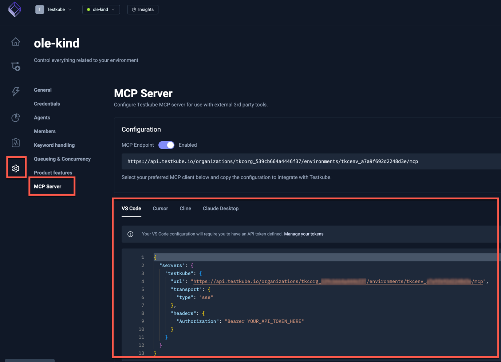

# Testkube Control Plane MCP Endpoint

The Testkube Control Plane provides an MCP endpoint that allows you to connect directly to Testkube without running a local MCP server. This is the recommended approach for most users.

:::tip
This is the easiest way to get started with the Testkube MCP Server - no local installation required!
:::

## Why Use the Control Plane MCP Endpoint?

- **No local setup** - No need to install the Testkube CLI or Docker
- **Remote access** - Connect to Testkube from any location without local setup
- **Always available** - The endpoint is always running and accessible
- **Simplified deployment** - No need to manage a local MCP server process
- **Centralized configuration** - Manage authentication and permissions through the Control Plane
- **Team collaboration** - Multiple users can connect to the same endpoint
- **Automatic updates** - Control Plane updates are handled automatically
- **Consistent performance** - Leverages the Control Plane's infrastructure

## Prerequisites

- **Access to a Testkube Environment** - You need an active Testkube organization and environment
- **API Token** - A valid Testkube API token with appropriate permissions
- **An AI tool that supports MCP with SSE transport** - Such as Claude Desktop, Cursor, VS Code with GitHub Copilot, or custom MCP clients

## Endpoint URL Structure

The Control Plane MCP endpoint follows this URL pattern:

```
https://api.testkube.io/organizations/{organization_id}/environments/{environment_id}/mcp
```

Replace:

- `{organization_id}` with your Testkube organization ID (e.g., `tkcorg_076487a004a7f6fb`)
- `{environment_id}` with your environment ID (e.g., `tkcenv_d19e797ff2c1449b`)

:::tip Finding Your IDs
You can find your organization and environment IDs in the Testkube Dashboard URL or by running:

```bash
testkube get context
```

:::

## Configuration Example

To use the Control Plane MCP endpoint with an AI tool that supports SSE (Server-Sent Events) transport:

```json
{
  "mcpServers": {
    "testkube": {
      "url": "https://api.testkube.io/organizations/tkcorg_076487a004a7f6fb/environments/tkcenv_d19e797ff2c1449b/mcp",
      "transport": {
        "type": "sse"
      },
      "headers": {
        "Authorization": "Bearer YOUR_API_TOKEN_HERE"
      }
    }
  }
}
```

Replace:

- `tkcorg_076487a004a7f6fb` with your actual organization ID
- `tkcenv_d19e797ff2c1449b` with your actual environment ID
- `YOUR_API_TOKEN_HERE` with your Testkube API token

## Obtaining an API Token

1. Log in to your Testkube Dashboard
2. Navigate to **Organization Settings** → **API Tokens**
3. Create a new API token with appropriate permissions
4. Copy the generated API token (you won't be able to see it again)

See [API Token Management](/articles/organization-management#api-tokens) for more details.

## Control Plane Endpoint in the Testkube Dashboard

The Testkube Dashboard provides convenient access to the Control Plane MCP endpoint for your Testkube Environments together with
configuration examples for common IDEs, simply navigate to the Environment Settings page and select the MCP Server option:



:::info Testkube Cloud vs Self-Hosted
The MCP endpoint feature shown in the screenshots above is **enabled by default** in Testkube Cloud.

For **self-hosted installations**, you must enable this feature in your Helm configuration (see below) before the MCP Server settings tab and endpoint become available.
:::

## Enabling MCP for Self-Hosted Deployments

:::warning Self-Hosted Configuration Required
For self-hosted Testkube Enterprise installations, the MCP endpoint is **disabled by default**. You must enable it via Helm configuration before it becomes available.
:::

### Step 1: Enable MCP in Helm Configuration

Add the following environment variables to your Helm values file:

```yaml
testkube-cloud-api:
  additionalEnvVars:
    - name: MCP_ENABLED
      value: "true"

testkube-cloud-ui:
  additionalEnv:
    MCP_ENABLED: true
```

### Step 2: Enable MCP per Environment

After deploying with MCP enabled, you need to enable it for each environment:

1. Log in to your Testkube Dashboard
2. Navigate to **Environment Settings** → **MCP Server**
3. Toggle the **MCP Endpoint** switch to "Enabled"
4. Copy the configuration for your preferred IDE

### Step 3: Configure Your AI Tool

For self-hosted instances, use your custom control plane URL in the MCP configuration:

```json
{
  "mcpServers": {
    "testkube": {
      "url": "https://your-control-plane.example.com/organizations/{organization_id}/environments/{environment_id}/mcp",
      "transport": {
        "type": "sse"
      },
      "headers": {
        "Authorization": "Bearer YOUR_API_TOKEN_HERE"
      }
    }
  }
}
```

Replace:

- `your-control-plane.example.com` with your self-hosted control plane domain
- `{organization_id}` with your organization ID
- `{environment_id}` with your environment ID
- `YOUR_API_TOKEN_HERE` with your API token
