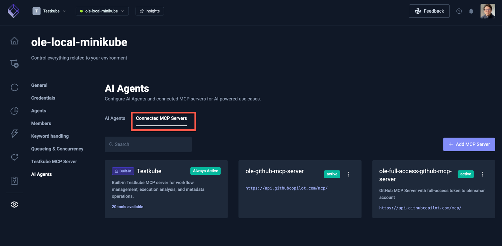
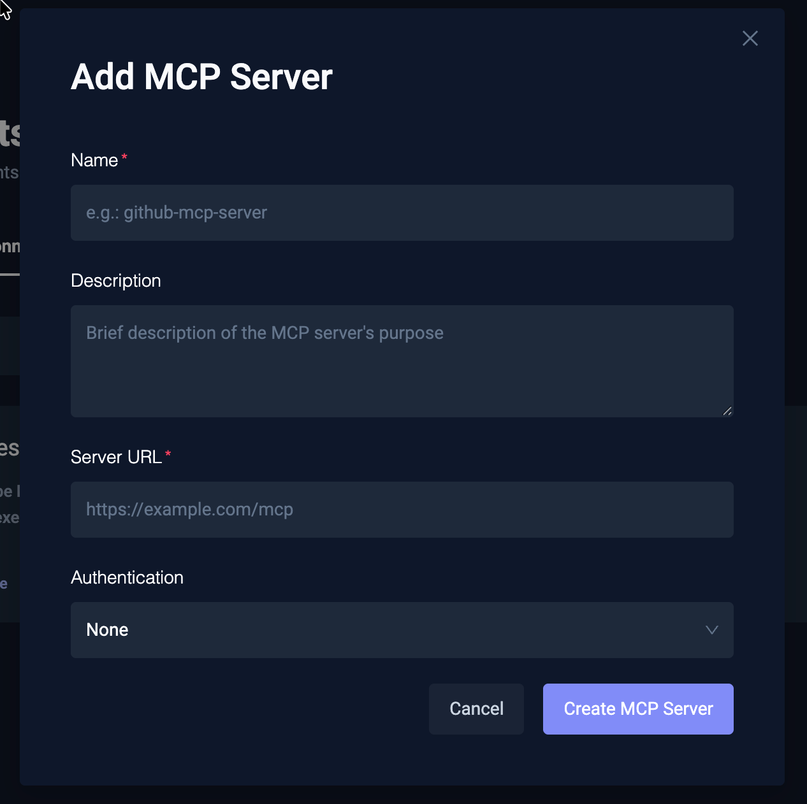
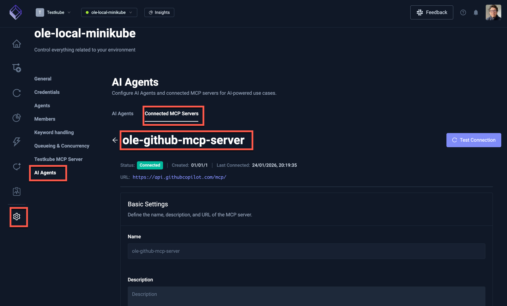
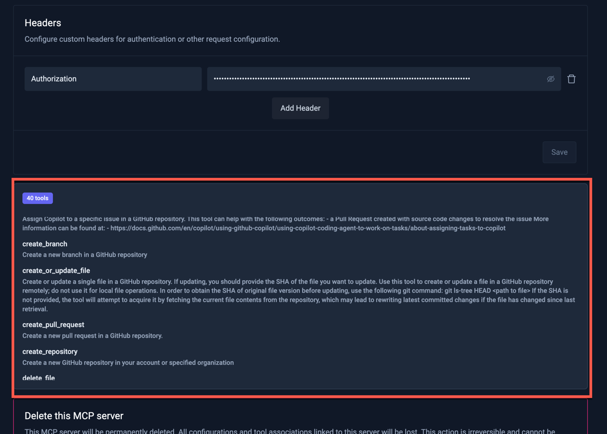

# Connected MCP Servers for AI Agents

For an AI Agent to have access to MCP Server(s) to perform its tasks, these MCP Servers need to be connected to the
Testkube platform. Once connected, they can be used by an AI Agent as described in [Configuring MCP Servers](/articles/defining-ai-agents#configuring-mcp-servers).  

Connected MCP Servers are shown in the Connected MCP Servers panel:

## Adding a new MCP Server

Select the "Add MCP Server" button to open the below modal, which prompts you for:

- **Name**: the name of the MCP Server
- **Description**: an optional description of what the MCP Server does and can be used for
- **Server URL**: the URL of the MCP Server
- **Headers**: optional headers to be sent with the requests to the MCP Server - mostly used for authentication

:::note
Testkube currently only supports header-based authentication for MCP Servers - authentication via OAuth flows will 
be supported in a near-future release.
:::

If the provided MCP Server can be accessed successfully, it will be added to the list of MCP Servers for further
configuration (see below).

## Configuring an MCP Server

Configure an existing (or newly added) MCP Server by selecting it from the list of MCP Servers. The provided 
panel has fields for

- **Name** (read-only): the name of the MCP Server
- **Description**: an optional description of what the MCP Server does and can be used for
- **Server URL**: the URL of the MCP Server
- **Headers**: optional headers to be sent with the requests to the MCP Server - mostly used for authentication
- **Tools**: a list of the tools available in the MCP Server
- **Delete**: option to delete the MCP Server

### MCP Server Tools

The list of tools available in an MCP Server is shown in the "Tools" section of the MCP Server panel. These tools can then 
be made available to AI Agents as described in [Defining AI Agents](/articles/defining-ai-agents#configuring-mcp-server-tools).

