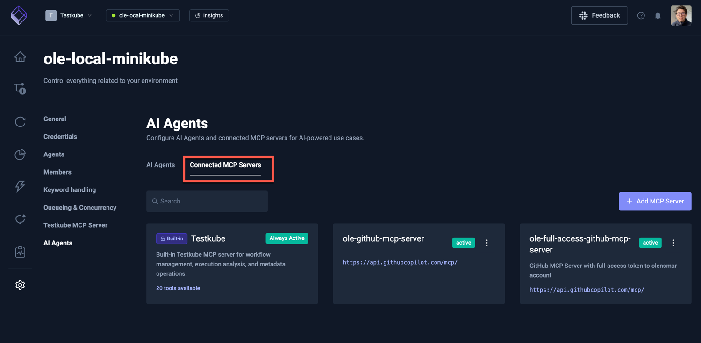
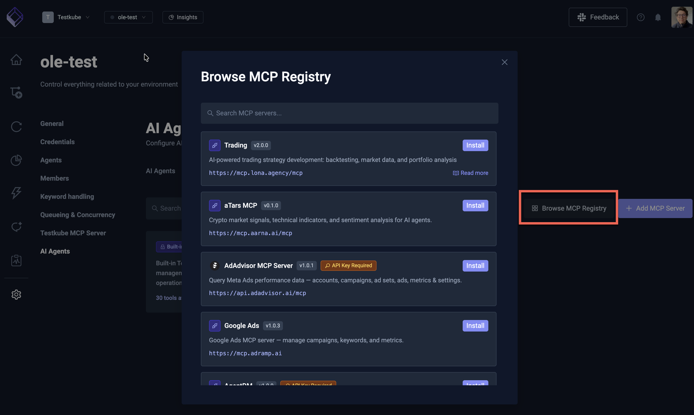
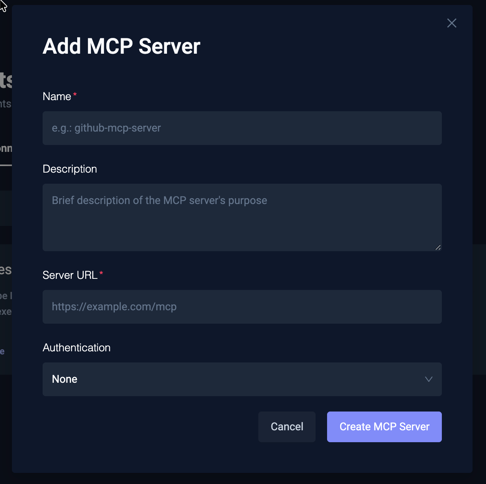
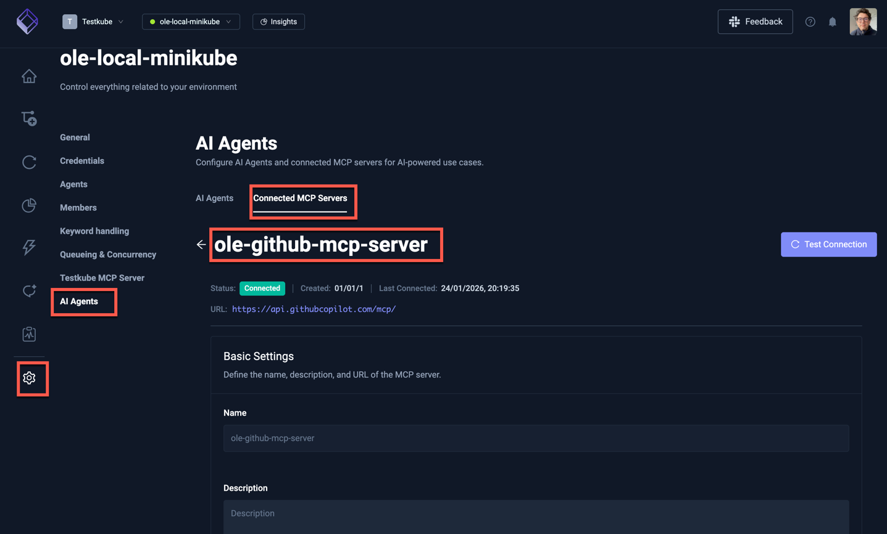
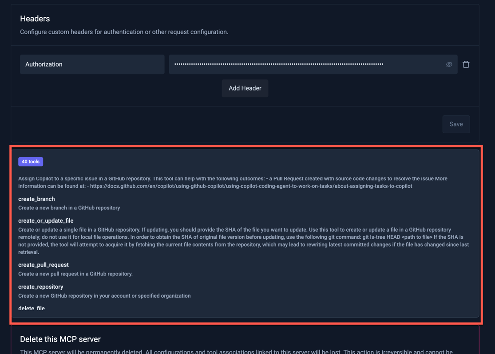

# Connected MCP Servers for AI Agents

For an AI Agent to have access to MCP Server(s) to perform its tasks, these MCP Servers need to be connected to the
Testkube platform. Once connected, they can be used by an AI Agent as described in [Configuring MCP Servers](/articles/defining-ai-agents#configuring-mcp-servers).  

Connected MCP Servers are shown in the Connected MCP Servers panel:

## Adding a New MCP Server

There are two ways to add an MCP Server: browse the MCP Server Registry for popular servers, or
configure one manually by providing its URL and authentication details.

### From the MCP Server Registry

Select the **Browse Registry** button to open the MCP Server Registry — a curated catalog of popular
MCP Servers that you can add with minimal configuration.

Browse or search for the server you need (e.g. GitHub, Slack, Jira, Linear), select it, and follow the
prompts to provide the required authentication credentials. The server URL and available tools are
pre-configured from the registry entry.

### Manual Configuration

Select the **Add MCP Server** button to configure an MCP Server manually. This is useful for
self-hosted servers, internal tools, or servers not yet listed in the registry.

The modal prompts you for:

- **Name**: the name of the MCP Server
- **Description**: an optional description of what the MCP Server does and can be used for
- **Server URL**: the URL of the MCP Server
- **Authentication**: how to authenticate with the MCP Server (see [Authentication](#authentication) below)

If the provided MCP Server can be accessed successfully, it will be added to the list of MCP Servers for further
configuration (see below).

## Authentication

Testkube supports two methods for authenticating with MCP Servers:

### Header-Based Authentication

Add custom headers that are sent with every request to the MCP Server. This is the most common method
for servers that use API keys or bearer tokens.

For example, to authenticate with the GitHub MCP Server:
- **Header name**: `Authorization`
- **Header value**: `Bearer <your-github-token>`

### OAuth Authentication

For MCP Servers that support OAuth, you can authenticate using an OAuth flow instead of managing
tokens manually. Select **OAuth** as the authentication method and follow the authorization prompt
to grant Testkube access to the MCP Server on your behalf.

OAuth is particularly useful for services where:
- Tokens are short-lived and need automatic refresh
- You want to use your existing user identity rather than a service account token
- The MCP Server provider requires OAuth for API access

<!-- Screenshot placeholder: OAuth authentication flow -->

## Configuring an MCP Server

Configure an existing (or newly added) MCP Server by selecting it from the list of MCP Servers. The provided 
panel has fields for:

- **Name** (read-only): the name of the MCP Server
- **Description**: an optional description of what the MCP Server does and can be used for
- **Server URL**: the URL of the MCP Server
- **Authentication**: headers or OAuth configuration for authenticating with the MCP Server
- **Tools**: a list of the tools available in the MCP Server
- **Delete**: option to delete the MCP Server

### MCP Server Tools

The list of tools available in an MCP Server is shown in the "Tools" section of the MCP Server panel. These tools can then 
be made available to AI Agents as described in [Defining AI Agents](/articles/defining-ai-agents#configuring-mcp-server-tools).

