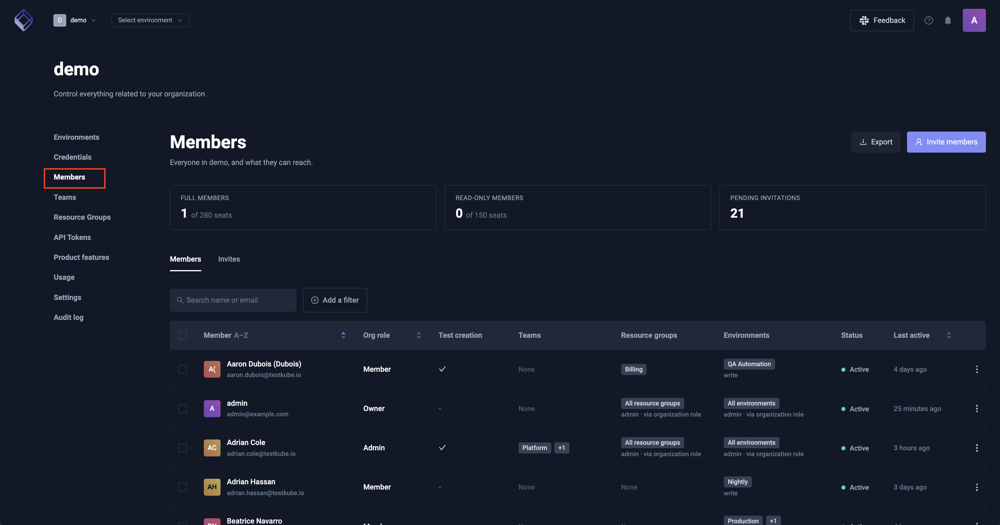
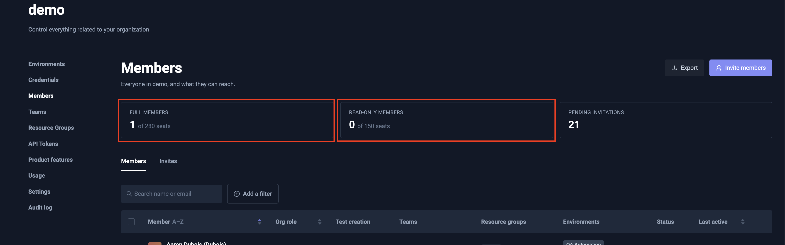
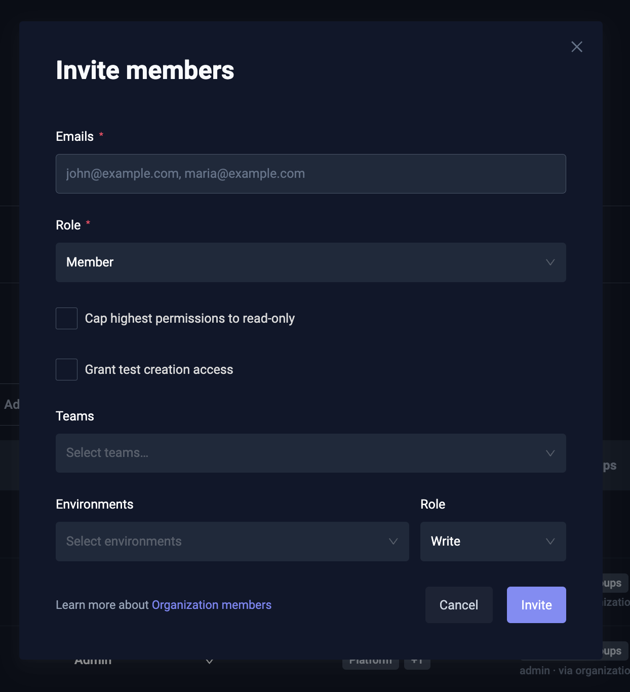
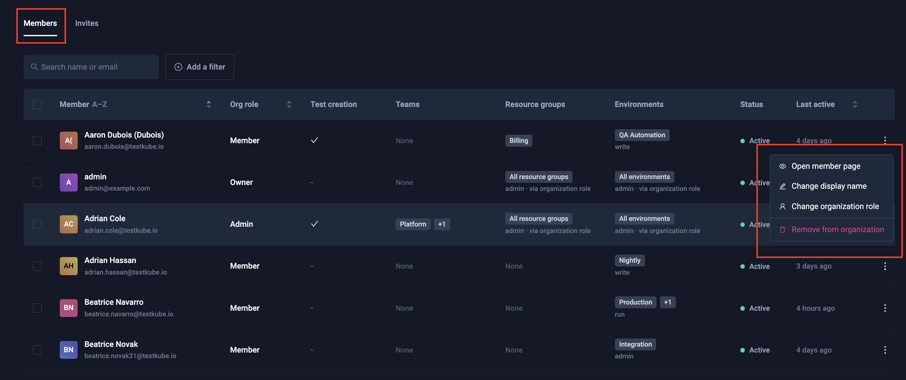
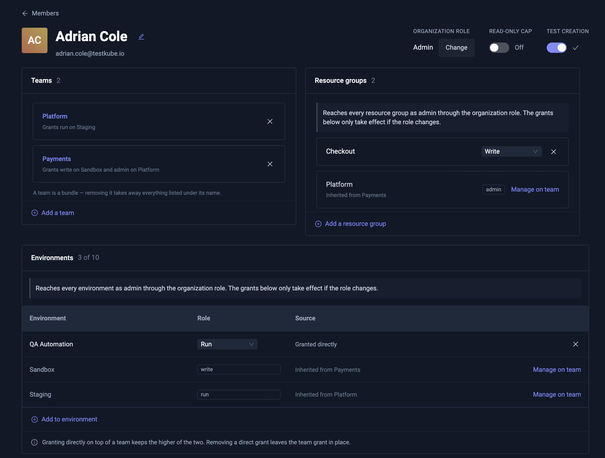
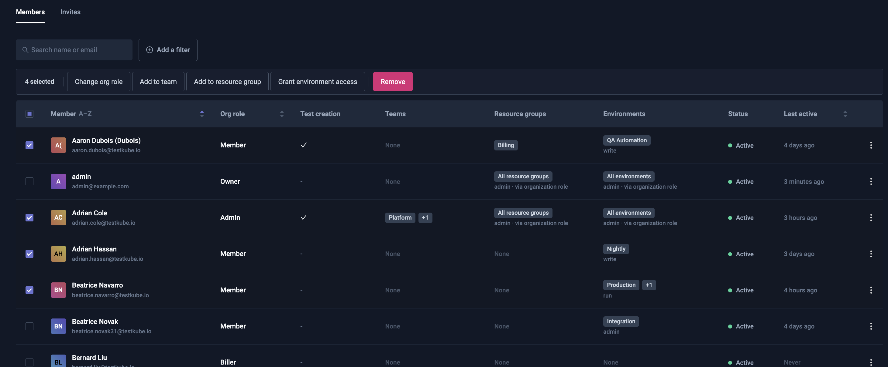
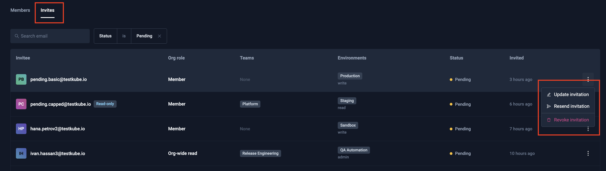

# Member Management

Manage your organization members from the [Members] option in the Organization management panel:

:::note
This document describes high-level member management within an Organization, please
check out [Resource Access Management](/articles/resource-access-management) to get an overview of how Testkube
allows you to manage and apply Resource Access controls for Organization Members.
:::

## Member Types

Testkube allows you to license for two type types of members; **full** and **read-only**. A members' type
is implicit and based on if that member has been given write-access to any resource/environment in Testkube:

- A member that has been given write-access automatically counts as a full member.
- A member that does not have any write-access counts as read-only.

You can see the number of used/available seats of each type in the members page:

### Rules / Constraints

This model imposes some constraints related to member types and permissions:

- It is not possible to give an existing read-only member write-access to any resource or environment,
  either directly or indirectly, if no full-member seats are available.
- When giving a read-only member write access to any resource or environment, and full-member seats are available,
  that member will automatically count to the full member quota instead.
- It is not possible to invite a member (or accept an invitation) if all member seats are occupied.
- For on-prem/SSO-enabled deployments, new members will not be able to sign in if no seats are available.
- Members who are read-only will count to the full-member limit if there aren't enough read-only seats available.

### Member licensing with the Testkube Cloud Control Plane

When using the Testkube Cloud Control Plane instead of hosting the Control Plane on-prem, members can be
licensed either within a fixed limit, or based on active member count at the end of each month.

- **Fixed** members licensing allocates a fixed number of full and read-only members to your organization, for which
  you will be billed in your billing cycle.
- **Pay-as-you-go** member licensing counts the number of members at the end of each
  billing cycle and bills you for that number of members. Please note that Pay-as-you-go licensing always invoices
  all members as full members even if there might a certain number of read-only members at a given point in time.
  Pay-as-you-go licensing is indicated by **Unlimited seats** on the member count cards:

:::info
Cloud Control Plane Trials have a 3 full and 5 read-only member limit by default.
:::

## Inviting Members

Invite new members from the Members page by specifying:

- Emails - a comma-separated list of emails to invite.
- Role - there are 4 roles for organization members:
  - `Owner` - Has access to all environments and organization settings, also can access billing details.
  - `Admin` - Has access to all environments and organization settings.
  - `Member` - Access to Resource Groups and Environments is defined by the roles assigned to given member.
  - `Biller` - Has access to billing details only.
- Teams - which Teams the invited members should belong to.
- Environments - which Environments the invited members should be added to, with their corresponding Environment Role

:::note
A new member will not have access to any resources or environments and will initially count as a read-only
member (see above) unless default permissions have been assigned via [SCIM](/articles/scim)
or [bootstrap member mapping](/articles/install/advanced-install#bootstrap-member-mapping).

See [Resource Access Management](/articles/resource-access-management) to learn how to give members access to
environments and resources.
::::

Once all specified, select the Invite button in the bottom right.

:::tip
For Testkube On-Prem deployments you can configure default organizations, environments and roles for users - see
[Bootstrap User Mapping](/articles/install/advanced-install#bootstrap-member-mapping).
:::

## Manage existing Members

The Members tab lists everyone in the organization with their role, teams, resource groups and
environments. Search by name or email, filter by role, team, resource group or environment, and
sort by name or last activity. **Export** downloads the filtered list as CSV, including each
grant's level and whether it is direct or inherited.

Select a row to open that member's page. Use the menu on the right to change their organization
role, rename them, opem member's page or remove them.

### Display names

Members are identified by email by default. Use **Change display
name** on the row menu, or on the member page, to give someone a name inside this organization.

### Member page

A member's page shows everything they can reach in one place: organization role, read-only cap,
teams, resource groups and environments. Each grant shows its level and where it comes from —
granted directly, or inherited from a team.

Grants can be added and changed from here, so you do not have to visit each environment or
resource group separately.

### Bulk actions

Tick several members to act on all of them at once: change their organization role, add them to a
team or resource group, grant environment access, or remove them from the organization.

The selection covers the members on the current page and is cleared when you change page, filter
or sort.

## Manage Invitations

The Invites tab lists invitations with their status — pending, accepted, declined, revoked or
failed (past its expiry). Filter by status or search by email.

The menu on each row offers:

- **Pending** — Update the role, teams and environments the invitation grants; Resend the email;
  or Revoke it.
- **Failed, declined or revoked** — **Invite again**, which opens the invite form filled in from
  the old invitation so you can send a fresh one. Resending is not offered, because the original
  link can no longer be accepted.

## Read access controls: Org-wide Read tokens & the Read-only user cap

### 1. Org-wide Read role (API tokens)

The **Org-wide Read** organization role grants automatic, read-only access to every
environment and resource group in the organization. It is intended for **API tokens** —
CI jobs, dashboards, observability/integrations, and scripts that need to read across the
whole org without being granted access to each environment individually. It is **not**
assignable to human members from the dashboard (members use Owner / Admin / Member).

### 2. Read-only cap for users (`maxRole`)

The **read-only cap** sets a per-member _ceiling_ on effective permissions. When a member
is capped to read, their effective role on every environment and resource group is
reduced to **read**, regardless of:

- direct environment/group roles they were granted,
- roles inherited from team membership, and
- the org **admin/owner** bypass (a capped admin is still limited to read).

Effective role = **min(granted role, cap)**. This is enforced everywhere access is
checked, so you can lock a member down to read without editing each individual grant —
useful for auditors, temporary read-only access, or revoking write access in one place.

Where a cap lowers a grant, the member page shows the capped level with the granted level
underneath — for example `read`, with `granted write` below it — so you can see what the member
would have without the cap, and what removing it would restore.

### Choosing between them

- Need a **machine identity that can read the whole org**? → issue an **Org-wide Read**
  API token.
- Need to **restrict a person** (including an admin) to read-only without touching each
  grant? → apply the **read-only cap** to that member/invite.

Both keep the user/identity on a **read-only seat** rather than consuming a full seat.
