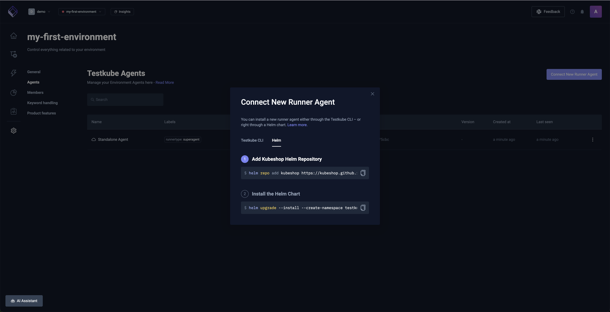

# Installing Testkube Agent with Helm Charts

You can install a Testkube Runner or Listener Agents using the `kubeshop/testkube-runner` Helm Chart. The Standalone
Agent is installed as described at [Installing the Standalone Agent](/articles/install/standalone-agent#installing-the-standalone-agent).

## Basic installation

Make sure you've read about Testkube Agents at [Agents Overview](/articles/agents-overview) before diving into the installation.

### Creating Agent for Helm Charts

To create an Agent with both the runner and listener capability, you can run `testkube create agent` command, like:

```sh
testkube create agent my-name --label my-label=my-value
```

After selecting the environment (unless you pass `--env env-id` parameter),
it will display information with agent ID and secret key:

```
ID:             tkcrun_55c1c5845a1fd20d9bf5de7737311959
Name:           my-name
Type:           Runner (reserved)
Created:        25 Apr 25 10:18 +0200 (0s)
Disabled:       no
Secret Key:     tkckey_run_6kivz9hvgoxwd9ihqq9xyhihk1y3qzua
Last Activity:  never
Last Version:
Last Namespace:
Environments:
    my-environment (tkcenv_9868d11cdb3ca577)
Labels:
   my-label: my-value
Policy:
   Required Matching Labels: name
```

### Helm install

Use the following command to install the Helm Chart from OCI Registry:
   ```sh
   helm upgrade --install \
     --create-namespace \
     --namespace my-runner \
     --set 'runner.id=<your:tkcrun_:runner_id>' \
     --set 'runner.orgId=<your:tkcorg_:organization_id>' \
     --set 'runner.secret=<your:tkckey_run_:key>' \
     --set 'cloud.url=agent.testkube.io:443' \
     my-runner oci://registry-1.docker.io/kubeshop/testkube-runner --version <version>
   ```

You can also use own `values.yaml` file, based on [our defaults](https://github.com/kubeshop/helm-charts/blob/main/charts/testkube-runner/values.yaml):

```yaml
runner:
  id: "<your:tkcrun_:runner_id>"
  orgId: "<your:tkcorg_:organization_id>"
  secret: "<your:tkckey_run_:key>"

cloud:
  url: "agent.testkube.io:443"
```

## Self-registering Agent Helm install

Sometimes it may be desirable to allow Agents to create themselves automatically on deployment (without using the CLI),
for example when using an ephemeral testing environment that is programmatically created.

Each environment has an Agent Join Token assigned to it. This API key can be used for creating Agents automatically when
the Agent itself first starts.

This enables you to install the Agent using only `helm`:

1. Retrieve the helm instructions including the Agent join token for the target environment:
   
2. Install the Helm Chart:
   ```sh
   helm upgrade --install \
     --create-namespace \
     --namespace my-runner \
     --set 'runner.orgId=<your:tkcorg_:organization_id>' \
     --set 'runner.register.token=<your:tkcapi_:key>' \
     --set 'cloud.url=agent.testkube.io:443' \
     --set 'runner.enabled=true' \
     --set 'listener.enabled=true' \
     my-runner oci://registry-1.docker.io/kubeshop/testkube-runner --version <version>
   ```
   
Or with a values file:

```yaml
runner:
  enabled: true
  orgId: "<your:tkcorg_:organization_id>"
  register: 
    token: "<your:tkcapi_:key>"
  
listener:
  enabled: true

cloud:
  url: "agent.testkube.io:443"
```

### Limitations of self-registering Agents

- Self-registering Agents must be able to create Kubernetes `Secrets` in their namespace.
  These secrets are used to store the agent's ID and connection key which are generated during registration.
  If the Agent cannot create a `Secret` it will self-register every time it starts up.
- Agents will not deregister themselves during `helm uninstall`. Instead, self-registered Agents must be manually removed using the UI or CLI.

## Runner Agent Cookbook

There are common things that you may want to set up in your values.

### Install Runner Agent in one namespace and run executions in another

To separate concerns, you may separate your Runner Agents from the execution:

```yaml
execution:
  default:
    namespace: my-execution-namespace
```

### Disable access to Kubernetes from executions

By default, your executions will use a ServiceAccount that has access to pods, jobs, and events.
It's required for [Parallel Steps](/articles/test-workflows-parallel) and [Services](/articles/test-workflows-services).

To disable it, you can disable auto-creation of ServiceAccount for executions:

```yaml
execution:
  default:
    serviceAccount:
      autoCreate: false
      # name: my-custom-service-account # you can also use your own service account
```

:::tip
Read more about [ServiceAccounts below](#service-accounts)
:::

### Support additional namespaces

You can also allow the Runner Agent to schedule in multiple namespaces.

In your `values.yaml` file:

```yaml
execution:
  additionalNamespaces:
    'custom-namespace':
      serviceAccount:
        autoCreate: false # set 'true' to allow parallel steps & services
        # name: my-custom-service-account # you can also use your own service account
```

Then, in your workflow configure:

```yaml
spec:
  job:
    namespace: custom-namespace
```

### Setting Global Template

For each Runner Agent, you may set a custom Global Template.
It will be used as the foundation for every execution in this Runner Agent.

It's useful, for example, to set up OpenShift's security context that will be separate for each Runner Agent:

```yaml
globalTemplate:
  enabled: true
  spec:
   pod:
     securityContext:
     enabled: true
     fsGroup: 1000650001
     runAsUser: 1000650001
   container:
     securityContext:
       runAsUser: 1000650001
       runAsNonRoot: true
```

### Register as a floating Runner Agent

Self-registering Runner Agents are by default assigned a fixed license, if you wish to assign them a floating license 
instead you can do as follows:

```yaml
runner:
  register:
    floating: true
```

:::tip
Read more about floating licenses at [Licensing for Runner Agents](/articles/agents-overview#licensing-for-runner-agents)
:::

### Service Accounts

The Runner Agent Helm Chart creates two kinds of ServiceAccounts:

- `exec-sa-testkube` - ServiceAccount for the Execution Pods; it allows the Execution to schedule and monitor Pods for `services` and `parallel` syntaxes.
- `agent-sa-testkube` - ServiceAccount for Agent Pods; it allows the Runner Agent to (1) create pods for executions, and (2) read configmaps/secrets in own namespace.

The `agent-sa-testkube` ServiceAccount needs to be in the Runner Agent's namespace, as it's used by the Runner Agent's Pod.
The `exec-sa-testkube` ServiceAccounts are deployed to the namespaces where the executions will run as they need to use them in the above situations.

:::note
The `-testkube` suffix in the ServiceAccount names above and below might differ based on the underlying Helm Chart release name.
:::

:::tip
See the [Chainsaw Example](/articles/examples/chainsaw-basic) to see how a custom ServiceAccount can be used in your Workflow.
:::

#### Example: Using the same namespace for Runner Agent and Executions

By default, we deploy both Runner Agent and Executions to the same namespace the Helm Chart is released to. 
Then, `agent-sa-testkube` and `exec-sa-testkube` are deployed in that namespace. `agent-sa-testkube` has wider permissions and is used by Runner Agent, 
`exec-sa-testkube` has smaller permissions and is used by Executions.

#### Example: Avoid ServiceAccount for the executions

If you are not using `services` and `parallel` syntax, you may want to set Helm Chart values to:

```yaml
execution:
  default:
    serviceAccount:
      autoCreate: false
```

This way, the executions will use default or specified ServiceAccount, that likely won't have access to i.e. reading pods (in opposite to auto-created one). 
This blocks the ability of using `services` and `parallel` though, unless you will provide service account name in the spec with

```yaml
  pod: 
    serviceAccountName: "my-name-or-i-e-agent-sa-testkube"
```

:::tip
Read more about Workflow `pod` configuration at [Test Workflows - Job and Pod Configuration](/articles/test-workflows-job-and-pod).
:::

#### Example: Run executions in a different namespace than the Runner Agent

For better security, you may isolate the executions to be running in a different namespace than the Runner Agent. This way, you ensure that they 
cannot read Runner Agent's data (like Agent Token), or anything else. Also, this could help to deploy multiple Runner Agents in the same namespace 
while having the executions for each of them in a different one.

To achieve that, you can use such Helm Chart values:

```yaml
execution:
  default:
    namespace: "my-namespace-where-only-executions-should-run"
```

In such case:
- `agent-sa-testkube` ServiceAccount will still be deployed in the Helm Chart release namespace,
- `exec-sa-testkube` ServiceAccount will be deployed in `my-namespace-where-only-executions-should-run` namespace

#### Example: Full Security

You can as well combine both cases - avoid `parallel`/`services` and deploy executions to a separate namespace. This way you have full isolation.

```yaml
execution:
  default:
    namespace: "my-namespace-where-only-executions-should-run"
    serviceAccount:
      autoCreate: false
```

#### Example: Multiple Namespaces

To allow Runner Agent to support  

```yaml
  job:
    namespace: "non-default-namespace"
```

in the Test Workflow's spec (see [Test Workflows - Job and Pod Configuration](/articles/test-workflows-job-and-pod)), you can provide additional namespaces alongside the default one:

```yaml
execution:
  additionalNamespaces:
    non-default-namespace:
      serviceAccount:
        autoCreate: true
```

## Listener Agent Cookbook

### Listening in additional namespaces

Listener Agents only listen for events in the namespace where they are deployed by default. You can configure 
additional namespaces to listen to by setting the `additionalNamespaces` value in the Helm Chart:

```yaml
listener:
  enabled: true
  additionalNamespaces:
    - nm-2
    - nm-3
```

### Listening in all namespaces

If you don't want to maintain a list of namespaces, you can enable cluster-wide listening by setting `watchAllNamespaces` to `true`:

```yaml
listener:
  enabled: true
  watchAllNamespaces: true
```

This makes the Listener Agent watch every namespace in the cluster. Use this when you need full coverage or when namespaces are created dynamically.
