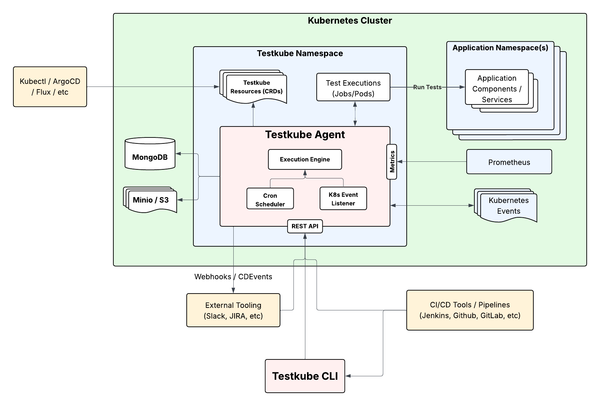

# Testkube Open Source 

The Testkube Agent is 100% Open Source and can be [deployed in standalone mode](install/standalone-agent) without being connected
to the commercial Control Plane.

Once deployed, you can interact with the agent through the [Testkube CLI](install/cli) or directly via the [Agent API](/openapi/overview#agent-api). 

- Check out [Getting Started](/articles/getting-started-with-open-source) on how to quickly set up your first Test Workflows.
- Read more about [Test Workflows](/articles/test-workflows) to learn how to run any type of test with Testkube.
- Head over to the [Examples & Guides](/articles/examples/overview) for sample Test Workflows with popular testing tools.
- Check out the [Getting Started with Testkube Open Source](https://testkube.io/blog/getting-started-with-testkube-open-source) blogpost to further see how you can use the Standalone Agent with GitHub Actions
- Go through the [CLI Reference](/cli/testkube) to see available CLI commands.
- Head over to the [Testkube Slack](https://bit.ly/testkube-slack) to ask questions and (hopefully) get answers.

## Open Source Functionality Overview

As described in the [Standalone Agent Overview](/articles/install/standalone-agent#running-in-standalone-mode), the agent

- Manages all Testkube Resources as CRDs in the cluster/namespace where it is deployed.
- Schedules and executes your Test Workflows and collects execution logs and artifacts into configured MongoDB and S3 storage.
- Listens to Kubernetes Events for Event Triggers.
- Emits Webhooks and CDEvents as configured.

## Migrating from OSS to Commercial

Migrating from a Standalone Agent deployment to utilizing the Testkube Control plane is described 
at [Connecting to the Testkube Control Plane](/articles/install/standalone-agent#connecting-to-the-testkube-control-plane).

## Source Code and Licensing

The source-code for the agent is available in the [Testkube GitHub repo](https://github.com/kubeshop/testkube)
and is dual-licensed under the MIT license and the Testkube Community License (TCL).
Read more in our [Licensing FAQ](testkube-licensing-FAQ).
