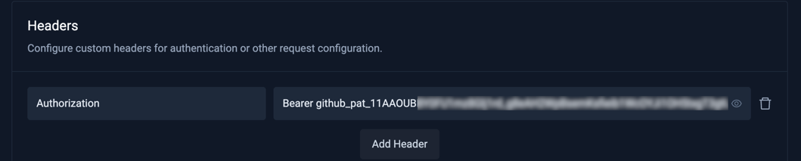
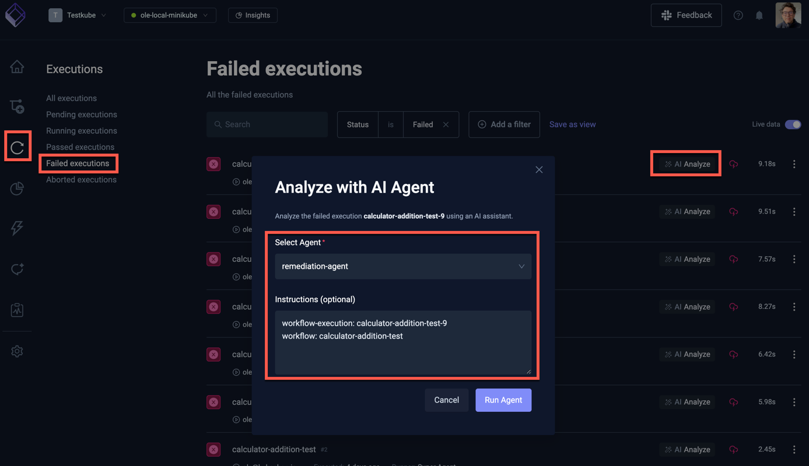
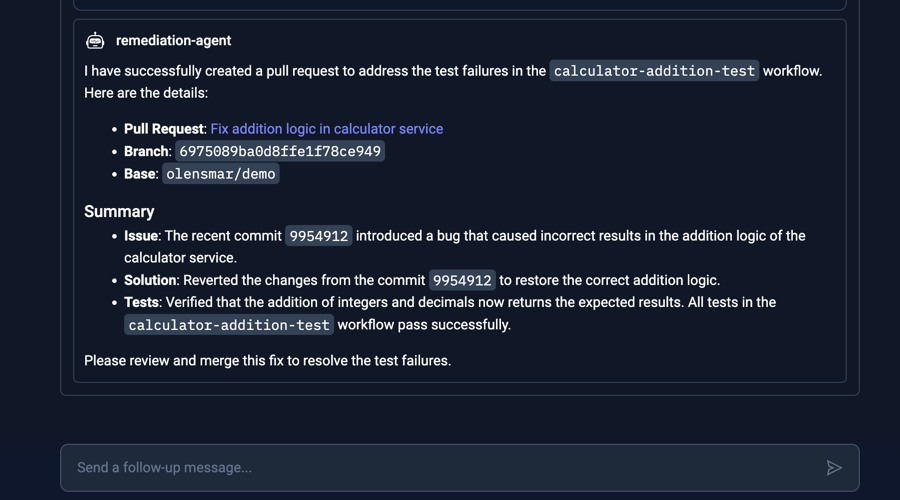

# Testkube Remediation Agent

A Remediation AI Agent in Testkube can be tasked to automatically identify, and in the best scenario, fix code or configurationissues related to failing tests. 

## Requirements

A Remediation AI Agent requires the following:

- **Access the test result**s of the failed tests - provided by the integrated Testkube MCP Server.
- **Access to a git repository** where it can inspect code changes, create branches and commits with a 
  suggested fix and possibly open a pull or merge request - provided by a corresponding MCP Server (GitHub, GitLab, etc).

Optionally, it can also be set up to:

- Interact with collaboration tools to notify that an issue has been fixed (Slack, Teams, etc)
- Create a corresponding issue in an issue tracker (JIRA, Linear, etc) 

## Basic Remedation Agent using GitHub

The following example AI Agent expects the code changes to be in a GitHub repository and uses
the [GitHub MCP Server](https://github.com/github/github-mcp-server) to create a pull request with the suggested fix.

### Start by connecting the GitHub MCP Server

To give the AI Agent access to GitHub, you will need to add the GitHub MCP Server as described at
[Configuring an MCP Server](/articles/mcp-servers-for-ai-agents#configuring-an-mcp-server).

Use the following configuration:
- Server URL: https://api.githubcopilot.com/mcp/
- Headers
    - `Authorization` - `Bearer <your-github-token>`



:::tip
You can generate your GitHub token at https://github.com/settings/tokens, make sure it has content access to the repositories
this AI Agent will interact with.
:::

### Create the Remediation AI Agent

- Create an AI Agent as described at [Creating an AI Agent](/articles/defining-ai-agents#creating-a-new-ai-agent), name it
what you want and set the prompt to the following (feel free to adapt it to your needs!):

> You are an expert engineer specializing in troubleshooting and remediating failed test results and recent code changes.
> You will be provided with a workflow execution and a GitHub repository and branch. If you are not provided with a
> GitHub repository, look for a `testkube.io/target-repository` annotation on the Workflow itself that could contain this
> (use the default branch if only a repo is provided). If that is not available, attempt to use the GitHub
> repo/revision used by the Workflows `content.git` property. 
>
>  Your task is to:
> 
> - Investigate the logs and artifacts for the specified execution to understand why the test failed
> - Look at the recent code changes in the specified repository and branch and determine if any of these changes could be causing the test failure. 
> - Try to suggest a solution/fix to the failing test and commit that to a new branch named after the execution
> - Open a pull-request against the original branch with a description containing your analysis of what is causing the failed test and how you attempted to fix it. 
> - If you are not provided with a workflow execution name or a GitHub repository/branch then just exit with a corresponding error message. 

- Add the GitHub MCP Server to the AI Agent as described at [Adding an MCP Server](/articles/defining-ai-agents#adding-an-mcp-server).
and give it access to the following tools:
  - `create_branch` - so it can create a new branch for the pull request
  - `create_or_update_file` - so it can add files with the suggested fix to the branch
  - `create_pull_request` - so it can create a pull request with the suggested fix
  - `list_commits` - so it can list commits in the specified branch to find recent code changes
  - `list_branches` - so it can list branches in the specified repository to find existing branches
  - `get_commit` - so it can get a specific commit to inspect its changes
  - `get_file_contents` - so it can get the contents of a specific file to inspect its changes


## Using the Remediation AI Agent

Once the AI Agent is created in line with the above settings, navigate to a failed Workflow Execution where 
the "AI Analyze" button is available. Make sure this Workflow is testing a component or service that 
has its GitHub repository defined in the corresponding `testkube.io/target-repository` annotation (see example below). 

Click the button and select the AI Agent you created: 



The instructions to the AI Agent are automatically prefilled with the execution and workflow names, which the agent 
will use for its task. As you can see this does not contain any repository or branch information, which the Agent 
will extract from the Workflow itself (as per its instructions).

```yaml
kind: TestWorkflow
apiVersion: testworkflows.testkube.io/v1
metadata:
  name: calculator-addition-test
  namespace: testkube
  annotations:
    testkube.io/target-repository: https://github.com/olensmar/testkube-mcp-demo/tree/olensmar/demo
spec:
  ...
```

:::tip
These heuristics for extracting the repository and branch information from the Workflow itself are just an example, 
you are free to define any mechanism that works best for your use-case.
:::

Select the "Run Agent" button, this will start the AI Agent and open up the corresponding Chat where you can 
see the progress of the analysis.


After its initial analysis, the agent will attempt to access your GitHub repository, unless you set the corresponding
GitHub MCP Server tools to auto-approve, you will be required to Approve them:


Once all steps have been completed (with corresponding tool approvals), you will see a Summary created by the AI Agent,
which in this case contained a link to the pull request:



(The prompt at the bottom allows you to send a follow-up message, for example ask it for more details about the issue)
