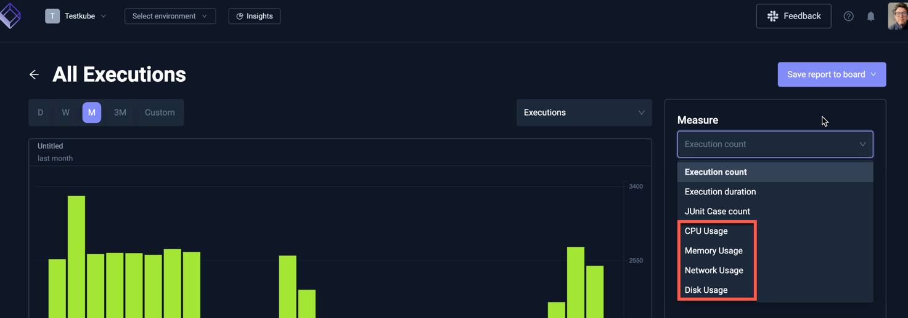
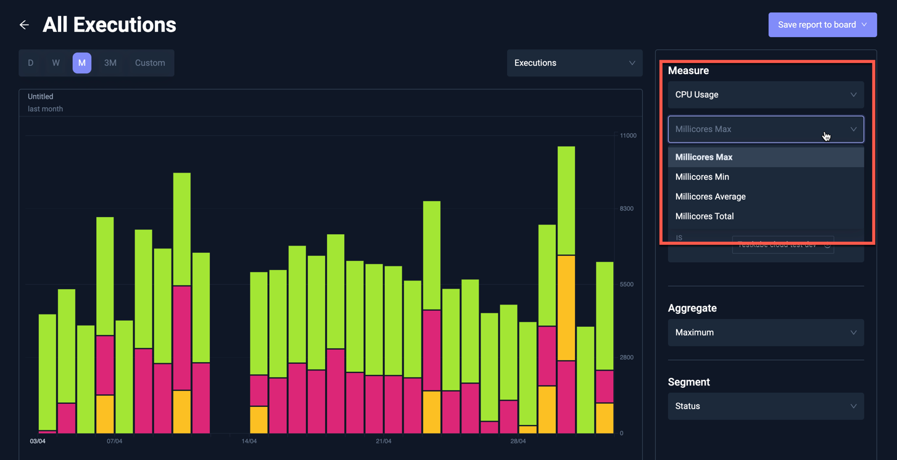
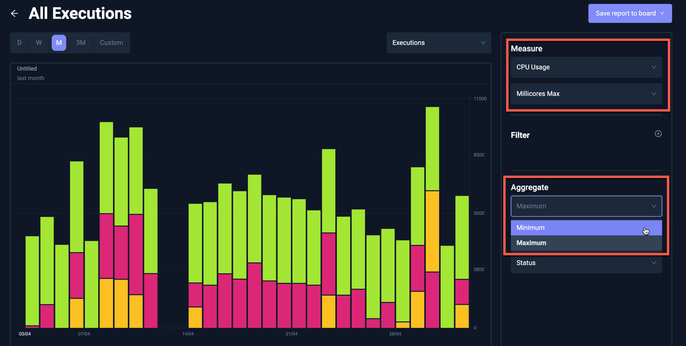

# Resource Metrics in Insights

The [Resource Usage](/articles/resource-metrics) collected for each Workflow execution is available for trend and aggregate analysis in Test Insights:

Selecting a metric allows you to select which value to use in the diagram:

## Available aggregates in Insights

Selecting a Metric value further allows you to select which aggregate to use in the diagram:

The following aggregates are available for each metric across selected Executions:

| Metric        | Metric Aggregate | Insights Aggregate | Description                                                 |
|---------------|------------------|--------------------|-------------------------------------------------------------|
| CPU Usage     | Millicores min   | min                | The min CPU Usage for all selected Executions               |
|               |                  | max                | The highest min CPU Usage for all selected Executions       |
|               | Millicores max   | min                | The smallest max CPU Usage for all selected Executions      |
|               |                  | max                | The max CPU Usage for all selected Executions               |
|               | Millicores avg   | average            | The average avg CPU Usage for all selected Executions       |
|               | Millicores total | sum                | The total CPU Usage for all selected Executions             |
| Memory Usage  | Used min         | min                | The min Memory Usage for all selected Executions            |
|               |                  | max                | The highest min Memory Usage for all selected Executions    |
|               | Used max         | min                | The smallest max Memory Usage for all selected Executions   |
|               |                  | max                | The max Memory Usage for all selected Executions            |
|               | Used avg         | average            | The average avg Memory Usage for all selected Executions    |
|               | Used total       | sum                | The total Memory Usage for all selected Executions          |
| Network Usage | Sent min         | min                | The min bytes sent for all selected Executions              |
|               |                  | max                | The highest min bytes sent for all selected Executions      |
|               | Sent max         | min                | The smallest max bytes sent for all selected Executions     |
|               |                  | max                | The max bytes sent for all selected Executions              |
|               | Sent avg         | average            | The average avg bytes sent for all selected Executions      |
|               | Sent total       | sum                | The total bytes sent for all selected Executions            |
|               | Received min     | min                | The min bytes received for all selected Executions          |
|               |                  | max                | The highest min bytes received for all selected Executions  |
|               | Received max     | min                | The smallest max bytes received for all selected Executions |
|               |                  | max                | The max bytes received for all selected Executions          |
|               | Received avg     | average            | The average avg bytes received for all selected Executions  |
|               | Received total   | sum                | The total bytes received for all selected Executions        |
| Disk Usage    | Read min         | min                | The min bytes read for all selected Executions              |
|               |                  | max                | The highest min bytes read sent for all selected Executions |
|               | Read max         | min                | The smallest max bytes read for all selected Executions     |
|               |                  | max                | The max bytes read for all selected Executions              |
|               | Read avg         | average            | The average avg bytes read for all selected Executions      |
|               | Read total       | sum                | The total bytes read for all selected Executions            |
|               | Write min        | min                | The min bytes written for all selected Executions           |
|               |                  | max                | The highest min bytes written for all selected Executions   |
|               | Write max        | min                | The smallest max bytes written for all selected Executions  |
|               |                  | max                | The max bytes written for all selected Executions           |
|               | Write avg        | average            | The average avg bytes written for all selected Executions   |
|               | Write total      | sum                | The total bytes written for all selected Executions         |

