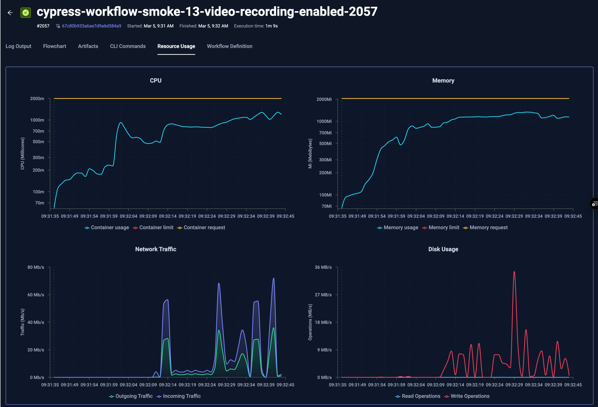

# Resource Metrics

Testkube automatically collects resource metrics for your workflow executions to help you understand their
resource usage and optimize accordingly. This functionality allows you to identify Workflows that

- Are over-provisioned for their needs, resulting in unnecessary resource allocation and costs.
- Are under-provisioned for their needs, resulting in unnecessarily long Workflow executions.
- Display unexpected resource-usage patterns over time (spikes, gradual increases, etc.)

## Metrics Collected

Testkube samples the following metrics and calculates aggregates for each Workflow Step that runs a container command:

| Metric          | Value Types | Aggregates                         | Description                                      |
|-----------------|-------------|------------------------------------|--------------------------------------------------|
| CPU             | millicores  | min, max, avg, total               | CPU usage in milicores over time                 |
| Memory          | bytes       | min, max, avg, total               | Memory usage in bytes over time                  |
| Network Traffic | bytes       | sent/received min, max, avg, total | Network traffic (read/write) in bytes per second |
| Disk IO         | bytes       | read/write min, max, avg, total    | Disk operations (read/write) in bytes per second |


:::note
The default sampling frequency is 1 second, please note that for short running tests (less than 3 seconds), this
can lead to misleading/insufficient data for performing accurate metrics analysis and visualisation.
:::

## Metrics Visualisation

Collected metrics and related metadata is visualized in the "Resource Usage" tab for a Workflow execution:


There are four charts:
- **CPU** - shows CPU usage over time for each pod/node, with CPU requests and limits as dashed and dotted lines respectively.
- **Memory** - shows memory usage over time for each pod/node, with Memory requests and limits as dashed and dotted lines respectively.
- **Network Traffic** - shows ingoing/outgoing network traffic over time.
- **Disk Usage** - shows data read/written over time.

The y-axis is logarithmic for the CPU and Memory charts, linear for Network and Disk Usage.

Moving the pointer over the chart will automatically highlight and show details for the corresponding data-point, as shown 
for the selected 10:21:08 timestamp above. 

The corresponding Workflow for the execution above had the following Resource Request defined:

```yaml
...
  container:
    workingDir: /data/repo/test/pytest/pytest-project
    image: python:3.12.6-alpine3.20
    resources:
      requests:
        cpu: 256m
        memory: 256Mi
...
```

As you can see in the chart:
- the CPU usage was well above the requested 256m for the initial seconds, but dropped below for the rest of the execution
- the memory usage was far below the requested 256Mi during the entire execution
- there were early spikes for both network traffic and disk usage, which were expected for the underlying test itself.

Since the Workflow had no Resource Limits defined, the default limits for CPU and Memory are shown in the charts.

The below example runs a Cypress test that has both requests and limits defined as follows:

```yaml
...
    resources:
      limits:
        cpu: 2
        memory: 2Gi
      requests:
        cpu: 2
        memory: 2Gi
...
```

which shows the following charts:



### Visualisation of multiple-step Workflows

For Workflows with multiple steps, these are separated by purple lines, for example:


This Workflow has 5 steps, each indicated with a vertical dotted line in the charts. Hovering over a specific line 
shows the name of the step on the top of the chart.

### Visualisation of parallel Nodes

When looking at resource metrics for a Workflow Execution that ran across multiple nodes, each node will be visualised
separately, for example the following k6 test that ran across 5 nodes:


shows the following resource usage, where each node has their own line in each chart:


Clicking on the individual labels for each line shows/hides them from the graph; in the below graph all Worker Writes have
been deselected to show only Worker Reads in the graph:


## Aggregate Visualisation

Hovering the Resource-Metric indicator in the Execution details and Execution list displays that executions average 
and peak value for each metric.

Execution Details:


Execution List:


### Resource Aggregates in Insights

The [Test Insights](/articles/test-insights) module exposes aggregate metrics for analysis:


Selecting a metric allows you to select which value to use in the diagram:


### Available aggregates in Insights

Selecting a Metric value further allows you to select which aggregate to use in the diagram:


The following aggregates are available for each metric across selected Executions:

| Metric        | Metric Aggregate | Insights Aggregate | Description                                                 |
|---------------|------------------|--------------------|-------------------------------------------------------------|
| CPU Usage     | Millicores min   | min                | The min CPU Usage for all selected Executions               |
|               |                  | max                | The highest min CPU Usage for all selected Executions       |
|               | Millicores max   | min                | The smallest max CPU Usage for all selected Executions      |
|               |                  | max                | The max CPU Usage for all selected Executions               |
|               | Millicores avg   | average            | The average avg CPU Usage for all selected Executions       |
|               | Millicores total | sum                | The total CPU Usage for all selected Executions             |
| Memory Usage  | Used min         | min                | The min Memory Usage for all selected Executions            |
|               |                  | max                | The highest min Memory Usage for all selected Executions    |
|               | Used max         | min                | The smallest max Memory Usage for all selected Executions   |
|               |                  | max                | The max Memory Usage for all selected Executions            |
|               | Used avg         | average            | The average avg Memory Usage for all selected Executions    |
|               | Used total       | sum                | The total Memory Usage for all selected Executions          |
| Network Usage | Sent min         | min                | The min bytes sent for all selected Executions              |
|               |                  | max                | The highest min bytes sent for all selected Executions      |
|               | Sent max         | min                | The smallest max bytes sent for all selected Executions     |
|               |                  | max                | The max bytes sent for all selected Executions              |
|               | Sent avg         | average            | The average avg bytes sent for all selected Executions      |
|               | Sent total       | sum                | The total bytes sent for all selected Executions            |
|               | Received min     | min                | The min bytes received for all selected Executions          |
|               |                  | max                | The highest min bytes received for all selected Executions  |
|               | Received max     | min                | The smallest max bytes received for all selected Executions |
|               |                  | max                | The max bytes received for all selected Executions          |
|               | Received avg     | average            | The average avg bytes received for all selected Executions  |
|               | Received total   | sum                | The total bytes received for all selected Executions        |
| Disk Usage    | Read min         | min                | The min bytes read for all selected Executions              |
|               |                  | max                | The highest min bytes read sent for all selected Executions |
|               | Read max         | min                | The smallest max bytes read for all selected Executions     |
|               |                  | max                | The max bytes read for all selected Executions              |
|               | Read avg         | average            | The average avg bytes read for all selected Executions      |
|               | Read total       | sum                | The total bytes read for all selected Executions            |
|               | Write min        | min                | The min bytes written for all selected Executions           |
|               |                  | max                | The highest min bytes written for all selected Executions   |
|               | Write max        | min                | The smallest max bytes written for all selected Executions  |
|               |                  | max                | The max bytes written for all selected Executions           |
|               | Write avg        | average            | The average avg bytes written for all selected Executions   |
|               | Write total      | sum                | The total bytes written for all selected Executions         |

