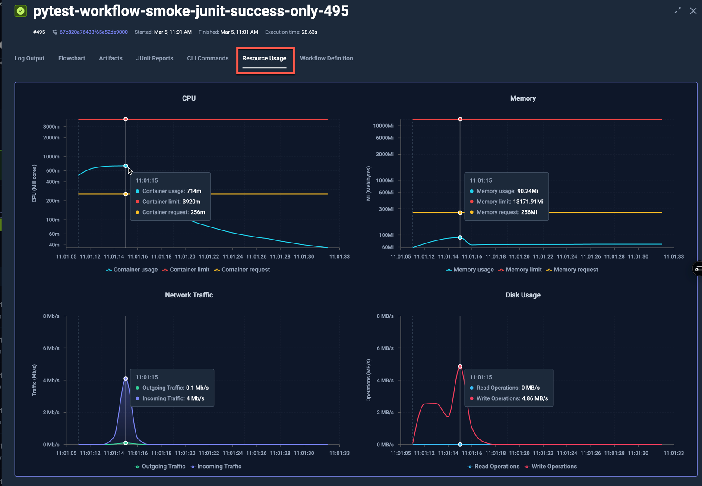
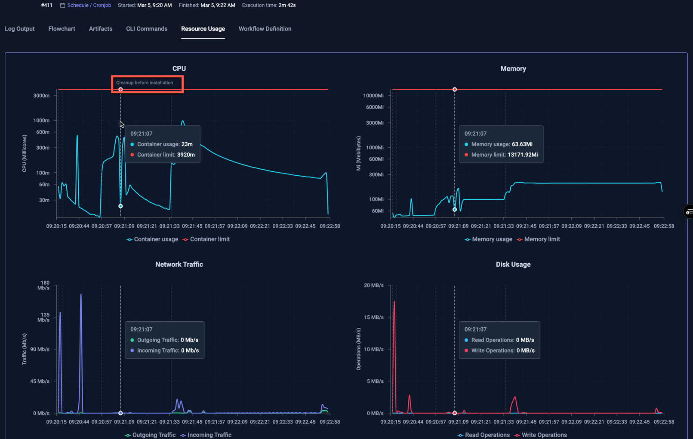

# Resource Metrics

Testkube automatically collects resource metrics for your workflow executions to help you understand their
resource usage and optimize accordingly. This functionality allows you to identify Workflows that

- Are over-provisioned for their needs, resulting in unnecessary resource allocation and costs.
- Are under-provisioned for their needs, resulting in unnecessarily long Workflow executions.
- Display unexpected resource-usage patterns over time (spikes, gradual increases, etc.)

## Metrics Collected

Testkube samples the following metrics for each Workflow Step that runs a container command:

- CPU
  - milicores used
- Memory
  - bytes used 
- Disk
  - bytes read total (not currently displayed)
  - bytes read per second
  - bytes written (not currently displayed)
  - bytes written per second
- Network
  - bytes read total (not currently displayed)
  - bytes read per second
  - bytes written (not currently displayed)
  - bytes written per second

The default sampling frequency is 1 second, please note that for short running tests (less than 3 seconds), this
can lead to misleading/insufficient data for performing an accurate metrics analysis.

## Metrics Visualisation

Collected metrics and related metadata is visualized in the "Resource Usage" tab for a Workflow execution:



There are four charts:
- **CPU** - shows CPU usage over time for each pod/node, with CPU requests and limits as orange and red lines respectively.
- **Memory** - shows memory usage over time for each pod/node, with Memory requests and limits as orange and red lines respectively.
- **Network Traffic** - shows ingoing/outgoing network traffic over time.
- **Disk Usage** - shows data read/written over time.

The y-axis is logarithmic for the CPU and Memory charts, linear for Network and Disk Usage.

Moving the pointer over the chart will automatically highlight and show details for the corresponding data-point, as shown 
for the selected 11:01:15 timestamp above. 

The corresponding Workflow for the execution above had the following Resource Request defined:

```yaml
...
  container:
    workingDir: /data/repo/test/pytest/pytest-project
    image: python:3.12.6-alpine3.20
    resources:
      requests:
        cpu: 256m
        memory: 256Mi
...
```

As you can see in the chart:
- the CPU usage was well above the requested 256m for the initial 10 seconds, but dropped below for the rest of the execution
- the memory usage was below the requested 256Mi during the entire execution
- there were early spikes for both network traffic and disk usage, which were expected for the underlying test itself.

Since the Workflow had no Resource Limits defined, the default limits for CPU and Memory are shown in the charts.

The below example runs a Cypress test that has both requests and limits defined as follows:

```yaml
...
    resources:
      limits:
        cpu: 2
        memory: 2Gi
      requests:
        cpu: 2
        memory: 2Gi
...
```

which shows the following charts:


## Visualisation of multiple-step Workflows

For Workflows with multiple steps, these are separated by purple lines, for example:



This Workflow has 5 steps, each indicated with a vertical dotted line in the charts. Hovering over a specific line 
shows the name of the step on the top of the chart.

## Visualisation of parallel Nodes

When looking at resource metrics for a Workflow Execution that ran across multiple nodes, each node will be visualised
separately, for example the following k6 test that ran across 5 nodes:


shows the following resource usage, where each node has their own line in each chart:


Clicking on the individual labels for each line shows/hides them from the graph; in the below graph all Worker Writes have
been deselected to show only Worker Reads in the graph:


