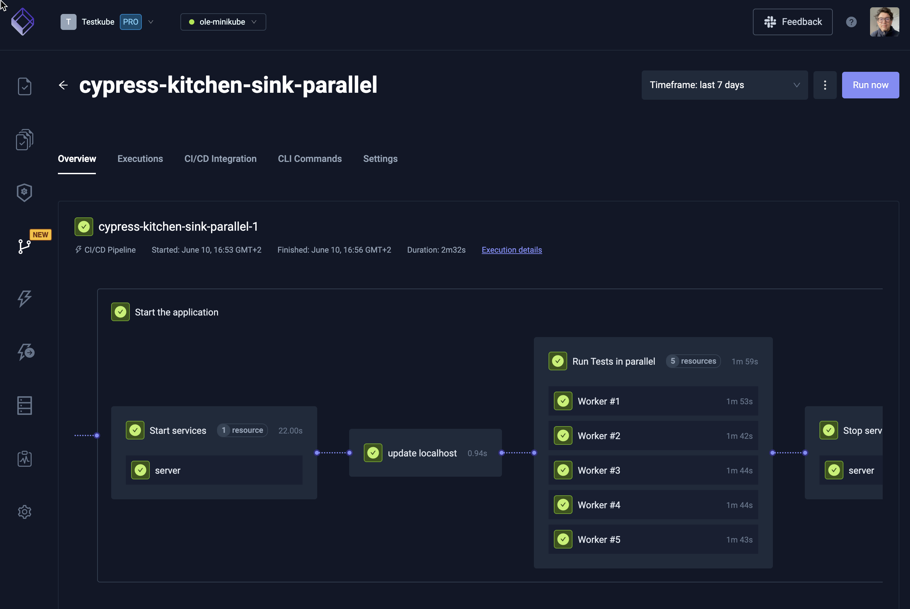

# Running and Scaling Tests

## Scaling Test Executions

Scaling test executions involves leveraging your CI/CD infrastructure, your own resources, or a combination of both. Key aspects include:

### Infrastructure Considerations

- **Parallel Execution:**  
  Support for multiple tests running concurrently—especially useful when different teams or components are building at the same time.

- **Scaling Individual Tests:**  
  Ability to scale a single test:
  - **Load Testing:** Generate massive load.
  - **E2E Testing:** Run tests across multiple browsers concurrently.

### Avoiding Resource Collisions

- Ensure that concurrently running tests do not impact each other in terms of load or state on shared resources (unless intentionally desired).

### Security Considerations

- Tests must have network/component access to the applications being tested.
- Running tests from outside the infrastructure may pose challenges, so ensure secure access paths are in place.

## Running Tests with Testkube

Testkube leverages Kubernetes to execute your tests, offering several run-time benefits:

### Kubernetes-Based Execution

- **Automated Scaling:**  
  The Kubernetes job scheduler manages scaling, enabling efficient resource allocation as long as Kubernetes itself has sufficient capacity.

### Parallelization & Sharding

- **Parallel Execution:**  
  Use Test Workflows' built-in [parallelization](test-workflows-parallel.mdx) capabilities to run multiple tests simultaneously.
- **Sharding:**  
  Scale the same test across multiple instances using [sharding](test-workflows-matrix-and-sharding.mdx) to generate massive load or test multiple permutations.

### Optimizing Pod Usage

- Configure Test Workflow Pods for optimal performance using:
  - **[Pod Affinity](test-workflows-job-and-pod#example-single-execution-per-node):**  
    Control where your tests run.
  - **[Topology Spread Constraints](test-workflows-job-and-pod#example-distribute-evenly-across-nodes):**  
    Evenly distribute workloads across nodes.

### Security Benefits

- Since tests run inside your clusters, external network access for testing tools is generally unnecessary.
- This setup enhances security and mirrors a production-like environment.

## Further Reading

Learn more about resolving issues by reading our article on [Troubleshooting Tests](../articles/troubleshooting-tests.md).
