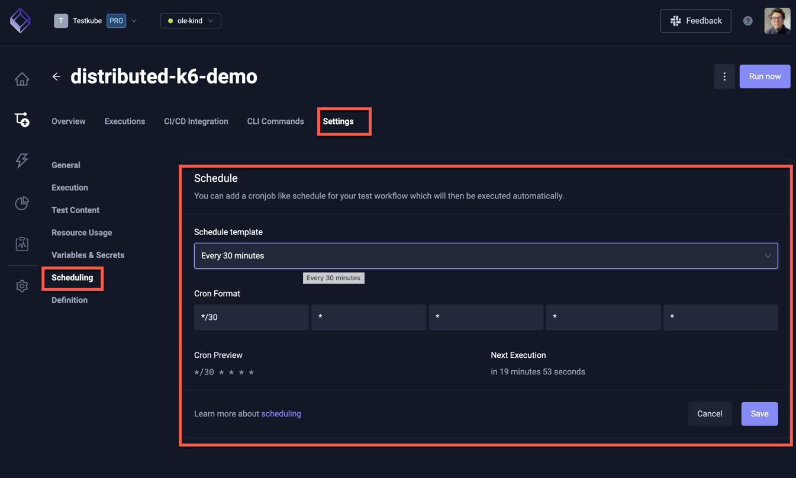
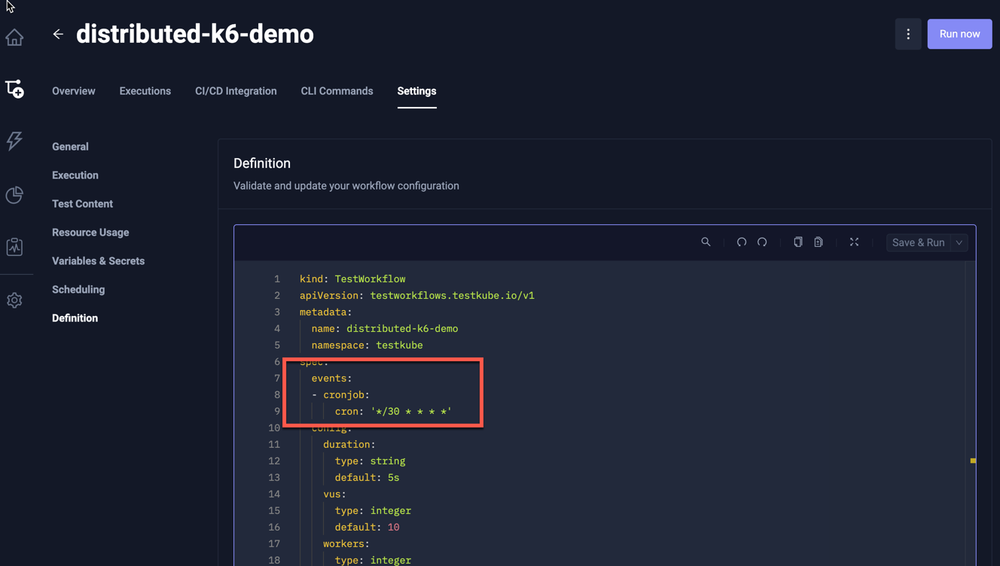

# Scheduling Workflows

Testkube supports a cron-based scheduling mechanism that allows you to run your Test Workflows at desired intervals/times.

## Scheduling a Workflow by updating the Workflow Definition

:::info

Schedules are defined in the Workflow YAML under a `spec.events.cronjob` property - [Read More](/articles/test-workflows#events-and-scheduling).

:::

The easiest way to schedule your Workflow is to modify the Workflow definition and add the corresponding
`spec.events.cronjob` property, for example the below workflow will be scheduled to run on a daily basis at 3 am:

```yaml
kind: TestWorkflow
apiVersion: testworkflows.testkube.io/v1
metadata:
  name: distributed-k6-demo
  namespace: testkube
spec:
  events:
  - cronjob:
      cron: 0 3 * * *
      timezone: America/New_York
...
```


:::tip
Testkube uses the same scheduling format as Kubernetes Cron jobs. For details on the cron expression syntax, 
refer to the [Wikipedia Cron format](https://en.wikipedia.org/wiki/Cron) for details.

The timezone value in Testkube is also based on the tz database, consistent with Kubernetes Cron jobs. 
If no timezone is specified, Testkube will fall back to the cluster’s local time (usually the system time of the node running the job).
For a list of supported time zones, see the [List of tz database time zones](https://en.wikipedia.org/wiki/List_of_tz_database_time_zones) for details.
:::

## Schedule a Workflow from the Testkube Dashboard

You can also schedule a Test Workflow from the Testkube Dashboard under the Workflow Settings/Scheduling Panel:



This will add the corresponding YAML to the Workflow definition:



:::info

The Dashboard will only allow you to manage _one_ schedule, if you want to define multiple schedules, you will have
to do this directly in the Workflow Definition.

:::

## Scheduling Architecture

In connected mode (v2.7+), scheduling is managed centrally by the Control Plane - [Read More](/articles/control-plane-source-of-truth#scheduling-changes).

For standalone deployments, the Testkube Agent includes a built-in cron scheduler (the default mode) that uses RPC to trigger
Test Workflows directly, eliminating the need to create separate CronJob pods. This significantly reduces Kubernetes resource
usage and scales efficiently, even with a large number of scheduled Test Workflows.

The built-in scheduler can be toggled with Helm chart values:

```yaml
    cronJobs:
      ## Should it manage cron jobs
      enabled: true
```

and

```yaml
  # -- Agent cron jobs for scheduling test, suites, workflows
  agentCronJobs: true
```
