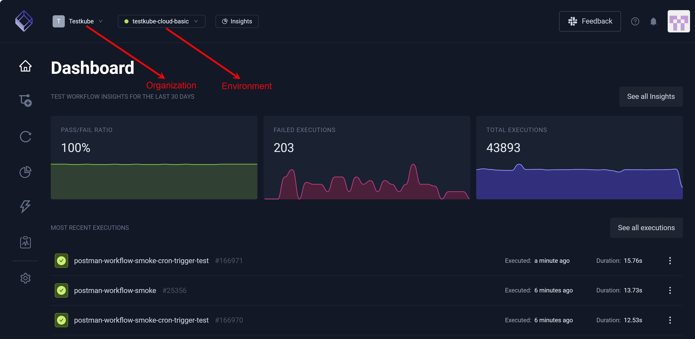
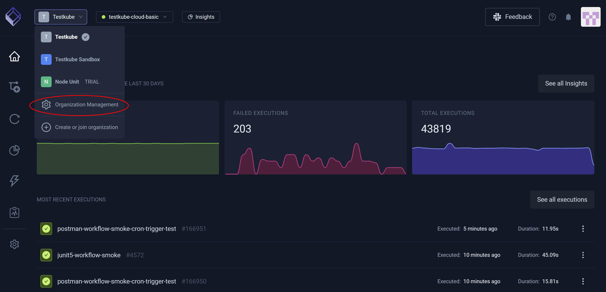
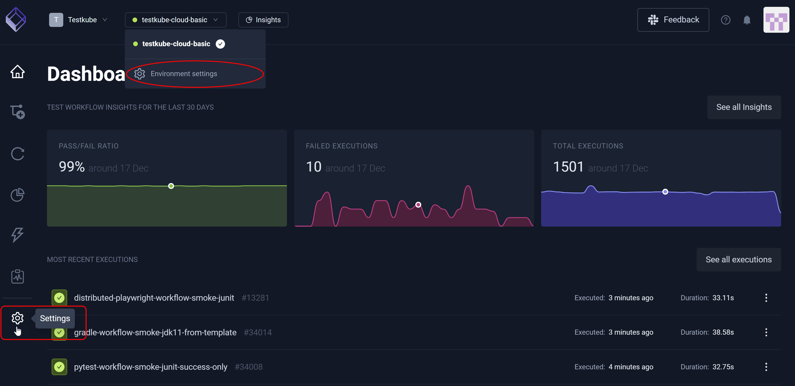

#  Global Settings 

The Testkube Dashboard provides a central location for you to configure your **Organization** and **Environment** settings.

## Organization Settings

You must have an **Owner** or **Admin** role to adjust this setting – configuring **Organization Management** by first selecting this option from the **Organization** drop-down list box. 
For additional information, read [Organization Management](/articles/organization-management) and [Inviting Members](../articles/member-management#inviting-members).

## Environment Settings

You must have an **Owner**, **Admin**, or **Editor (Write)** role to adjust this setting – configuring **Environment Settings** by first selecting this option from the **Environment** drop-down list box 
or selecting **Settings** from the left navigation pane. For additional information, read [Environment Management](../articles/environment-management.md) and [Resource Access Management](../articles/resource-access-management.md).

