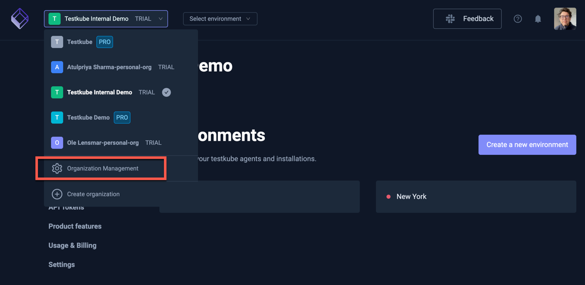
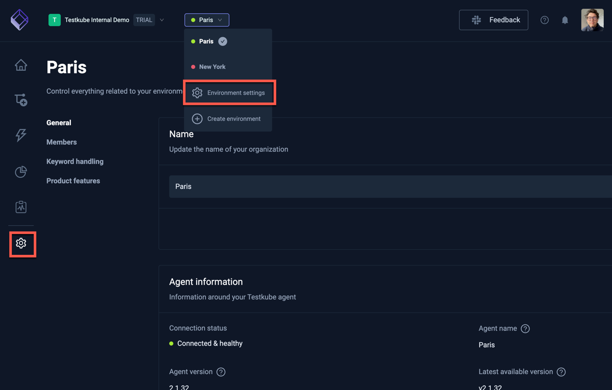

#  Global Settings 

The Testkube Dashboard allows you to configure settings for both your Organizations and Environments.

## Organization Settings

Configure your Organization by selecting the "Organization Management" menu action from the 
Organization drop-down at the top of the Dashboard - [Read More about Organization Management](/testkube-pro/articles/organization-management).

## Environment Settings

Configure your Environments by selecting either the bottom icon in the left toolbar or by selecting
the "Environment Settings" menu action from the Environment drop-down at the top of the Dashboard - [Read More about Environment Management](/testkube-pro/articles/environment-management).

