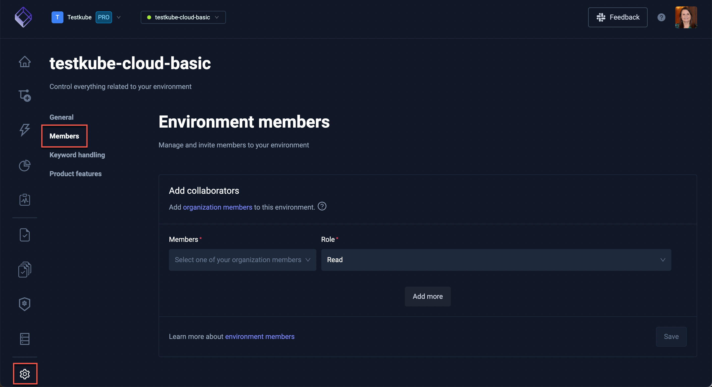

# Explore the Settings Dashboard

Control everything related to your environment in the Settings Dashboard.

## General Settings

Find the general settings for your environment on the **General** tab. You can also delete the environment here, but, be aware, this action cannot be undone.

## Members

See all members with access to the environment and add new members on the **Members** tab.

## Keyword Highlighting

Define the keywords Testkube should highlight in the logs on the **Keyword highlighting** tab.

## Product Features

Manage how you want this environment to handle available Testkube features on the **Product Features** tab.

