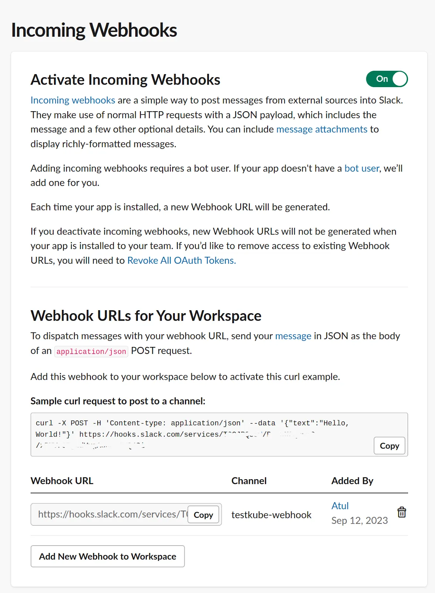

# Integrating with Slack Using Webhooks

# Using Slack with Testkube

When creating [webhooks](..//articles/webhooks.mdx) to integrate Testkube with external systems, you can send a notification to a Slack channel when a test passes.

## Setting Up Slack Integration

Testkube provides a Slack integration where you can configure a Testkube bot in your Slack workspace. If your Slack workspace doesn’t allow you to install a bot, you can follow the steps below.

You can configure Slack to receive notifications either in a channel or via direct message. We’ll configure a private channel for this example. You can refer to this article to create a private Slack channel.

Then, create a Slack app for a workspace that will receive the incoming events via webhook. To do that, navigate to https://api.slack.com/apps and **Create a New App**. In the modal that opens, choose **From Scratch**, provide the name, and choose the workspace where you want to create this app.


Create the app and navigate to the **Add Features and Functionality** section and click on **Incoming Webhooks**. By default, this is turned off, so you need to turn it on.



Click **And New Webhook to Workspace** and choose the private channel that we created earlier on the next screen.


Copy the webhook URL from the next screen and keep it handy, as we’ll need it while creating a webhook in Testkube.


## Creating a Webhook in Testkube

Testkube allows you to create Webhooks using the dashboard as well as the CLI. 

### Using the Testkube Dashboard

Navigate to the Webhooks section and **Create a new webhook**. Provide a name and choose the **Resource Identifier** as test-type: curl-test which refers to the cURL test. For **Triggered events**,choose **end-test-success**.


On the next screen, provide the Slack incoming webhook URL that you generated while setting up Slack integration.


We have successfully configured the Slack webhook and will now receive events in the Slack channel when any event is sent to this endpoint.

## Using the CLI

We’ll create a webhook for the Slack integration using the Testkube CLI, which is simple. Open a terminal and use the `testkube create webhook` command to create a webhook.

```
$ echo '{"text": "Test succeeded"}' > webhook.tpl &amp;&amp; \testkube create webhook --name slack-cli --events end-test-success --selector test-type=curl-test --header Content-Type=application/json --payload-template webhook.tpl --uri  https://hooks.slack.com/services/ABCDEFGHJKL/MNOPQRSTUVW&amp;&amp; \rm webhook.tpl
```

Below are the parameters used in the create webhook command:

- **name**: Name of the webhook.
- **events**: Events that will trigger the webhook. We’ve provided‘start-test’ and ‘end-test-success’ which means this will trigger every time a test starts and test finishes successfully.
- **selector**: The resource for which the webhook will be configured, in this case, it’s the curl-test that we’ve created.
- **header**: The header parameters for the request, **application/json** in this case.
- **payload-template**: The payload that you want to send. We’re creating a `webhook.tpl` file with the content and later deleting it once the webhook is created.
- **URI**: Slack endpoint URL.

The webhook is created after executing the above command.

# Testing the Webhook

When the test passes, you’ll get a notification in the Slack channel with the message “Test succeeded”.


Watch the following video to see these steps in action:

<iframe width="560" height="315" src="https://www.youtube.com/embed/MSyZNGDsnLE" title="Configure Slack webhooks for Kubernetes Tests Notifications" frameborder="0" allow="accelerometer; autoplay; clipboard-write; encrypted-media; gyroscope; picture-in-picture; web-share" referrerpolicy="strict-origin-when-cross-origin" allowfullscreen></iframe>

