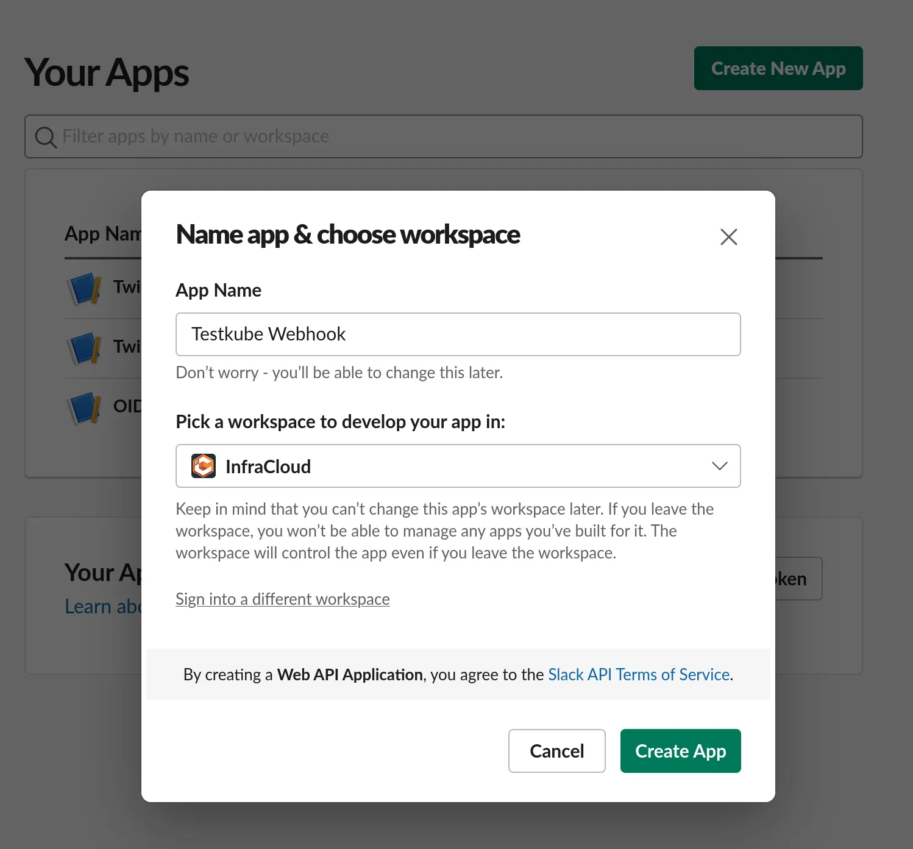
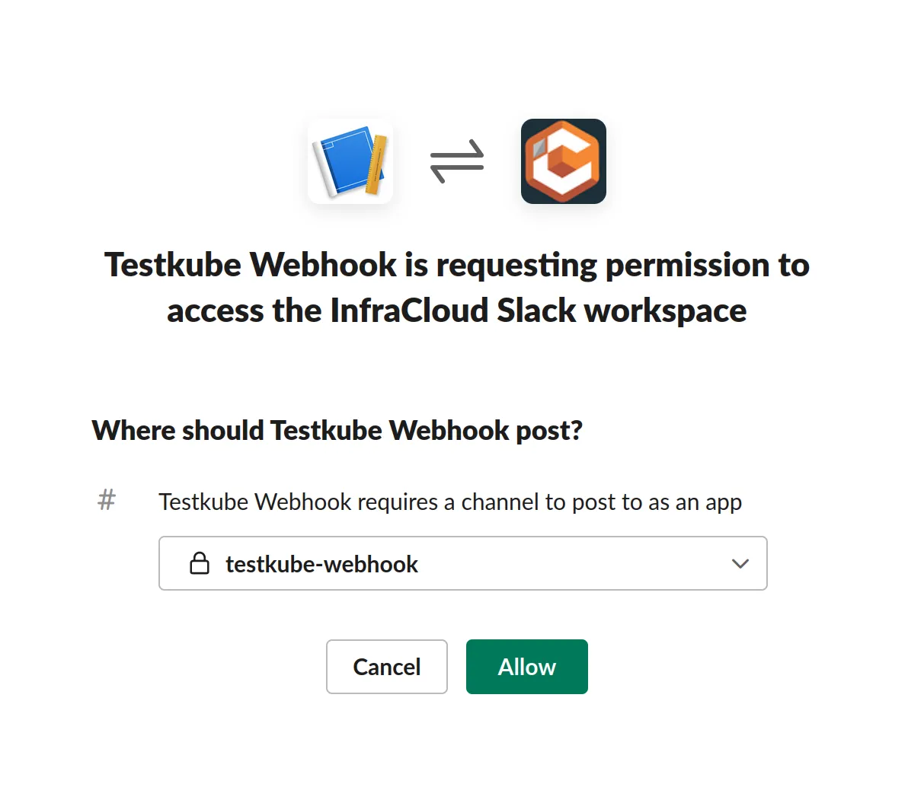
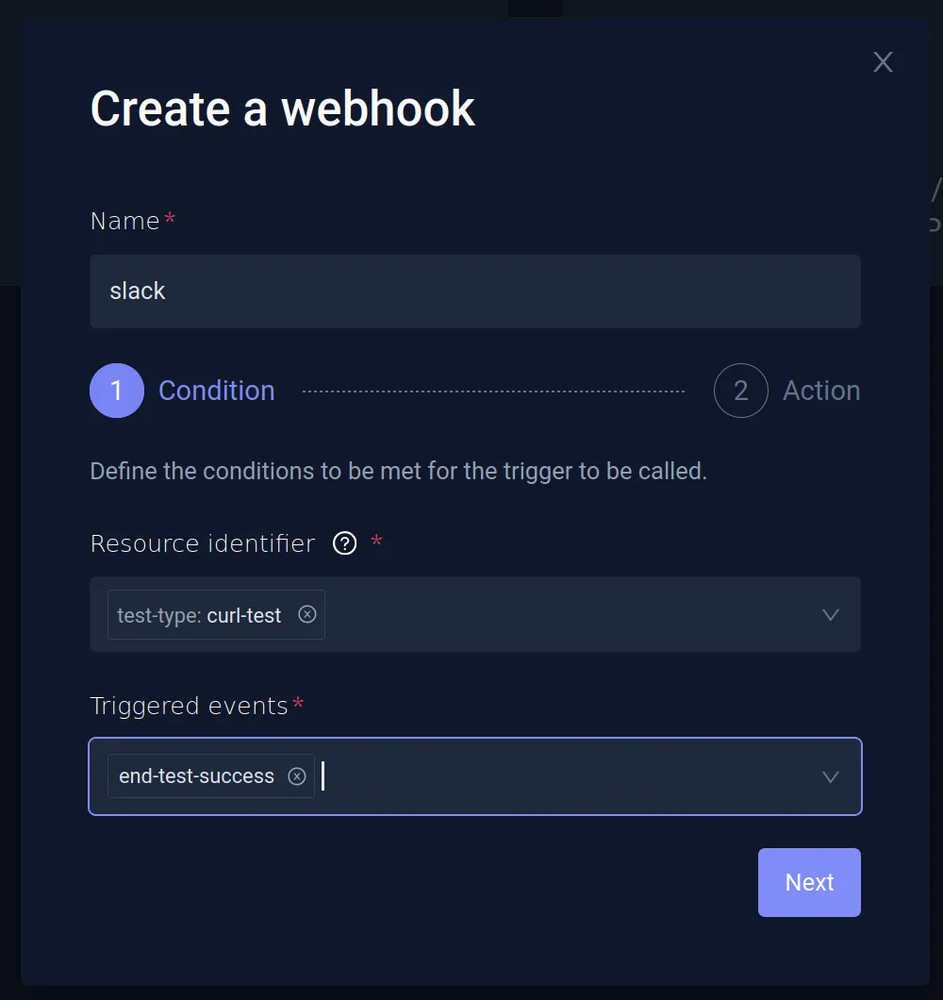
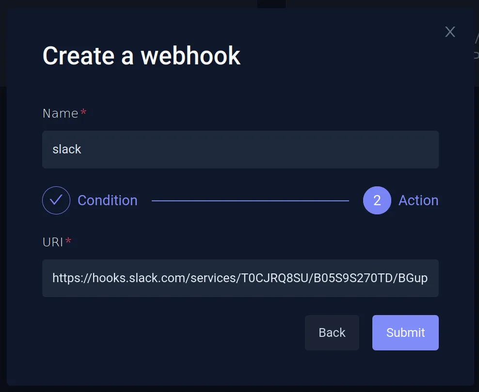
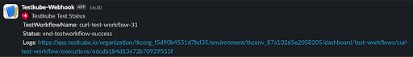

import Admonition from "@theme/Admonition";

# Integrating with Slack Using Webhooks

# Using Slack with Testkube

When creating webhooks to integrate Testkube with external systems, you can send a notification to a **Slack channel** when a test passes. Please visit the [Webhooks](..//articles/webhooks.mdx) page for the details for using Webhooks with Testkube.

## Setting Up Slack Integration

Testkube provides a Slack integration where you can configure a Testkube bot in your Slack workspace. If your Slack workspace doesn’t allow you to install a bot, you can follow the steps below.

You can configure Slack to receive notifications either in a channel or via direct message. We’ll configure a private channel for this example. You can refer to this article to create a private Slack channel.

Then, create a Slack app for a workspace that will receive the incoming events via webhook. To do that, navigate to https://api.slack.com/apps and **Create a New App**. In the modal that opens, choose **From Scratch**, provide the name, and choose the workspace where you want to create this app.



Create the app and navigate to the **Add Features and Functionality** section and click on **Incoming Webhooks**. By default, this is turned off, so you need to turn it on.


Click **And New Webhook to Workspace** and choose the private channel that we created earlier on the next screen.



Copy the webhook URL from the next screen and keep it handy, as we’ll need it while creating a webhook in Testkube.


## Creating a Webhook For Slack

Testkube allows you to create Webhooks using the Dashboard as well as the CLI. 

### Using the Testkube Dashboard

Navigate to the Webhooks section and **Create a new webhook**. Provide a name and choose the **Resource Identifier** as test-type: curl-test which refers to the cURL test. For **Triggered events**,choose **end-testworkflow-success**.

<Admonition type="tip" title="Failed Tests">
    If you want to be notified about failures as well, don't forget adding events like `end-testworkflow-failed` or `end-testworkflow-aborted`.
</Admonition>

<Admonition type="info" title="Legacy Tests and Test Suites">
    If you need support for legacy Tests and Test Suites too, you should consider also `end-test-success` and `end-testsuite-success` events.
</Admonition>



On the next screen, provide the Slack incoming webhook URL that you generated while setting up Slack integration.



The last step is to configure the payload that will be sent to the Slack Webhook. After creating the webhook, you can navigate to **Integrations -> Webhooks** and click **Slack**. Navigate to the **Action** tab, and under **Custom Payload** add the following text:

```json
{
	"text": ":alert: Testkube Test Status \n *Name*: {{.TestWorkflowExecution.Name}} \n *Status*: {{ .Type_ }} \n *Logs*: https://app.testkube.io/organization/{{ index .Envs "TESTKUBE_PRO_ORG_ID" }}/environment/{{ index .Envs "TESTKUBE_PRO_ENV_ID" }}/dashboard/test-workflows/{{ .TestWorkflowExecution.Workflow.Name }}/executions/{{ .TestWorkflowExecution.Id }}"
}
```

Here, we’re adding custom text that includes:

- The name of the test workflow.
- The status.
- A link to the execution log of that particular test workflow. 

To build the URL, we access the environment variables **TESTKUBE_PRO_ORG_ID** and **TESTKUBE_PRO_ENV_ID**, which are your organization and environment variables that you get when you create an environment in Testkube.

We have successfully configured the Slack webhook and will now receive events in the Slack channel when any event is sent to this endpoint.

<Admonition type="info" title="Legacy Tests and Test Suites">
    If you need support for legacy Tests and Test Suites too, you can use more complex generic payload to obtain their information.
    <details>
        <summary>Custom Payload</summary>

        ```
        {{ $dashboardUrl := print "https://app.testkube.io/organization/" (index .Envs "TESTKUBE_PRO_ORG_ID") "/environment/" (index .Envs "TESTKUBE_PRO_ENV_ID") "/dashboard" }}
        {{ $name := "" }}
        {{ $logsUrl := "" }}
        {{ if .TestWorkflowExecution }}
          {{ $name = .TestWorkflowExecution.Name }}
          {{ $logsUrl = print $dashboardUrl "/test-workflows/" .TestWorkflowExecution.Workflow.Name "/executions/" .TestWorkflowExecution.Id }}
        {{ end }}
        {{ if .TestExecution }}
          {{ $name = .TestExecution.Name }}
          {{ $logsUrl = print $dashboardUrl "/tests/" .TestExecution.TestName "/executions/" .TestExecution.Id }}
        {{ end }}
        {{ if .TestSuiteExecution }}
          {{ $name = .TestSuiteExecution.Name }}
          {{ $logsUrl = print $dashboardUrl "/test-suites/" .TestSuiteExecution.TestSuite.Name "/executions/" .TestSuiteExecution.Id }}
        {{ end }}
        {
            "text": ":alert: Testkube Test Status \n *Name*: {{$name}} \n *Status*: {{ .Type_ }} \n *Logs*: {{$logsUrl}}"
        }
        ```
    
    </details>
</Admonition>

## Using the CLI

We’ll create a webhook for the Slack integration using the Testkube CLI. Open a terminal and use the `testkube create webhook` command to create a webhook.

```sh
testkube create webhook --name slack-cli --events end-test-success --selector test-type=curl-test --header Content-Type=application/json --uri  https://hooks.slack.com/services/ABCDEFGHJKL/MNOPQRSTUVW
```

Below are the parameters used in the create webhook command:

- **name**: Name of the webhook.
- **events**: The event(s) that will trigger the webhook. We’ve provided ‘start-test’ and ‘end-test-success’ which means this will trigger every time a test starts and test finishes successfully.
- **selector**: The resource for which the webhook will be configured. In this case, it’s the curl-test that we’ve created.
- **header**: The header parameters for the request, **application/json** in this case.
- **URI**: Slack endpoint URL.

The webhook is created after executing the command.

```sh
$ testkube create webhook --name slack-cli --events end-test-success --selector test-type=curl-test --header Content-Type=application/json --uri  https://hooks.slack.com/services/ABCDEFGHJKL/MNOPQRSTUVW

Context: cloud (2.0.8)   Namespace: testkube   Org: Atulpriya Sharma-personal-org   Env: local-kind
---------------------------------------------------------------------------------------------------
Webhook created slack-cli 🥇

```


# Testing the Webhook

When the test passes, you’ll get a notification in the Slack channel with the message **Test succeeded**.



Watch the following video to see these steps in action:

<iframe width="560" height="315" src="https://www.youtube.com/embed/MSyZNGDsnLE" title="Configure Slack webhooks for Kubernetes Tests Notifications" frameborder="0" allow="accelerometer; autoplay; clipboard-write; encrypted-media; gyroscope; picture-in-picture; web-share" referrerpolicy="strict-origin-when-cross-origin" allowfullscreen></iframe>

