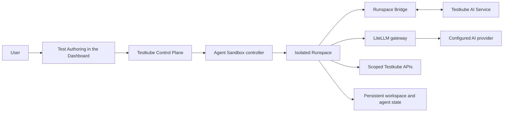

# How Test Authoring Works

Test Authoring provides an AI-assisted workspace for creating, updating, and running tests in Testkube.
Each authoring session is connected to an isolated environment called a **Runspace**, where the authoring
agent can inspect files, make changes, and run tests while you review its progress in the Dashboard.

## Authoring session flow

When you start Test Authoring:

1. The Testkube Control Plane creates the authoring session and provisions a Runspace for it.
2. The Agent Sandbox controller creates the isolated Kubernetes workload and its persistent storage.
3. The Runspace Bridge opens an authenticated outbound connection to the Testkube AI Service and starts
   the authoring agent inside the Runspace.
4. The agent examines the test files, updates the workspace, and runs tools or tests in that environment.
5. Model requests go through the LiteLLM gateway to the configured AI provider. The Runspace uses its own
   limited model-access key rather than the provider credential.
6. For a TestBundle, the Runspace can use a workflow-scoped Testkube token to update and run the workflow
   associated with that bundle.
7. Testkube can checkpoint an idle session and remove its active workload. When the session is resumed, a
   replacement Runspace restores the saved workspace.

Each authoring session has one active Runspace. When you resume a session, Testkube may create a new
Runspace and restore the files from its checkpoint.

## Main components

| Component                                                                        | Responsibility                                                                                                                            |
| -------------------------------------------------------------------------------- | ----------------------------------------------------------------------------------------------------------------------------------------- |
| **Test Authoring UI**                                                            | Provides the chat, file navigation, test output, and session controls in the Testkube Dashboard.                                          |
| **Testkube Control Plane**                                                       | Owns session metadata and lifecycle, provisions Runspaces, issues scoped credentials, and coordinates checkpoints and cleanup.            |
| **[Agent Sandbox](https://github.com/kubernetes-sigs/agent-sandbox) controller** | Trusted cluster infrastructure that creates and manages the Kubernetes workloads and storage used by Runspaces.                           |
| **Runspace**                                                                     | The isolated environment where the authoring agent reads and changes files and runs tools or tests.                                       |
| **Runspace Bridge**                                                              | Maintains the authenticated connection between a Runspace and the AI Service and carries agent events and workspace operations.           |
| **Testkube AI Service**                                                          | Coordinates the authoring conversation and communicates with the agent running in the Runspace.                                           |
| **[LiteLLM](https://docs.litellm.ai/) gateway**                                  | Routes model requests, applies model selection and per-Runspace limits, and keeps provider credentials outside Runspaces.                 |
| **Persistent storage**                                                           | Holds workspace files and private agent state so the session can be checkpointed or resumed according to the configured retention policy. |

The component responsibilities and Runspace isolation boundary are the same in Testkube Cloud and
Testkube On-Prem.

## Security and isolation

The Runspace is the primary security boundary for an authoring session. It is separate from the Testkube
Control Plane, the Agent Sandbox controller, and other Runspaces.

Testkube configures Runspace workloads with the following protections:

- Containers run as a non-root user with privilege escalation disabled and Linux capabilities dropped.
- The container root filesystem is read-only; writable data is limited to dedicated workspace, agent-state,
  and temporary volumes.
- Host networking, host PID, and host IPC access are disabled.
- The Runspace ServiceAccount does not mount a Kubernetes API token.
- [NetworkPolicies](https://kubernetes.io/docs/concepts/services-networking/network-policies/) deny unsolicited ingress and restrict egress to required Testkube and AI services, DNS,
  and destinations allowed by the installation's network policy.
- The AI provider credential remains behind the LiteLLM gateway. Each Runspace receives a separate virtual
  key with configurable model, budget, request, and token limits.
- TestBundle access uses a token scoped to the associated organization, environment, and workflow rather
  than an environment-wide administrator credential.
- Workspace and private agent-state data use separate persistent volumes and follow the configured
  checkpoint and cleanup lifecycle.

These controls rely on the Kubernetes cluster enforcing NetworkPolicy and
[Pod Security Standards](https://kubernetes.io/docs/concepts/security/pod-security-standards/).
Administrators should also use encrypted storage, restrict access to the Runspace and Agent Sandbox
controller namespaces, and enable the
[RuntimeDefault seccomp profile](https://kubernetes.io/docs/reference/node/seccomp/) where it is compatible
with the tools used by their authoring sessions.

The Agent Sandbox controller is trusted infrastructure with the Kubernetes permissions needed to create
and manage sandbox resources. Users and Runspace ServiceAccounts should not be granted access to its roles
or credentials.
